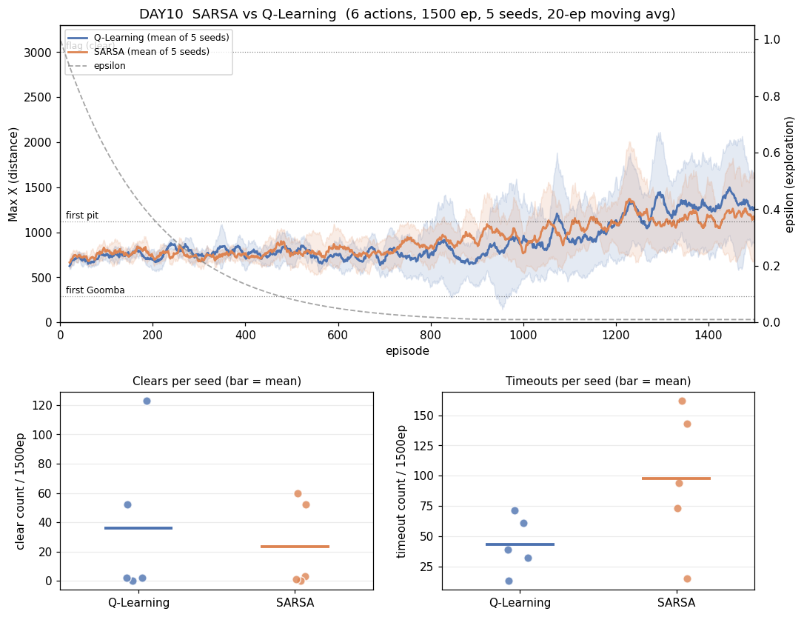
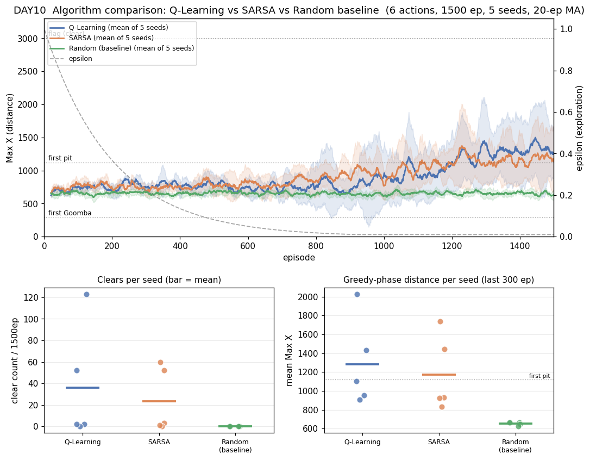

# [DAY10] 다른 두뇌 — SARSA (알고리즘 비교 ①)

> 🎯 **같은 마리오, 다른 두뇌** — Q-Learning을 baseline 삼아, 같은 1-1·5시드 분포로 알고리즘들을 비교한다. 첫 타자는 SARSA.

**배경** · 표 Q-Learning은 1-1 클리어로 목표 달성, 더 튜닝해도 분산에 묻힌다(DAY9). 소켓 뒤 Python(게임·보상·측정)은 *누가 행동을 정하는지* 모르므로, **Java 두뇌만 갈아끼우면** 같은 환경에서 알고리즘을 비교할 수 있다. → 새 챕터 = "여러 두뇌 대결."

**이번** · 두뇌를 교체 가능하게 `Brain` 인터페이스로 빼고(`-Dmario.algo`), 첫 다른 알고리즘으로 **SARSA**를 붙인다. (나머지 — Expected SARSA·Monte Carlo·기준선·진화 — 는 다음 트라이로 하나씩.)

*가설은 실험 전에 먼저 쓴다(예측→검증).*

---

## 공통 설정 (알고리즘 간 고정)

DAY9와 동일, **알고리즘만 바꾼다.**

| 항목 | 값 |
|---|---|
| 상태·테이블 | 두 테이블(공통 108 + 위치 1080), α=0.1 · γ=0.99 |
| epsilon | 1.0 → ×0.995/판 → 하한 0.01 |
| 프레임 스킵 · 에피소드 | 2 · 1500 |
| 행동 | **6개(긴 점프 OFF)** — DAY9에서 효과 없음 확인, *알고리즘* 변수만 격리 |
| 시드 반복 | 5회 — 결론용 지표는 5회 분포로 |
| 측정 지표 | clear · 평균 Max X · 관문 통과율 · **낙사(dead_pit)** · timeout |

---

## 트라이 1 — SARSA (on-policy)

### 🤔 왜 이 방향인가

**Q-Learning**은 목표를 "다음 상태에서 **가장 좋은** 행동의 Q"(`max`)로 잡는다 — 실제로 뭘 하든(탐험) "최선을 가정"하고 배운다(off-policy). **SARSA**는 "다음 상태에서 **실제로 고른** 행동의 Q"로 잡는다 — 자기가 진짜 한 대로 배운다(on-policy). 목표 한 곳만 다르다.

### 변경
- `Brain` 인터페이스(`selectAction`/`learn`/`endEpisode`) + `TabularBrain` 공통 베이스(두 테이블·ε·save/load). **Q-Learning·SARSA는 부트스트랩 목표 한 줄만 다르다**(max ↔ 실제 다음 행동).
- 학습 루프를 SARSA식으로(다음 행동 `a'`를 학습 *전에* 선택). Q-Learning도 그대로 동작(`a'` 무시).
- `-Dmario.algo=qlearning|sarsa` (기본 `qlearning` — 회귀 방지).

### 가설
- SARSA는 on-policy라 **탐험의 위험을 Q에 반영**한다 → 구덩이·굼바 옆에서 "탐험하다 죽는" 경로를 피해 더 보수적. **낙사(dead_pit)↓**를 기대.
- 단 ε 하한이 0.01이라 후반은 거의 greedy → Q-Learning과 차이가 작을 수도. **5시드 분포가 겹치는지**로 판정한다(DAY9 교훈).

### 결과 — 6행동·1500판·5시드 (qlearning vs sarsa, **같은 시드 1~5**)

**시드별 (분산 그대로 보기)**

| 지표 | Q-Learning (s1~s5) | SARSA (s1~s5) |
|---|---|---|
| clear | 2 · 0 · 52 · 2 · 123 | 3 · 60 · 0 · 1 · 52 |
| timeout | 61 · 71 · 13 · 39 · 32 | 143 · 94 · 162 · 73 · 15 |

**분포 (mean ± std [min~max])**

| 지표 | Q-Learning | SARSA |
|---|---|---|
| clear | 35.8 ± 47.8 [0~123] | 23.2 ± 26.9 [0~60] |
| 평균 Max X (후반 300판) | 1284 ± 414 [907~2027] | 1173 ± 354 [830~1736] |
| best Max X | 3023 ± 276 | 3023 ± 276 |
| **timeout** | 43 ± 21 [13~71] | **97 ± 52 [15~162]** |
| dead_pit (낙사) | 293 ± 108 | 383 ± 87 |
| dead_enemy | 1128 ± 117 | 997 ± 82 |

*(maxX를 Java·Python 양쪽 로그에서 교차검증 — 불일치 0판, 전사·정렬 정상.)*

- **본선 지표(clear·거리·best)는 분포가 완전히 겹친다.** clear는 std가 평균보다 커(±48), "큰 시드"가 QL은 s5(123)·SARSA는 s2(60)로 제각각 = **시드 영향 ≫ 알고리즘**(DAY9 재현). best는 둘 다 깃발(3161) 도달.
- **유일하게 기우는 차이 = timeout.** SARSA 4/5 시드(73·94·143·162)가 QL 최댓값(71)보다 많다 → SARSA가 ~2배 자주 시간초과.
- 사망 구성도 이동: SARSA는 dead_enemy↓ · dead_pit↑ · timeout↑.

### 결론

- **가설(낙사↓) 기각.** SARSA의 dead_pit는 오히려 ↑(383 vs 293). on-policy "보수성"은 *낙사 회피*가 아니라 **timeout 증가**(못 죽지만 못 끝냄 = 우물쭈물)로 나타났다. 굼바엔 더 조심(dead_enemy↓)했지만 거리·클리어로 이어지진 않았다.
- **본선 성능은 무승부.** ε 하한 0.01이라 후반은 거의 greedy → off/on-policy의 차이가 들어갈 틈이 작다(가설 단서대로). 5시드 분포가 다 겹쳐 "SARSA가 낫다/못하다"를 말할 수 없다.
- **챕터 교훈 재확인**: 두뇌를 바꿔도 *이 환경에선* 분산이 차이를 덮는다. 견고하게 남는 단 하나 = SARSA의 timeout 성향. → [알고리즘 비교 보드](./[비교]%20알고리즘%20비교%20보드.md)에 baseline·SARSA 분포를 박제하고, 다음 두뇌(Expected SARSA·Monte Carlo·진화)를 같은 칸에 쌓는다.

---

## 트라이 2 — 랜덤 기준선 (무학습 바닥선)

### 🤔 왜 이 방향인가

트라이1에서 QL·SARSA가 **무승부**였다. 둘 다 잘해서인지, 둘 다 *분산일 뿐*인지는 학습기끼리 봐선 모른다. **학습을 끈 두뇌**로 바닥선을 박아 비교 기준을 만든다 — "학습했다면 적어도 이것보단 나아야 한다."

### 변경
- `RandomBrain implements Brain` 추가 — 상태 무시·매 스텝 균등 무작위, `learn`/`endEpisode` no-op, epsilon 고정 1.0. 테이블이 없어 `TabularBrain`을 상속하지 않는다(저장/로드 대상도 아님).
- `-Dmario.algo=random`(+ `Main.createBrain` 분기). 비교는 동일하게 **6행동·1500판·시드 1~5**.

### 가설
- 무작위는 학습이 없으니 **분포가 고정**(시드 간 거의 동일) → 분산이 *작을* 것. 깃발은 **거의/전혀 못 닿음**.
- 핵심 관심: QL·SARSA의 거리·클리어가 **무작위 분포 위로 분리되는가.** 분리되면 트라이1의 "무승부"는 *둘 다 진짜 학습*이라는 뜻.

### 결과 — 6행동·1500판·5시드

| 지표 | Q-Learning | SARSA | **Random** |
|---|---|---|---|
| clear | 35.8 ± 47.8 | 23.2 ± 26.9 | **0 ± 0** [0~0] |
| 평균 Max X (후반 300판) | 1284 ± 414 [907~2027] | 1173 ± 354 [830~1736] | **654 ± 17 [624~667]** |
| best Max X | 3023 (깃발 도달) | 3023 (깃발 도달) | **2109 ± 275 (깃발 ✗)** |
| timeout | 43 ± 21 | 97 ± 52 | **588 ± 16 (~39%)** |
| dead_pit | 293 | 383 | **48 ± 5** |

- **깃발 0** — 7500판(5시드×1500) 내내 클리어 0. 거리도 654로 고정(±17 = QL ±414의 1/20). 가설대로 무학습은 분포가 안 흔들린다.
- **학습군은 바닥선과 안 겹친다** — QL 거리 최솟값 907·SARSA 830 > Random 최댓값 667. 모든 학습 시드가 모든 무작위 시드보다 멀리 간다.
- **무작위는 ~39%가 timeout**(588). 학습이 이를 43·97로 격감 — SARSA가 QL보다 timeout 많던 것도 바닥선에 비하면 미미.
- **dead_pit이 가장 적다(48)** — 첫 구덩이(1120)까지 자주 못 가서다(굼바에 먼저 죽음). → pit 사망 많음 = 멀리 갔다는 신호(트라이1 SARSA pit↑ 해석 확증).

### 결론

- **가설 적중.** 무작위는 깃발 0·거리 654로 고정. 학습군 거리가 그 위로 완전히 분리 → 트라이1 "무승부"는 *둘 다 분산이 아니라 둘 다 진짜 학습*이라는 뜻.
- **챕터 읽는 법**: "둘 중 누가 낫나"(분산에 묻힘)가 아니라 **"각 두뇌가 바닥선 위 어디냐"**. → 다음 두뇌도 같은 바닥선 위에 올려 [비교 보드](./[비교]%20알고리즘%20비교%20보드.md)에 쌓는다.
