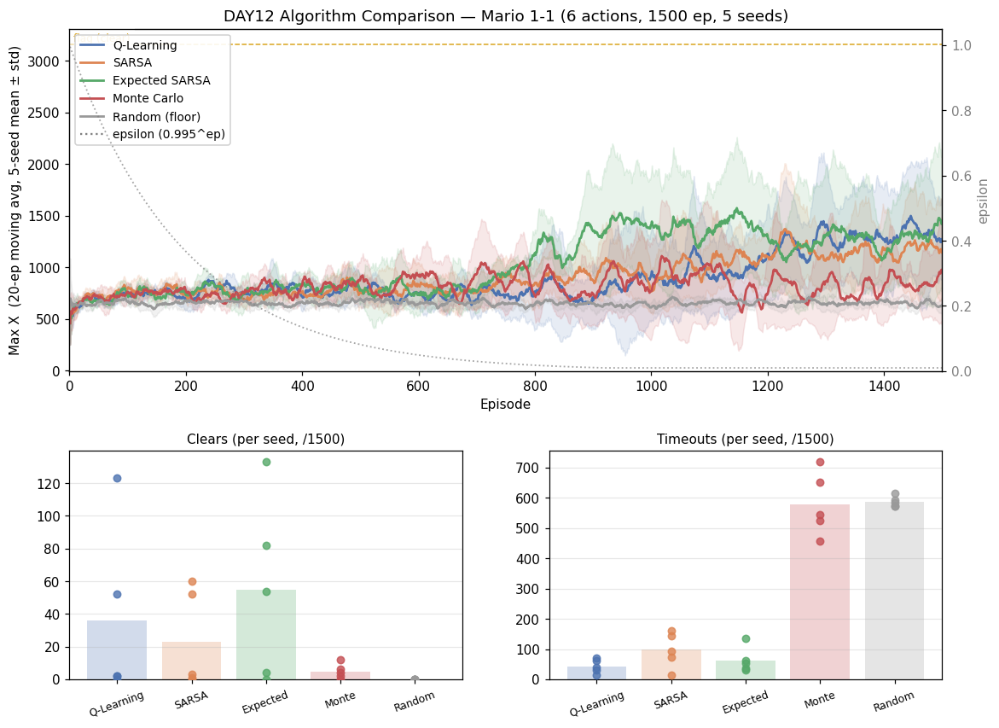

# [DAY12] 다른 두뇌 — Monte Carlo (알고리즘 비교 ③)

> 🎯 **같은 마리오, 다른 두뇌** — 알고리즘 비교 챕터의 네 번째 참가자(학습기로는 세 번째). 지금까지는 전부 **TD**(매 스텝 추정치로 갱신)였다. 이번엔 처음으로 **부트스트랩을 버린** 두뇌.

**배경** · [DAY10~11]에서 QL·SARSA·Expected SARSA는 **본선 무승부 + 바닥선(Random) 위 분리**였고, 셋의 유일하게 견고한 차이는 **timeout**(on/off-policy 성향)이었다. 셋 다 "다음 상태의 *추정치*"로 현재를 갱신한다(부트스트랩). Monte Carlo는 그 추정을 안 쓴다 — **에피소드가 끝날 때까지 기다렸다가 실제 받은 보상으로** 갱신한다.

*가설은 실험 전에 먼저 쓴다(예측→검증).*

---

## 공통 설정 (알고리즘 간 고정)

DAY10~11과 동일, **알고리즘만 바꾼다.** (고정값은 [알고리즘 비교 보드](./[비교]%20알고리즘%20비교%20보드.md) "고정 설정" 참조.)

| 항목 | 값 |
|---|---|
| 상태·테이블 | 두 테이블(공통 108 + 위치 1080), α=0.1 · γ=0.99 |
| epsilon | 1.0 → ×0.995/판 → 하한 0.01 |
| 프레임 스킵 · 에피소드 | 2 · 1500 |
| 행동 | **6개(긴 점프 OFF)** |
| 시드 반복 | 5회 — 결론용 지표는 5회 분포로 |

---

## 🤔 왜 이 방향인가

TD 가족은 매 스텝 "다음 상태가 얼마나 좋을지의 *추정치*"로 현재를 갱신한다(부트스트랩). 추정에 추정을 쌓으니 **편향**이 생길 수 있지만, 매 스텝 신호가 와서 **분산은 작고** 빨리 배운다. **Monte Carlo는 정반대다** — 한 판이 끝날 때까지 기다렸다가 그 판에서 *실제로 받은* 보상의 할인 합(return G)으로 갱신한다. 추정을 안 쓰니 **편향이 없지만**, 한 판의 운(어디서 죽었나·랜덤 탐험)이 그대로 G에 들어가 **분산이 크다**.

마리오 1-1은 큰 보상이 **종료 시점에 몰려 있다**(클리어 +1000 · 사망/시간초과 −100/−50). MC는 그 종료 신호를 궤적 전체에 **역방향으로 직접 전파**하므로, "이 판의 끝이 좋았나/나빴나"를 경로 전체에 한 번에 칠한다. TD가 그 신호를 한 스텝씩 천천히 흘려보내는 것과 대비된다.

## 변경
- `MonteCarlo extends TabularBrain` 추가 — 두 테이블·ε-greedy 선택·저장/로드는 그대로 재사용하고, **갱신 타이밍 하나만** 바꾼다:
  - `learn`은 갱신하지 않고 궤적 `(common, local, action, reward)`만 쌓는다.
  - `endEpisode`에서 궤적을 **역방향**으로 훑어 return을 누적하고 매 스텝을 그 값으로 당긴다(그 뒤 ε 감쇠):
    ```
    G ← 0
    for t = last … 0:
        G ← reward_t + γ·G
        updateToward(c_t, l_t, a_t, target = G)   // α/2씩 두 테이블에 (TD와 같은 갱신식)
    ```
  - **every-visit · constant-α** MC: 한 판에서 같은 (상태,행동)을 또 밟으면 매번 갱신, 갱신폭은 α 고정(방문 횟수 평균 대신).
  - TD가 아니라 `bootstrap`은 쓰지 않는다(호출되면 학습 루프 버그 → 예외). `TabularBrain`의 "단 한 줄(bootstrap)만 다르다" 패턴을 처음 벗어난 두뇌.
- `-Dmario.algo=monte_carlo`(+ `Main.createBrain` 분기). 비교는 동일하게 **6행동·1500판·시드 1~5**.

## 가설
- **본선은 또 무승부**일 것이다(clear·거리·best 분포가 TD 셋과 겹침). 환경·시드 분산이 알고리즘 차이를 덮는 이 챕터의 패턴이 MC에서도 깨질 이유는 약하다 — 단, **바닥선(Random) 위로는 분리**돼야 진짜 학습([DAY10] 잣대).
- **MC 고유의 차이는 분산 축에서 날 것이다.** return의 분산이 커서 **시드 간 분산↑**, 특히 **학습 초반이 더 출렁**일 것으로 예상(매 스텝 신호가 없어 ε 높은 초반엔 거의 무작위 궤적의 G로만 배움). Expected SARSA에서 기각됐던 "시드 분산" 축이 MC에선 *반대로* 커질 수 있다.
- **timeout은 TD의 on/off-policy 성향과 무관**할 것이다(MC엔 부트스트랩 보수성 자체가 없음). SARSA식 "우물쭈물"이 없어 QL에 가깝거나, 분산에 묻힐 것.
- 판정은 5시드 분포 겹침으로(DAY9 교훈).

## 결과 — 6행동·1500판·5시드 (5개 알고리즘 같은 시드 1~5)

**Monte Carlo 시드별 (분산 그대로)**

| 지표 | MC (s1~s5) |
|---|---|
| clear | 2 · 4 · 0 · 12 · 6 |
| timeout | 546 · 525 · 719 · 457 · 651 |
| 후반 Max X | 1148 · 811 · 491 · 919 · 744 |

**분포 (mean ± std [min~max])** — 5개 비교군 나란히

| 지표 | Q-Learning | SARSA | Expected SARSA | **Monte Carlo** | Random |
|---|---|---|---|---|---|
| clear | 35.8 ± 48 | 23.2 ± 27 | 54.6 ± 50 | **4.8 ± 4 [0~12]** | 0 |
| 평균 Max X (후반 300판) | 1284 ± 414 | 1173 ± 354 | 1268 ± 493 | **823 ± 215 [491~1148]** | 654 ± 17 |
| best Max X | 3023 ± 276 | 3023 ± 276 | 3099 ± 124 | **3024 ± 274** (4/5 깃발) | 2109 ± 275 |
| **timeout** | 43 ± 21 | 97 ± 52 | 63 ± 38 | **580 ± 93 [457~719]** | 588 ± 15 |
| dead_pit | 293 ± 108 | 383 ± 87 | 369 ± 67 | **177 ± 11** | 48 ± 5 |

*(5개 알고리즘 모두 maxX를 Java·Python 양쪽 로그에서 교차검증 — 불일치 0판. 같은 시드라 QL·SARSA·ES·Random 숫자는 기존 보드값을 결정적으로 재현. 원본 로그는 `mario_training_logs/day10/monte_carlo/`에 영구 보관 → 재학습 없이 그래프 재생성 가능.)*



- **본선에서 처음으로 밀렸다.** MC의 clear 4.8은 TD 셋(35.8·23.2·54.6)보다 *분포째* 낮고([0~12] vs TD [0~133]), 후반 거리 823도 TD(1173~1284) 아래다. 비교 챕터 4개 두뇌 중 **무승부가 깨진 첫 사례** — "본선은 늘 무승부"였던 패턴이 MC에서 무너졌다.
- **timeout이 Random 수준(580 ≈ 588).** 이게 MC의 시그니처다. TD 셋은 43~97인데 MC는 한 자릿수 배 높은 580 = 거의 학습 안 한 Random과 같은 빈도로 **끝을 못 낸다**(시간초과).
- **단 깃발엔 닿는다.** best Max X 3024(4/5 시드 3161=깃발) = TD와 동급이라 *완전 실패는 아니다*. 가끔은 끝까지 가지만 *대부분* 중간에 못 끝낼 뿐.
- **바닥선 분리도 애매해졌다.** 후반 거리 최솟값 491(seed3) < Random 최댓값 667 → seed3은 후반 기준 Random보다도 못 갔다(clear 0). TD가 바닥선을 *깨끗이* 이긴 것과 달리, MC는 **시드에 따라 바닥선에 닿는다**.
- **dead_pit 177(낮고 분산 작음).** 굼바·구덩이까지 가는 빈도 자체가 낮다 = *멀리 못 가서* 구덩이에 덜 빠진 것(거리 낮음의 부산물, "낙사 회피"가 아님).

## 결론

- **가설 ① (본선 무승부) 기각.** MC는 clear·후반거리에서 TD 셋보다 *분포째* 낮다 — 챕터 최초로 "본선 무승부"가 깨졌다. 같은 상태·보상·예산인데 **알고리즘만으로 본선 성적이 갈린 첫 사례**(지금까진 시드 분산이 늘 알고리즘 차이를 덮었다).
- **가설 ② (분산 축·timeout↑) 적중.** MC의 시그니처는 **timeout 580 ≈ Random 588**. 부트스트랩을 버리니 매 스텝의 전진 보상(+0.1×px)을 *그때그때* 전파하지 못하고, "계속 전진해 끝을 내라"를 약하게 배운다 → 자주 멈칫하다 시간초과. **sparse-reward 1-1에서 부트스트랩의 가치를 역설적으로 증명**한 셈(TD가 매 스텝 신호로 전진을 빠르게 굳히는 것과 대비).
- **챕터 메시지 갱신.** 세 TD 두뇌는 "본선 무승부 + 바닥선 위 분리"였는데, **Monte Carlo는 "본선 열세 + 바닥선에 가끔 닿음"으로 처음 다른 군에 속한다.** 단 깃발엔 닿으므로(best 3024) *학습은 한다* — "약하게 학습하는 두뇌". → [비교 보드](./[비교]%20알고리즘%20비교%20보드.md)에 5번째 행 추가. 다음 두뇌 = 진화(GA/ES)도 같은 바닥선 위에 쌓는다.
- 한 줄: **"부트스트랩을 버린 대가 = 끝을 못 냄(timeout Random급). MC는 깃발엔 닿지만 본선에서 TD에 처음으로 밀린 두뇌."**
