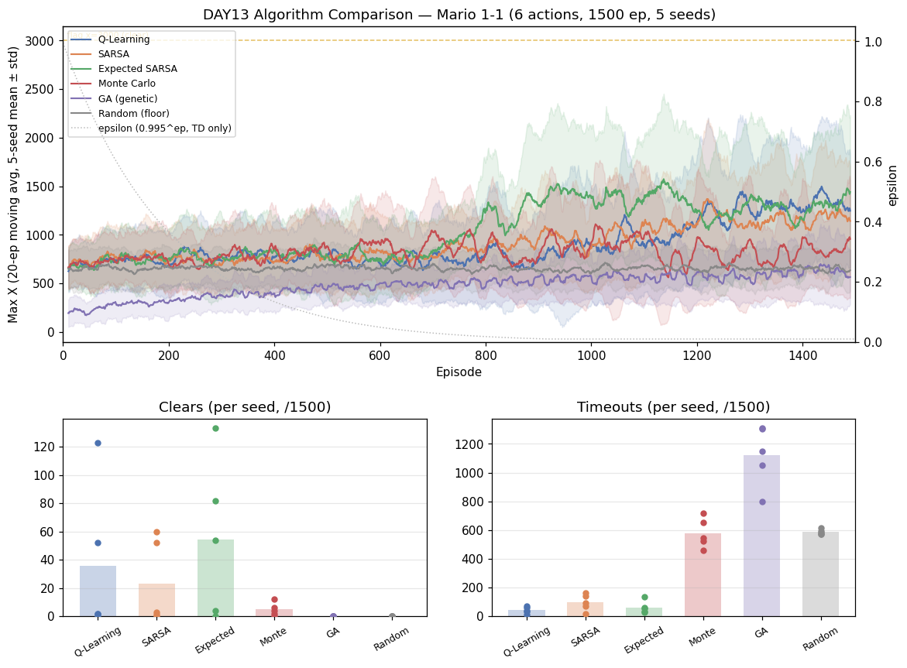

# [DAY13] 다른 두뇌 — 유전 알고리즘 GA (알고리즘 비교 ④)

> 🎯 처음으로 **Q값 자체를 갱신하지 않는** 두뇌 — 진화. 정책 여러 벌(모집단)을 통째로 한 판씩 굴려 점수를 매기고, **잘한 정책을 골라 섞고 흔들어** 다음 세대를 만든다. 개체는 한 판 내내 안 바뀐다.

*가설은 실험 전에 먼저 쓴다(예측→검증).*

---

## 공통 설정

DAY10~12와 동일, 알고리즘만 교체. (고정값은 [비교 보드](./[비교]%20알고리즘%20비교%20보드.md) 참조.)

| 항목 | 값 |
|---|---|
| 상태·테이블 | 두 테이블(108+1080) — **개체(genome)의 모양도 이것** |
| 프레임 스킵 · 에피소드 · 행동 | 2 · 1500 · **6개** |
| 시드 반복 | 5회 |

> ⚠️ GA엔 α·γ·ε이 **없다** — 대신 모집단·세대·돌연변이.

---

## 🤔 왜 이 방향인가

가치 기반 두뇌는 보상 신호를 매 스텝 가치에 흘려넣었다. **진화는 그 흐름을 통째로 버린다** — 정책의 좋고 나쁨을 **한 판 적합도 숫자 하나**로만 보고, 높은 정책을 다음 세대에 더 남긴다. "왜 좋은지"는 묻지 않는다(자연선택). 같은 정책 표현·환경·예산에서 *스텝 단위 신용 할당 없이 생존 선택만으로 마리오를 얼마나 보낼 수 있나?*

## 변경
- `GeneticAlgorithm implements Brain` — 모집단=테이블 여러 벌이라 `TabularBrain` 미상속(`RandomBrain` 패턴).
  - **개체 = 두 테이블 가중치**(TD/MC와 같은 정책 표현 = 공정 비교). 행동 = 합산 argmax(ε 없음).
  - **적합도 = 그 판 보상 합.** `learn`은 reward만 누적, `endEpisode`에서 확정 → 다음 개체.
  - **진화**: 엘리트 2 + 토너먼트(3) + 균등 교배 + 돌연변이(5%, σ=0.5), 초기화 σ=0.1.
  - **예산**: 1500판 = 모집단 30 × 50세대. 세대마다 `[GA] gen=N best=… mean=…` 로그.
- `-Dmario.algo=ga`. 6행동·1500판·시드 1~5.

## 가설
- **① 본선은 TD에 밀림(MC 군)** — 한 판을 한 숫자로 평가하는데 대상은 8천 가중치, 30×50으론 빈약.
- **② 그래도 바닥선(Random 654)은 이김** — 분리 못 하면 "이 예산으론 진화 실패"가 결론.
- **③ 시드 분산 큼**(초기 모집단이 전부 난수).
- **④ 학습 곡선이 세대 단위 계단식.** ⑤ **timeout 중간~높음.**

## 결과 — 6행동·1500판·5시드

| 지표 | GA (s1~s5) |
|---|---|
| clear | 0 · 0 · 0 · 0 · 0 |
| timeout | 1151 · 1304 · 796 · 1308 · 1053 |
| 후반 Max X | 543 · 498 · 1053 · 431 · 493 |
| best | 1369 · 1138 · 2594 · 1232 · 1826 |

| 지표 | QL | SARSA | ESARSA | MC | **GA** | Random |
|---|---|---|---|---|---|---|
| clear | 35.8 | 23.2 | 54.6 | 4.8 | **0** | 0 |
| 후반 300판 평균 | 1284 | 1173 | 1268 | 823 | **603 ± 227** | 654 ± 17 |
| best | 3023 | 3023 | 3099 | 3024 | **1632 ± 536** | 2109 |
| **timeout** | 43 | 97 | 63 | 580 | **1122 ± 190** | 588 |
| dead_pit | 293 | 383 | 369 | 177 | **41** | 48 |

*(6개 알고리즘 maxX 교차검증 불일치 0판 · 기존 보드값 결정적 재현. 로그 `mario_training_logs/day10/ga/`.)*

- **챕터 최초 — 학습기가 바닥선 *아래로*.** 후반 603 < Random 654, best 1632 < Random 2109. **깃발에 한 번도 안 닿은 첫 학습기**(MC는 열세여도 best 3024로 닿았다).
- **timeout 1122 = 챕터 최고, Random의 2배** — 무학습보다도 끝을 못 낸다.
- dead_pit 41(최저) = 구덩이까지 못 가서 안 빠진 것(회피 아님). 시드 분산은 크지만(seed3 best 2594) 폭발해도 TD의 3161엔 한참 미달.

## 결론

- **① 적중(예상보다 심함)** — MC보다도 아래. **② 기각 = 핵심 결과** — [DAY10] 잣대("학습기는 바닥선보단 나아야")를 처음 통과 못 함. **⑤ 대폭 적중.**
- **왜 무학습보다 못한가 — 셋의 합작**:
  1. **결정론 정책의 덫** — ε 없는 argmax라 막히면 그 판 내내 못 빠져나옴(Random은 주사위로 탈출).
  2. **8천 파라미터 vs 30×50 예산** — 파라미터당 평가 0.2회, 초기 무작위 편향에서 못 벗어남.
  3. **적합도가 "겁쟁이"를 선택** — timeout(−50)이 사망(−100)보다 덜 아파 "안 죽고 버티되 멀리 안 가는" 정책이 살아남음 → timeout 폭증 + 거리 정체 동시 설명.
- 줄세우기: TD 셋 > MC > **GA(바닥선 아래)**. 단 **진화가 나쁜 게 아니라 이 조합에서 무너진 것.** → 다음 = **ES(DAY14)**로 "진화 자체"인지 "GA 구현"인지 가른다.
- 한 줄: **"GA = 바닥선 아래로 처음 떨어진 학습기 — (큰 파라미터 × 빈약 예산 × timeout 너그러운 적합도 × 신용할당 부재)의 합작."**
