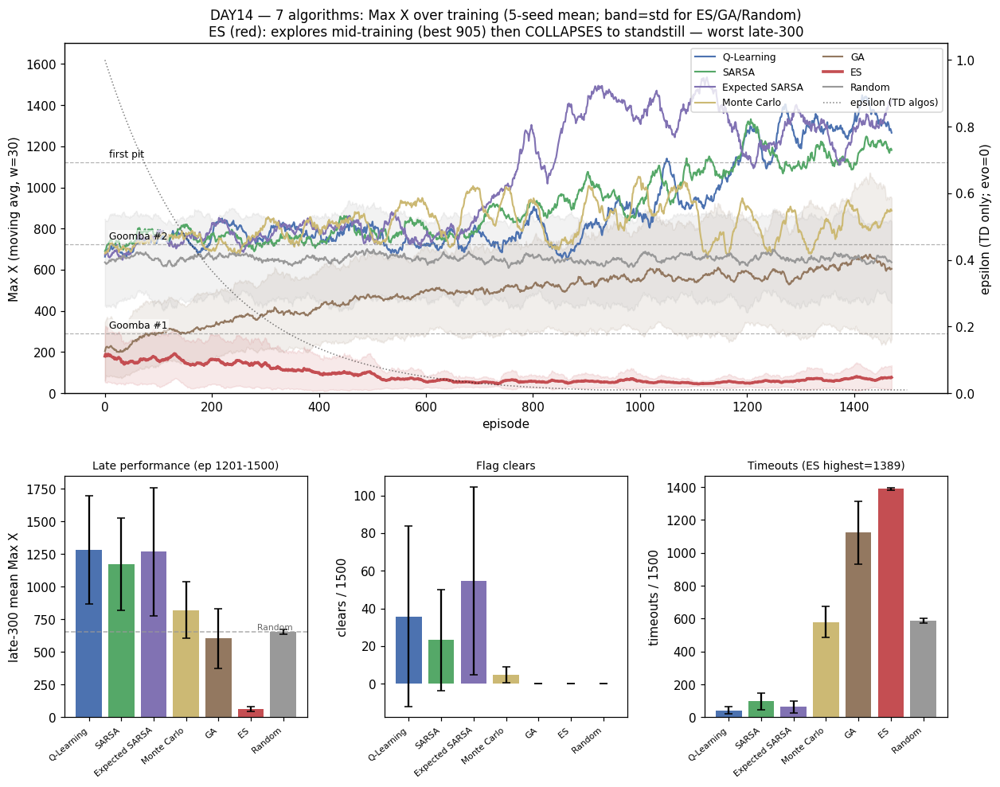

# [DAY14] 다른 두뇌 — 진화 전략 ES (알고리즘 비교 ⑤)

> 🎯 **두 번째 진화 두뇌.** GA는 여러 부모를 토너먼트로 골라 섞었지만, ES는 **부모가 단 하나** — 그 하나를 노이즈로 흔들어 "어느 방향이 좋은지"를 추정해 한 걸음씩 옮긴다.

**배경** · [DAY13] GA는 바닥선 아래로 떨어진 첫 학습기였고, 결론은 "진화가 나빠서가 아니라 조합의 합작". 그렇다면 **같은 진화 패밀리의 다른 구현은 다를까?** — ES가 그 대조군.

*가설은 실험 전에 먼저 쓴다(예측→검증).*

---

## 공통 설정

DAY10~13과 동일, 알고리즘만 교체. GA처럼 α·γ·ε 없음 — 대신 **σ(노이즈)·α(걸음)·λ(자식 수)·세대**.

| 항목 | 값 |
|---|---|
| 상태·테이블 | 두 테이블(108+1080) — 부모(θ)·자식의 모양 |
| 프레임 스킵 · 에피소드 · 행동 | 2 · 1500 · **6개** |
| 시드 반복 | 5회 |

---

## 🤔 왜 이 방향인가

점 하나(GA)로는 "진화가 원래 약한가"와 "GA 방식이 약한가"를 못 가른다. ES는 **두 번째 점**:

| | **GA**(DAY13) | **ES**(DAY14) |
|---|---|---|
| 부모 수 | 여럿(모집단 30) | **하나**(θ) |
| 다음 세대 | 토너먼트 + 교배 + 돌연변이 | 노이즈 → **적합도 가중 평균으로 부모 한 걸음** |
| 비유 | 자연선택 | 기울기 추정 |

ES는 매 세대 부모를 *방향성 있게* 옮긴다(교배는 방향이 없다) — "신용할당 없음"을 세대 단위 방향 신호로 일부 메운다.

## 변경
- `EvolutionStrategy implements Brain`(`TabularBrain` 미상속 — GA·Random 패턴). 행동 = 합산 argmax(ε 없음), 적합도 = 그 판 보상 합(GA와 동일).
- **부모 갱신 = OpenAI-ES**: 세대(자식 λ=30)를 다 굴린 뒤 적합도 정규화(평균0·표준편차1) → `θ ← θ + α/(λσ)·Σ F̂ᵢ·εᵢ`. 토너먼트·교배·엘리트 없음. σ=0.3 · α=0.05 · 부모 초기화 0. 예산 1500 = 30×50세대. `[ES] gen=…` 로그.
  - ⚠️ **σ 함정(학습 전 발견)**: σ=0.1로 돌렸더니 **2/5 시드 즉시 collapse** — 부모가 출발 상태 argmax=NOOP로 수렴하면 σ0.1로 못 뒤집어 30자식 전부 timeout(−50) → **적합도 분산 0 → 기울기 0 → 탈출 불가 고정점**(maxX=40 영구). ES 섭동 σ는 GA *초기화*(0.1)가 아니라 *돌연변이*(0.5) 역할에 가까워 **0.3**으로 보정. (이 collapse 자체가 "부모 하나 ES는 퇴화에 취약"의 증거.)
- `-Dmario.algo=es`. 6행동·1500판·시드 1~5.

## 가설
- **① GA보다 나을 것**(방향성 갱신 덕) — 1순위 관전 포인트.
- **② 본선은 TD에 밀림.** **③ 바닥선(654) 판정이 핵심** — 위면 "GA 구현 탓", 아래면 "진화 패밀리 자체가 약함" 확정.
- **④ timeout은 GA보단 낮을 것.** ⑤ 시드 분산 큼. ⑥ 학습 곡선 단조 우상향(부모의 누적 이동).

## 결과 — 6행동·1500판·5시드

> σ=0.1 1차 학습은 폐기. 아래는 σ=0.3 재학습.

| 지표 | QL | SARSA | ESARSA | MC | GA | **ES** | Random |
|---|---|---|---|---|---|---|---|
| clear | 35.8 | 23.2 | 54.6 | 4.8 | 0 | **0** | 0 |
| 후반 300판 평균 | 1284 | 1173 | 1268 | 823 | 603 | **64 ± 20** | 654 ± 17 |
| best | 3023 | 3023 | 3099 | 3024 | 1632 | **905 ± 278** | 2109 |
| **timeout** | 43 | 97 | 63 | 580 | 1122 | **1389 ± 8** | 588 |
| dead_pit | 293 | 383 | 369 | 177 | 41 | **0.2** | 48 |

ES 구간별 평균(300판 단위): 전 시드 `~155 → ~64` **단조 하락**. 교차검증 불일치 0판, 로그 `mario_training_logs/day10/es/`.

- **챕터 최하위 — 전 지표 꼴찌.** 후반 64(GA 603·Random 654보다 한참 아래)·best 905(최저)·timeout 1389(최고).
- **시간이 갈수록 *나빠지는* 유일한 두뇌** — 중반(ep300~600)엔 best 905까지 탐험했지만 부모가 "안전 timeout" 분지로 끌려가 후반엔 출발선(~50)으로 수렴. **σ=0.3은 즉시 동결을 "느린 동결"로 늦췄을 뿐.** dead_pit 0.2 = 구덩이도 거의 못 만남(사망 93%가 timeout).

## 결론

- **①·⑥ 둘 다 기각** — GA보다 전 지표 아래 + 유일한 우하향. 단일 부모의 방향성 갱신이 오히려 독: "안전 timeout" 분지에 끌리면 모집단 다양성으로 버티는 GA와 달리 통째로 빨려든다.
- **③ — ES도 바닥선 아래.** GA·ES 두 점으로 **"이 환경에선 진화 패밀리 자체가 약함" 확정.**
- **④ 예상 반대** — 1389로 최고. 진짜 범인은 σ가 아니라 **보상 지형**: timeout(−50) < 사망(−100)이라 적합도 최대화 = "안 죽고 버티기". 그 고정점에선 자식이 전부 동점이라 탈출 기울기가 없다 — σ는 빠지는 *속도*만 바꾼다.
- 줄세우기: TD 셋 > MC > Random > GA > **ES**.
- 한 줄: **"ES = 중반엔 탐험하다 후반엔 제자리로 퇴보하는 유일한 우하향 두뇌. σ는 동결을 늦출 뿐, 범인은 timeout이 사망보다 덜 아픈 보상 지형."**
