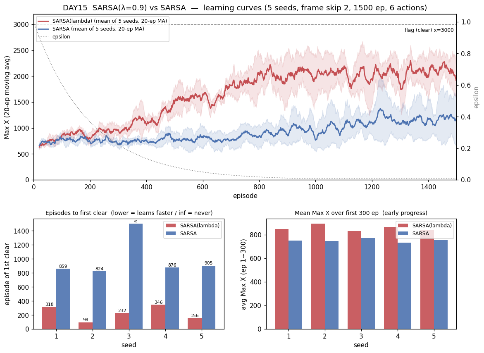
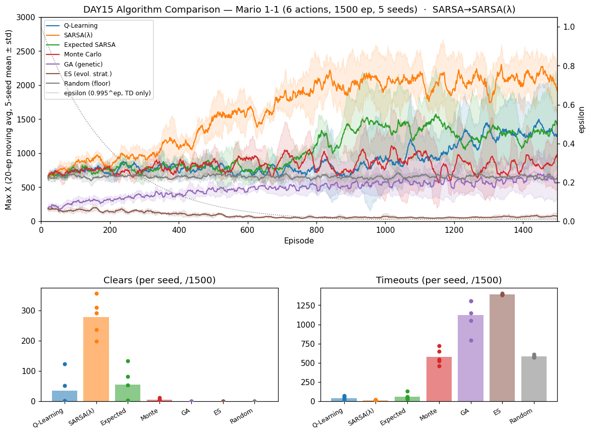

# [DAY15] 흔적을 남기다 — SARSA(λ) 적격흔적 (세로 심화 ①)

> 🎯 **새 챕터 — 두뇌 하나씩 강화(세로 심화 2막).** 알고리즘 비교 챕터(DAY10~14)에서 7개 두뇌를 *가로로* 다 깔았다(같은 환경, 다른 알고리즘). 이제 방향을 튼다 — 각 두뇌를 **교과서적 다음 버전으로 하나씩 세로로 발전**시킨다(DAY1~9가 Q-Learning을 한 변수씩 심화한 것의 재현). 첫 타자는 **SARSA → SARSA(λ)**: 가장 우아한 한 축인 **적격흔적(eligibility trace)**.

**배경** · [DAY10] SARSA는 본선(clear·거리·best)에서 QL·Expected SARSA와 **무승부**였고, 견고한 차이는 timeout뿐이었다(97±52, on-policy 우물쭈물). [DAY12] Monte Carlo는 **부트스트랩을 버려** sparse-reward 1-1에서 약했다(본선 첫 열세). 두 결과가 한 스펙트럼의 양 끝이다 — **1-step SARSA(부트스트랩 최대, 신용 전파는 한 칸씩)** ↔ **MC(부트스트랩 없음, 판이 끝나야 전파)**. 그 사이를 잇는 손잡이가 **λ**다.

*가설은 실험 전에 먼저 쓴다(예측→검증).*

---

## 공통 설정 (baseline과 고정)

DAY10~14와 동일, **알고리즘만 SARSA → SARSA(λ)로 바꾼다.** baseline = [DAY10] SARSA(같은 시드 1~5 로그 재사용).

| 항목 | 값 |
|---|---|
| 상태·테이블 | 두 테이블(공통 108 + 위치 1080), α=0.1 · γ=0.99 |
| epsilon | 1.0 → ×0.995/판 → 하한 0.01 |
| 프레임 스킵 · 에피소드 | 2 · 1500 |
| 행동 | **6개(긴 점프 OFF)** |
| 시드 반복 | 5회 — 결론용 지표는 5회 분포로 |
| **추가 손잡이** | **λ=0.9** (replacing trace), `-Dmario.lambda`로 조절 |

---

## 🤔 왜 이 방향인가 — 그리고 새 자(尺)가 필요하다

**왜 적격흔적인가.** 1-step SARSA는 한 스텝의 TD 오차를 **바로 직전 상태 하나**에만 반영한다. 1-1은 큰 보상(깃발 +1000)이 맨 뒤에 한 번뿐인 **sparse-reward**라, 그 신호가 출발선까지 스미려면 여러 에피소드에 걸쳐 한 칸씩 역전파돼야 한다(느림). 적격흔적은 **최근 밟은 상태들에 "책임 꼬리표"(trace)를 남겨** 한 번의 TD 오차를 그 꼬리표만큼 **과거로 한꺼번에 전파**한다 → 신용 할당이 빨라진다. **MC가 못 한 바로 그것**(빠른 전파)을, MC와 달리 부트스트랩은 유지한 채 한다.

**⚠️ 왜 새 지표가 필요한가(측정 주의).** 1-1에선 SARSA도 **이미 깃발을 뽑는다.** 그래서 λ를 붙여 "더 잘 배워도" 최종 clear·거리는 **본선 분산에 묻힐 공산이 크다**(DAY9·10에서 TD끼리 무승부였던 그 분산). 적격흔적의 진짜 이득은 "**더 빨리** 배운다"이므로, *최종값*이 아니라 *학습 속도*를 재는 자를 새로 든다:

| 새 지표 | 정의 | 무엇을 잡나 |
|---|---|---|
| **첫-클리어 판수** | 처음 깃발에 닿은 에피소드 번호(작을수록 빠름, 못 하면 ∞) | 신용 전파 속도의 직접 증거 |
| **학습곡선 AUC** | Max X 20판 이동평균의 전체 면적(누적 진도) | "얼마나 일찍부터 멀리 갔나" |
| **초반 N판 평균** | 앞 300판(ep 1~300) 평균 Max X | ε이 아직 높을 때의 조기 성능 |

기존 지표(clear·후반거리·best·timeout)도 그대로 보고하되, **판정은 위 세 새 지표 우선**이다.

---

## 변경
- `SARSALambda extends SARSA` 추가 — SARSA와 **부트스트랩(다음 실제 행동의 값)은 완전히 같으므로** 상속하고 `learn`·`endEpisode`만 오버라이드. `RLAgent`·소켓·프로토콜은 한 줄도 안 바뀐다.
  - **적격흔적 테이블** `eCommon[108][6]`·`eLocal[1080][6]`(가치 테이블과 같은 모양). 가치가 두 테이블 합이라 흔적도 테이블별로 따로 둔다.
  - **매 스텝**: SARSA TD 오차 `δ = r + γ·Q(s',a') − Q(s,a)` 계산 → 현재 (s,a) 흔적을 **1로 세우고(replacing)** → 활성 흔적 전체에 `Q += α/2·δ·e` 적용 후 `e ← γλ·e`로 감쇠. **에피소드 끝에 흔적 전부 0.**
  - **replacing trace**(재방문 시 +1 누적이 아니라 1로 재설정) — 반복 방문에 흔적이 폭주하지 않아 sparse-reward에서 더 안정적(Sutton 기본).
  - **효율**: 흔적이 0이 아닌 (상태,행동)만 활성 목록으로 추적해 매 스텝 전체 테이블(약 7천 칸) 스윕을 피한다(γλ=0.891이라 흔적은 ~80스텝이면 임계 아래로 꺼짐).
  - **하이퍼파라미터**: λ=0.9(강한 전파), `-Dmario.lambda`로 조절. α·γ·ε은 baseline SARSA와 동일.
- `-Dmario.algo=sarsa_lambda`(+ `Main.createBrain` 분기·`-Dmario.lambda` 파싱). 비교는 동일하게 **6행동·1500판·시드 1~5**.

## 가설
- **① 첫-클리어 판수가 SARSA보다 빠를 것(1순위).** 흔적이 깃발 보상을 앞쪽 상태로 즉시 되돌려 → 더 이른 에피소드에 첫 깃발. *적격흔적의 핵심 주장.*
- **② 본선 최종은 무승부일 것.** clear·후반거리·best는 SARSA와 분포가 겹칠 것(TD끼리 분산에 묻힘, DAY9·10 재현). → **최종값으론 판정 못 함**이 오히려 예측.
- **③ 학습곡선 AUC·초반 300판 평균이 SARSA보다 위.** "더 빨리 배운다"가 곡선 초·중반에서 드러날 것.
- **④ timeout은 SARSA(97)보다 낮을 것.** 흔적이 "끝내기(깃발·죽음)"로 이어지는 경로를 더 빨리 강화 → on-policy 우물쭈물(끝을 못 냄)이 줄 것. (단 QL 43 수준까진 아닐 수도.)
- **⑤ 시드 분산은 여전히 클 것.** 분산 출처가 목표 추정이 아니라 환경·탐험·greedy 고착이면(DAY11 결론) λ로는 안 줄 것.

## 결과 — 6행동·1500판·5시드 (SARSA baseline은 DAY10 같은 시드 재사용)

> maxX 교차검증(Java `[Episode]` ↔ Python `[Ep]`) 불일치 **0판**. 로그: `mario_training_logs/day15/sarsa_lambda/`.

**새 지표(판정 우선) — mean ± std [min~max]**

| 새 지표 | **SARSA(λ=0.9)** | SARSA (baseline) | 배율 |
|---|---|---|---|
| **첫-클리어 판수** ↓ | **230 ± 94 [98~346]** · 5/5 클리어 | 866 ± 29 [824~905] · **4/5**(seed3 미클리어) | **≈3.8배 이르게** |
| **전체 평균 Max X (AUC/N)** ↑ | **1627 ± 100 [1447~1723]** | 911 ± 108 [729~1034] | ≈1.8배 |
| **초반 300판 평균 Max X** ↑ | **856 ± 22 [830~892]** | 751 ± 13 [731~769] | +14% |

**기존 지표 — mean ± std [min~max]**

| 지표 | **SARSA(λ=0.9)** | SARSA (baseline) |
|---|---|---|
| clear | **279 ± 56 [199~357]** | 23 ± 27 [0~60] |
| 후반 300판 평균 Max X | **2079 ± 174 [1767~2260]** | 1173 ± 354 [830~1736] |
| best Max X | **3161 ± 0** (5/5 깃발) | 3023 ± 276 [2471~3161] |
| **timeout** | **17 ± 3 [13~20]** | 97 ± 52 [15~162] |
| dead_pit | 396 ± 39 | 383 ± 87 |

- **분포가 안 겹친다 — 분산 신기루가 아니다.** clear는 SARSA(λ) 최솟값 199 > SARSA 최댓값 60, 첫-클리어는 SARSA(λ) 최댓값 346 < SARSA 최솟값 824. 두 축 모두 **다섯 시드가 완전히 분리**된다. DAY9~11에서 TD끼리 늘 겹쳤던 그 분산을 **적격흔적이 정면으로 뚫었다.**
- **학습곡선(그래프 상단)**: 두 곡선은 ε이 아직 높은 ~250판까지 붙어 있다가 그 뒤 빨강(λ)이 급격히 갈라져 후반 ~2100까지 우상향. 파랑(SARSA)은 후반에야 겨우 ~1200. std 밴드도 대부분 안 겹친다.
- **timeout 1/6로 급락**(97→17). 가설 ④ 강하게 적중 — 흔적이 "끝내기(깃발·죽음)" 경로를 빨리 강화해 on-policy 특유의 "우물쭈물(끝을 못 냄)"이 거의 사라졌다.

## 결론

- **가설 ① (첫-클리어 빠름) — 강하게 적중.** 230 vs 866, **첫 깃발을 ~3.8배 일찍**. 게다가 SARSA(λ)는 **5/5 전 시드가 클리어**, SARSA는 seed3가 1500판 내내 못 함. 적격흔적의 핵심 주장(빠른 신용 전파)이 새 지표에서 그대로 드러났다.
- **가설 ② (본선 무승부) — 기각(좋은 쪽으로).** clear·후반거리·best까지 **최종값도 분포째 압도**했다. "TD 강화는 1-1 분산에 묻힐 것"이라던 사전 경계와 반대로, 효과가 워낙 커서 분산을 넘어 *최종 지표에서도* 갈렸다. → **세로 심화 챕터 첫 완승.**
- **가설 ③ (AUC·초반평균 위) — 적중.** 전체 평균 1627 vs 911, 초반 300판 856 vs 751. 새로 든 자가 "더 빨리 배운다"를 정확히 포착.
- **가설 ④ (timeout↓) — 강하게 적중.** 97→17. on-policy 우물쭈물이 λ로 해소.
- **가설 ⑤ (시드분산 여전) — 실질 기각.** std 자체는 남지만(clear ±56), **분포가 baseline과 안 겹쳐** 결론을 못 뒤집는다. 분산의 출처가 무엇이든, 적격흔적의 이득이 그보다 훨씬 크다.
- **왜 이렇게 컸나.** 1-1은 큰 보상이 맨 뒤(깃발)에 몰린 sparse-reward다. 1-step SARSA는 그 신호를 한 판에 한 칸씩만 뒤로 밀어 학습이 느렸고(DAY10), MC는 부트스트랩을 버려 약했다(DAY12). **적격흔적은 "부트스트랩은 유지 + 신용은 흔적만큼 한꺼번에 뒤로"** — 이 환경이 정확히 원하던 처방이었다. MC가 못 한 빠른 전파를, MC와 달리 부트스트랩을 지킨 채 해냈다.
- 한 줄: **"SARSA(λ)=적격흔적 한 축으로 SARSA를 분포째 압도 — 첫 깃발 3.8배 일찍(5/5 전 시드)·클리어 12배·timeout 1/6. sparse-reward 신용할당을 흔적이 정면으로 푼, 세로 심화 챕터 첫 완승."**

### 알고리즘 비교 보드에서 — plain SARSA를 SARSA(λ)로 교체

같은 실험을 [알고리즘 비교 보드](./[비교]%20알고리즘%20비교%20보드.md)의 눈으로도 본다(6행동·1500판·5시드, 같은 형식). plain SARSA 자리를 SARSA(λ)로 갈아끼우면(비교군 7개, maxX 교차검증 불일치 0):

- **SARSA(λ)(주황)가 비교군 전체의 새 최상위.** 학습곡선이 ~250판부터 홀로 치솟아 후반 ~2100 — 나머지 6개(TD 둘 ~1200·MC·GA·ES·Random)를 std 밴드째 넘어선다. Clears 패널에서 279로 다음 높은 Expected SARSA(55)의 5배, Timeouts는 17로 최저.
- DAY10~14의 결론 "**세 TD(QL·SARSA·Expected SARSA)는 본선 무승부**"는 *plain* SARSA끼리의 이야기였다. **SARSA를 λ로 강화하니 그 무승부를 깨고 홀로 위로 빠져나온다** — 세로 심화가 "가로 비교에서 분산에 묻히던 차이"를 실제로 만들어냄을 보여주는 그림. (보드 표·서사도 이 교체를 반영.)

> 다음 세로 심화 후보(CLAUDE.md): QL→Double Q-Learning(최대화 편향)·Expected SARSA→n-step/tree-backup·MC→부트스트랩 도입(n-step로 TD와 잇기)·GA/ES→진단 수정. **SARSA(λ)는 이 챕터에서 "새 지표(첫-클리어·AUC)가 TD 강화 효과를 잡아낸다"를 입증** — 이후 TD 강화도 같은 자로 잰다.
