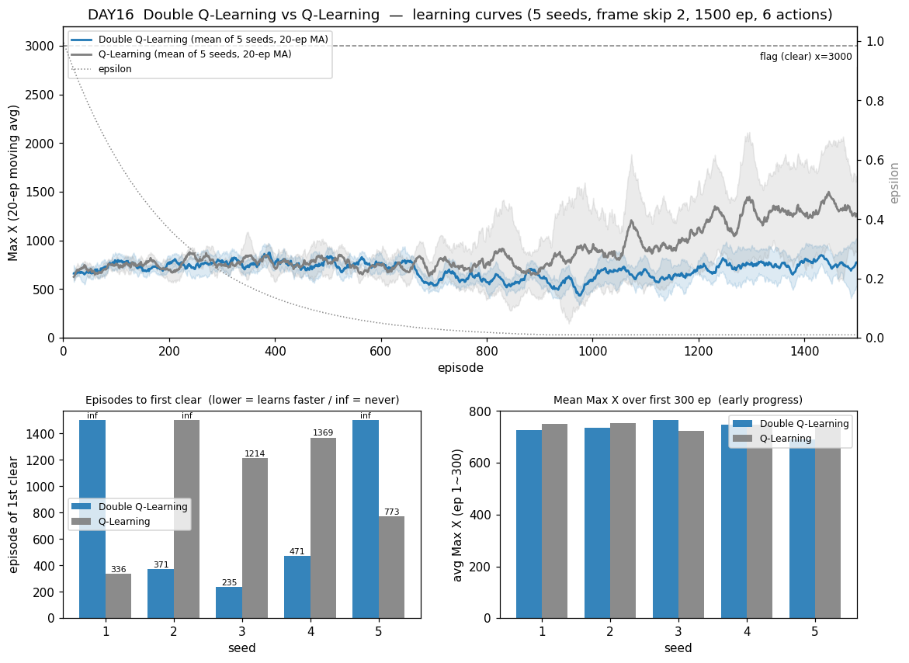

# [DAY16] 낙관 편향을 지우다 — Double Q-Learning (세로 심화 ②)

> 🎯 **기준 학습기 QL을 강화한다.** [DAY15]가 SARSA(λ)로 첫 완승을 뽑았다. 이번엔 **QL → Double Q-Learning**: QL이 태생적으로 안은 **최대화 편향(maximization bias)**을 테이블 두 벌로 걷어낸다.

**배경** · QL의 갱신 `target = r + γ·max_a Q(s',a)`에서 Q값은 잡음 섞인 추정치라, "최댓값을 고른다"는 행위 자체가 우연히 크게 나온 추정을 반복해 집어 든다 → 값이 부풀려진다. Double-Q는 **"고르는 테이블"과 "값을 읽는 테이블"을 분리**해 이 자기참조를 끊는다.

*가설은 실험 전에 먼저 쓴다(예측→검증).*

---

## 공통 설정 (baseline과 고정)

DAY10~15와 동일, 알고리즘만 QL → Double QL. baseline = [DAY10] QL(같은 시드 1~5 재사용).

| 항목 | 값 |
|---|---|
| 상태·테이블 | 두 테이블(108+1080), α=0.1 · γ=0.99 |
| epsilon | 1.0 → ×0.995/판 → 하한 0.01 |
| 프레임 스킵 · 에피소드 · 행동 | 2 · 1500 · **6개** |
| 시드 반복 | 5회 |
| **추가되는 것** | **가치 테이블 2벌(Q_A·Q_B)** — 동전으로 한 벌만 갱신, 다른 벌로 값 읽기 |

---

## 🤔 왜 이 방향인가 — 그리고 이번엔 다른 예측

`a* = argmax Q_A(s',·)`로 **고르고** 값은 `Q_B(s',a*)`에서 **읽는다** — 서로 다른 잡음이라 부풀림이 상쇄(역할은 매 스텝 동전 교대).

**⚠️ 이번엔 "묻힐 것"이 기본 예측.** Double-Q가 고치는 건 값의 크기(편향)지 신용 전파가 아니고, QL은 이미 깃발을 뽑는다(편향이 치명적 병목이 아닐 정황). 오히려 두 테이블 분할로 유효 학습 빈도가 절반이라 **초반이 느릴 수도**(SARSA(λ)와 반대 방향 예측). 판정은 [DAY15] 새 지표(첫-클리어·AUC·초반 300) 우선.

---

## 변경
- `DoubleQLearning extends TabularBrain` — 갱신이 `bootstrap` 한 줄이 아니라 "고르기/읽기 분리"라 `learn`·`selectAction` 직접 오버라이드(`bootstrap`은 미사용→예외, [DAY12] MC 패턴).
  - 가치 테이블 2벌: A=기존 `qCommon/qLocal` 재사용, B=`qCommonB/qLocalB` 추가(두 테이블 합산 구조 위라 총 4벌).
  - 매 스텝 동전(50/50): A 갱신이면 `a*=argmax Q_A(s',·)` → `target=r+γ·Q_B(s',a*)` → A에 α/2·δ. B는 대칭. greedy는 `Q_A+Q_B` 합(Sutton 표준).
  - **하이퍼파라미터 추가 없음**(α·γ·ε 동일).
- `-Dmario.algo=double_qlearning`(별칭 `double_q`). 6행동·1500판·시드 1~5.

## 가설
- **① 본선 무승부(1순위)** — 편향은 sparse-reward 병목과 다른 축이라 최종값을 크게 못 흔들 것.
- **② 초반이 빠르지 않음(어쩌면 느림)** — 한 벌씩만 갱신해 유효 학습 빈도 절반.
- **③ 시드 분산은 줄 수 있음** — 값 폭주 방지로 후반이 더 일관적.
- **④ timeout ≈ QL(43).**
- **⑤ 편향은 1-1의 병목이 아니다** — 이 실험의 값어치는 "모든 교과서적 강화가 이득은 아니다"를 같은 자로 보여주는 것(SARSA(λ)의 대조군).

## 결과 — 6행동·1500판·5시드 (QL baseline은 day10 재사용)

> maxX 교차검증 불일치 **0판**. 로그: `mario_training_logs/day16/double_qlearning/`.

**새 지표 — mean ± std [min~max]**

| 새 지표 | **Double Q-Learning** | Q-Learning | 방향 |
|---|---|---|---|
| 첫-클리어 판수 | 359 ± 97 · **3/5** | 923 ± 403 · 4/5 | 섞임(아래) |
| **AUC** ↑ | 702 ± 34 | **894 ± 159** | Double-Q ↓ |
| 초반 300판 평균 | 733 ± 24 | 742 ± 11 | 거의 무승부 |

**기존 지표**

| 지표 | **Double Q-Learning** | Q-Learning |
|---|---|---|
| clear | **1 ± 1 [0~2]** | 36 ± 48 [0~123] |
| 후반 300판 평균 | **751 ± 126** | 1284 ± 414 |
| best | 2924 ± 311 (3/5 깃발) | 3023 ± 276 (4/5) |
| timeout | 88 ± 49 | 43 ± 21 |
| dead_pit | 284 ± 33 | 293 ± 108 |

- **그래프 한 장이 말한다 — Double-Q(파랑)는 눌러앉고 QL(회색)만 올라간다.** ~ep600까지 ~700에 붙어 있다가 QL만 ~1300 우상향, Double-Q는 끝까지 ~750 평평(바닥선 654 바로 위, MC 823 아래).
- **clear 1 vs 36** — 깃발에 닿긴 해도(3/5) 반복 클리어가 없다.
- **첫-클리어는 "섞임"** — 깬 세 시드는 오히려 일찍 깼지만(235·371·471) 두 시드는 ∞. 3/5<4/5라 표본이 달라 평균 비교 무효. 지배적 신호는 후반 정체(AUC·clear).
- **timeout 43→88** — 낙관을 지운 greedy가 깃발 경로에 확신을 못 굳혀 "끝을 덜 낸다".

## 결론

- **① 기각(나쁜 쪽)** — 무승부가 아니라 분포째 진다(clear 1 vs 36·후반 751 vs 1284·AUC 702 vs 894).
- **② 적중** — 초반 무승부였다가 못 따라 올라감. "세로 심화가 늘 이득은 아님"의 실례.
- **③ 형식상 적중·무의미**(std 48→1이지만 전부 0 근처로 붕괴) · **④ 빗나감**(2배).
- **⑤ 강하게 적중, 그 이상** — 편향을 지우니 오히려 후퇴. 1-1은 큰 보상이 깃발 하나뿐인 sparse-reward라 **QL의 과대추정(낙관)이 사실은 "드문 고가치 깃발 경로로 밀어붙이는 힘"**이었다. **이 환경에선 편향이 버그가 아니라 (우연히) 기능이었다.**
- **⚠️ caveat — 편향 제거 탓인가, 학습속도 절반 탓인가.** 두 벌 분할로 유효 학습 빈도가 절반이라 이 실험만으론 미분리(가르려면 QL α/2 또는 예산 2배 대조군). 단 둘 다 같은 방향이라 헤드라인은 어느 쪽이든 선다.
- 한 줄: **"편향을 지우니 QL이 바닥선 바로 위로 주저앉음 — 낙관이 깃발로 미는 힘이었다. SARSA(λ) 완승의 완벽한 대조군: '교과서적 강화'가 늘 이득은 아니다."**

### 왜 마스터 보드엔 올리지 않았나

SARSA(λ)는 *이겨서* 자리를 교체했지만 Double-Q는 *졌으므로* [비교 보드](./[비교]%20알고리즘%20비교%20보드.md)의 QL 자리를 그대로 둔다 — **실패한 심화는 대표를 못 바꾼다.** Double-Q는 이 일지의 직접 대조로만 기록.

> 세로 심화 지금까지: **SARSA(λ) 완승**(진짜 병목=신용 전파) ↔ **Double-Q 후퇴**(병목 아닌 편향). **교훈: 강화의 방향이 실제 병목과 맞아야 이득이 난다.**
