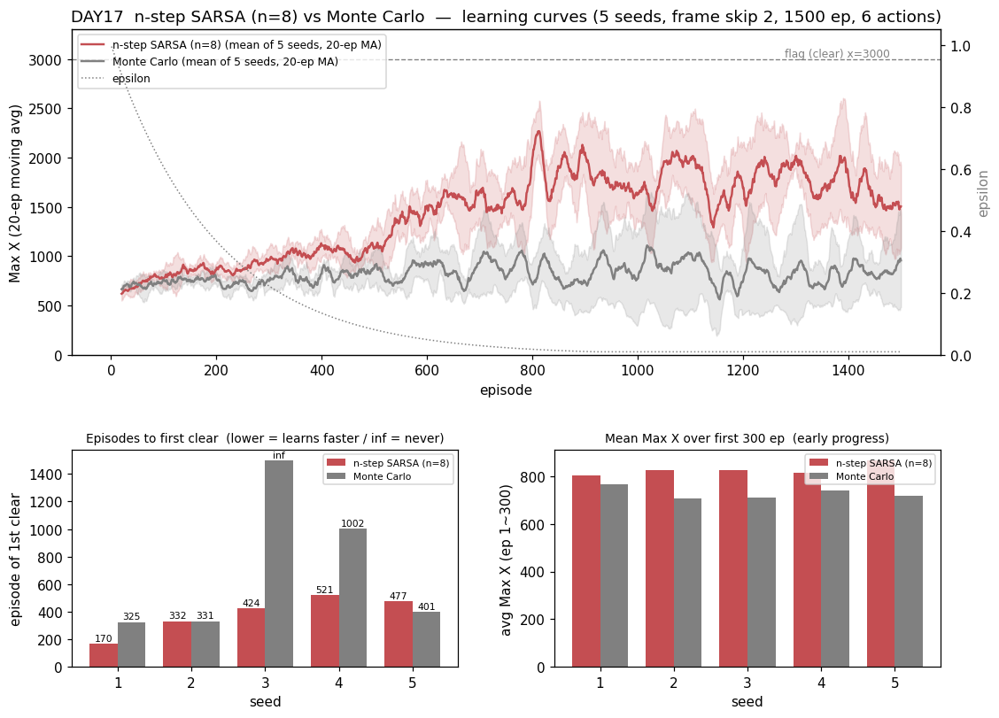
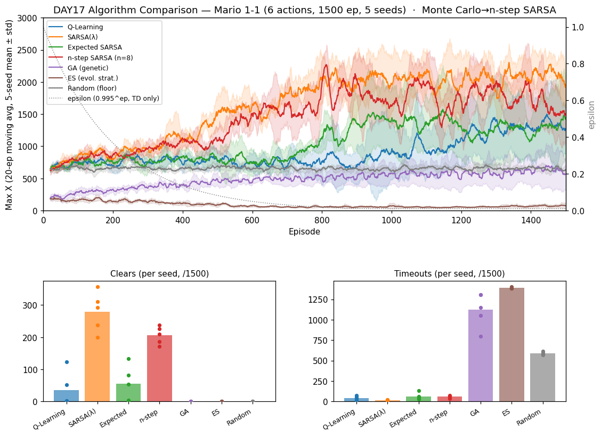

# [DAY17] 끝까지 기다리지 않는다 — n-step SARSA (세로 심화 ③)

> 🎯 **세로 심화 2막 세 번째 타자 — 이번엔 가장 약했던 학습기를 손본다.** [DAY15]는 SARSA를 λ로 강화해 완승했고, [DAY16]은 QL의 편향을 지웠다가 후퇴했다. 두 결과가 가리키는 결론은 하나였다 — **강화의 방향이 그 환경의 진짜 병목(sparse-reward 신용 전파)과 맞아야 이득이 난다.** 그렇다면 [DAY12]에서 **바로 그 병목에 정면으로 당한** Monte Carlo에, 그때 버렸던 **부트스트랩을 도로 넣으면** 어떻게 되는가. 손잡이는 **n**이다.

**배경** · [DAY12] Monte Carlo는 부트스트랩을 완전히 버리고 **판이 끝나야** 실제 return G로 배웠다. 결과는 챕터 최초의 "본선 무승부 깨짐" — clear 4.8(TD 23~55 대비 낮음)·후반거리 823(TD 1173~1284 아래)·**timeout 580 ≈ Random 588**(끝을 못 냄). 원인은 명확했다: 전진 보상(+0.1×px)조차 즉시 전파하지 못해 "끝내기"를 약하게 배웠다 = **sparse-reward 1-1에서 부트스트랩의 가치를 역설적으로 증명**한 셈. [DAY15] SARSA(λ)는 그 반대편에서 같은 진실을 말했다 — **부트스트랩은 유지하되 신용을 흔적만큼 한꺼번에 뒤로** 보내니 챕터 첫 완승. 이제 MC와 1-step TD 사이의 스펙트럼을 **n**이라는 정직한 손잡이로 직접 걸어본다.

*가설은 실험 전에 먼저 쓴다(예측→검증).*

---

## 공통 설정 (baseline과 고정)

DAY10~16과 동일, **알고리즘만 Monte Carlo → n-step SARSA로 바꾼다.** baseline = [DAY12] Monte Carlo(같은 시드 1~5 로그 재사용).

| 항목 | 값 |
|---|---|
| 상태·테이블 | 두 테이블(공통 108 + 위치 1080), α=0.1 · γ=0.99 |
| epsilon | 1.0 → ×0.995/판 → 하한 0.01 |
| 프레임 스킵 · 에피소드 | 2 · 1500 |
| 행동 | **6개(긴 점프 OFF)** |
| 시드 반복 | 5회 — 결론용 지표는 5회 분포로 |
| **추가 손잡이** | **n=8** (실제 보상 8칸 + 그 뒤는 부트스트랩), `-Dmario.nstep`으로 조절 |

---

## 🤔 왜 이 방향인가 — n은 MC와 TD를 잇는 유일한 손잡이

**한 식으로 보는 스펙트럼.** 세 두뇌는 사실 *같은 갱신식의 n만 다른 형제*다:

```
G = r_t + γ·r_{t+1} + … + γ^{n-1}·r_{t+n-1}  +  γ^n · Q(S_{t+n}, A_{t+n})
    └────────── 실제로 받은 보상 n개 ─────────┘     └──── 부트스트랩(추정치) ────┘

n = 1        → 1-step SARSA  (부트스트랩 최대, 신용은 한 칸씩만 뒤로)   [DAY10]
n = 8        → 이번 실험      (실제 보상 8칸 + 추정치로 잇기)
n = 에피소드  → Monte Carlo   (부트스트랩 0, 판이 끝나야 배움)          [DAY12]
```

**즉 이번 심화는 "MC에서 n을 잘라 TD 쪽으로 끌어오는" 것이다.** MC가 못 한 것(빠른 전파·끝내기 학습)을 부트스트랩으로 되찾되, 1-step보다는 **실제 보상을 8칸이나 실어** 신용 할당도 빠르게 한다. [DAY15] λ=0.9의 유효 horizon(≈1/(1−λ)=10스텝)과 대응되도록 **n=8**로 잡았다 — SARSA(λ) 완승과 직접 견줄 수 있는 자리다.

**구현 검증(추측 말고 측정).** 이 클래스가 정말 "다리"인지 학습 전에 코드로 확인했다 — 같은 (s,a,r,s',a') 시퀀스를 먹였을 때 **n=1은 SARSA와, n=∞는 Monte Carlo와 Q 테이블이 완전히 일치**(최대 오차 0.000000000000). 경계가 기존 두뇌와 비트 단위로 같으니, 중간값 n=8의 의미도 신뢰할 수 있다.

| 새 지표 | 정의 | 무엇을 잡나 |
|---|---|---|
| **첫-클리어 판수** | 처음 깃발에 닿은 에피소드 번호(작을수록 빠름, 못 하면 ∞) | 신용 전파 속도의 직접 증거 |
| **학습곡선 AUC** | 전체 1500판 평균 Max X(누적 진도) | "얼마나 일찍부터 멀리 갔나" |
| **초반 300판 평균** | 앞 300판(ep 1~300) 평균 Max X | ε이 아직 높을 때의 조기 성능 |

기존 지표(clear·후반거리·best·timeout)도 그대로 보고. **판정은 새 지표 우선.**

---

## 변경
- `NStepSARSA extends SARSA` 추가 — 부트스트랩 규칙(다음 실제 행동의 값)이 SARSA와 **완전히 같으므로** 상속하고 `learn`·`endEpisode`만 오버라이드([DAY15] `SARSALambda`와 같은 패턴). `RLAgent`·소켓·프로토콜은 한 줄도 안 바뀐다.
  - **슬라이딩 창(window)**: 최근 n스텝을 큐에 담아두고, 창이 n칸으로 차면 **가장 오래된 스텝**을 위 식(`실제 보상 n개 + γ^n·부트스트랩`)으로 갱신하며 창에서 뺀다. 스텝마다 정확히 한 번 갱신되되, **n스텝 지연**된다.
  - **에피소드 꼬리 처리**: 판이 끝나면 창에 남은 스텝들(n칸을 못 채운 마지막 구간)은 부트스트랩할 미래가 없으므로 **MC와 똑같이 역방향 실제 return으로** 마감한다. 이 꼬리가 곧 "n=∞면 MC" 동등성의 근거.
  - **효율**: `γ^0…γ^n`을 미리 캐시하고 창은 최대 n칸(=8)이라 스텝당 비용이 상수다.
  - **하이퍼파라미터**: n=8, `-Dmario.nstep`으로 조절. α·γ·ε은 baseline MC와 동일.
- `-Dmario.algo=nstep_sarsa`(+ `Main.createBrain` 분기·`-Dmario.nstep` 파싱). 비교는 동일하게 **6행동·1500판·시드 1~5**.

## 가설
- **① 본선에서 MC를 분포째 이길 것(1순위).** MC는 이 챕터에서 헤드룸이 가장 큰 학습기다(clear 4.8·후반거리 823·timeout 580). 부트스트랩 복원은 [DAY12]가 스스로 짚은 처방 그 자체이므로, **clear·후반거리·AUC 전부 MC 위**로 올라설 것. (DAY15와 달리 "분산에 묻힐" 걱정이 적다 — 약한 두뇌라 이득이 크게 보인다.)
- **② timeout이 급락할 것.** MC의 시그니처는 timeout 580(≈Random 588, "끝을 못 냄")이었다. 부트스트랩이 "끝내기(깃발·죽음)" 신호를 **즉시** 앞으로 전파하므로 SARSA(λ)(17)·TD(43~97) 수준으로 떨어질 것. **MC 심화의 가장 뚜렷한 증거가 여기서 나올 것.**
- **③ 첫-클리어 판수가 MC보다 이를 것.** MC는 깃발엔 닿았지만(best 3024, 4/5) 반복 클리어를 못 했다. n-step은 더 이른 판에 첫 깃발을 뽑고, **5/5 전 시드 클리어**도 가능할 것.
- **④ 다만 SARSA(λ)에는 못 미칠 수 있다.** n-step은 정확히 **n칸까지만** 신용을 되돌리는 반면, 적격흔적은 **모든 과거**에 지수 가중으로 신용을 뿌린다(더 부드럽고 넓다). 게다가 n-step 갱신은 n스텝 **지연**된다. 같은 horizon(8 vs ≈10)이라도 SARSA(λ)(clear 279)에 살짝 못 미치는 게 자연스러운 예측.
- **⑤ 왜 이번엔 이득을 예상하나 — DAY16과의 대비.** Double-Q는 병목이 아닌 축(값의 편향)을 건드려 후퇴했다. n-step이 건드리는 축은 **바로 그 병목(신용 전파 속도·끝내기 학습)**이며, [DAY15]가 λ로 같은 축을 밀어 완승했다. **"방향이 병목과 맞으면 이득"이라는 가설을 다른 두뇌(MC)에서 한 번 더 검증**하는 것이 이 실험의 값어치다.

## 결과 — 6행동·1500판·5시드 (MC baseline은 DAY10 같은 시드 재사용)

> maxX 교차검증(Java `[Episode]` ↔ Python `[Ep]`) 불일치 **0판**. 로그: `mario_training_logs/day17/nstep_sarsa/`.

**새 지표(판정 우선) — mean ± std [min~max]**

| 새 지표 | **n-step SARSA (n=8)** | Monte Carlo (baseline) | 방향 |
|---|---|---|---|
| **첫-클리어 판수** ↓ | **385 ± 125 [170~521]** · **5/5** | 515 ± 283 [325~1002] · 4/5 | n-step ↑(아래 설명) |
| **전체 평균 Max X (AUC/N)** ↑ | **1431 ± 40 [1392~1483]** | 819 ± 85 [692~929] | **≈1.7배** |
| **초반 300판 평균 Max X** ↑ | **828 ± 21 [803~867]** | 728 ± 23 [707~768] | +14% |

**기존 지표 — mean ± std [min~max]**

| 지표 | **n-step SARSA (n=8)** | Monte Carlo (baseline) |
|---|---|---|
| clear | **206 ± 24 [172~237]** | 5 ± 4 [0~12] |
| 후반 300판 평균 Max X | **1745 ± 151 [1538~1889]** | 823 ± 215 [491~1148] |
| best Max X | **3161 ± 0** (5/5 깃발) | 3024 ± 274 (4/5) |
| **timeout** | **59 ± 13 [37~76]** | 580 ± 93 [457~719] |
| dead_pit | 327 ± 40 | 177 ± 11 |



- **timeout 580 → 59, 10분의 1 아래.** 이 한 줄이 이번 실험의 전부다. MC의 timeout 580은 무학습 Random(588)과 **사실상 같은 수치**였다 — 즉 MC는 "끝내기"만큼은 *아무것도 못 배운* 상태였다. 부트스트랩을 8칸 넣자마자 그 병이 사라졌다.
- **clear 5 → 206(40배), 분포가 안 겹친다.** n-step 최솟값 172 > MC 최댓값 12. **5/5 전 시드가 깃발**(best 3161 ± 0)이고, MC는 seed3이 1500판 내내 한 번도 못 깼다. 분산 신기루가 아니다.
- **학습곡선(그래프 상단)**: 두 곡선은 ε이 높은 ~200판까지 붙어 있다가 빨강(n-step)만 갈라져 후반 ~1750까지 우상향한다. **회색(MC)은 ~850에서 평평** — [DAY16] Double-Q의 정체 곡선과 똑같은 모양이지만, 이번엔 그게 baseline 쪽이다.
- **dead_pit ↑(177 → 327)은 나빠진 게 아니다.** [DAY10 트라이2]에서 확인한 대로 **"멀리 갔다"는 신호**다 — 첫 구덩이가 x≈1120이라, 거기까지 못 가면 애초에 빠질 수도 없다. MC의 낮은 dead_pit은 실력이 아니라 도달 실패의 부산물이었다.
- **첫-클리어는 "이겼다"고 못 읽는다(정직하게).** 평균은 385 < 515지만, MC의 515는 **깬 4시드만의 평균**이다(seed3 = ∞ 제외). 표본이 다르므로 [DAY16]과 같은 이유로 이 지표는 판정에서 뺀다. 대신 **"5/5 전 시드가 깃발을 뽑았다"**는 사실(MC 4/5)이 같은 이야기를 더 정확하게 한다.

## 결론

- **가설 ① (본선에서 MC를 분포째 이김) — 강하게 적중.** clear 206 vs 5(40배)·AUC 1431 vs 819·후반거리 1745 vs 823. 세 축 모두 **다섯 시드가 완전히 분리**된다. [DAY12]에서 "본선 첫 열세"를 기록했던 MC가, 부트스트랩을 되찾자 상위권으로 복귀했다.
- **가설 ② (timeout 급락) — 가장 강하게 적중.** 580 → 59. MC의 시그니처였던 "끝을 못 냄"이 **부트스트랩 부재 탓**이었음을 인과적으로 확정한다. [DAY12]의 자기 진단("전진 보상을 즉시 전파 못 해 끝내기를 약하게 배움")이 처방까지 그대로 맞았다.
- **가설 ③ (첫-클리어 이름) — 부분 적중(표본 문제로 판정 보류).** 위 결과 참고. 다만 **5/5 전 시드 클리어**(MC 4/5)는 달성.
- **가설 ④ (SARSA(λ)엔 못 미침) — 적중.** 나란히 두면 clear 206 vs **279**, AUC 1431 vs **1627**, 후반거리 1745 vs **2079**, timeout 59 vs **17** — **전 지표에서 SARSA(λ)가 여전히 위**다. 같은 horizon(n=8 ↔ λ≈10스텝)인데도 흔적이 나은 이유는 예측한 그대로: 적격흔적은 **모든 과거에 지수 가중으로** 신용을 뿌리는데, n-step은 **딱 8칸만**, 그것도 **8스텝 지연**돼 갱신한다. *같은 축을 밀어도 더 부드럽고 즉각적인 쪽이 이긴다.*
- **가설 ⑤ (방향이 병목과 맞으면 이득) — 재확인.** [DAY15](SARSA→λ, 완승)·[DAY16](QL→Double-Q, 후퇴)에 이어 **세 번째 데이터점**. 세 실험을 겹쳐 보면 규칙이 선명하다 — **신용 전파를 건드린 둘(λ·n-step)은 이겼고, 값의 편향을 건드린 하나(Double-Q)는 졌다.** 1-1의 병목은 처음부터 끝까지 *"드문 보상을 얼마나 빨리 뒤로 보내느냐"* 하나였다.
- **부트스트랩의 값어치, 양방향으로 증명 완료.** [DAY12]는 부트스트랩을 **빼서** 나빠지는 걸 봤고([역설적 증명]), [DAY17]은 그것을 **도로 넣어** 좋아지는 걸 봤다(직접 증명). 같은 결론에 도달하는 두 방향의 실험이 갖춰졌다.
- 한 줄: **"n-step SARSA(n=8)=MC에 부트스트랩을 8칸만 되돌려 timeout 580→59·clear 5→206으로 부활 — 다만 SARSA(λ)엔 여전히 못 미친다(흔적이 n칸 창보다 부드럽고 즉각적). 세로 심화 2승 1패, 규칙은 하나: 신용 전파를 건드리면 이긴다."**

### 알고리즘 비교 보드에서 — Monte Carlo를 n-step SARSA로 교체

[DAY15] 규칙 그대로다 — **이긴 심화가 그 계보의 보드 대표를 교체한다**(진 심화는 [DAY16] Double-Q처럼 대표를 못 이겨 교체 없음). MC 자리를 n-step SARSA로 갈아끼우면(비교군 7개, maxX 교차검증 불일치 0):



- **n-step(빨강)이 SARSA(λ)(주황) 바로 아래 2위로 올라섰다.** MC가 앉아 있던 자리는 Random(회색) 언저리를 오르내리는 중위권이었는데, 같은 계보가 이제 **TD 3형제(QL·Expected·SARSA)를 모두 넘어선** 상위권에 있다. Clears 패널에서도 206으로 SARSA(λ)(279) 다음이고, Timeouts는 59로 TD와 같은 최저 구간에 들어왔다(MC는 580으로 GA·ES·Random과 함께 상위권이었다).
- 보드의 서사가 바뀐다: DAY12의 "**MC = 본선에서 TD에 처음 밀린 두뇌**"는 *부트스트랩을 버린* MC의 이야기였다. **n으로 그것을 되돌리자 같은 계보가 SARSA(λ) 다음가는 2위로 복귀한다** — 보드에서 부트스트랩의 값어치를 눈으로 읽는 그림.

> 세로 심화 지금까지: **SARSA(λ) 완승** · **Double-Q 후퇴** · **n-step SARSA 완승**. 남은 후보(CLAUDE.md): Expected SARSA→tree-backup·QL→Watkins Q(λ)/Dyna-Q(**QL 계보는 DAY16 실패 이후 아직 강화 성공 사례가 없다**)·GA/ES→진단 수정. **교훈: 강화의 방향이 그 환경의 실제 병목(신용 전파)과 맞아야 이득이 난다 — 이제 3개 실험이 같은 말을 한다.**
