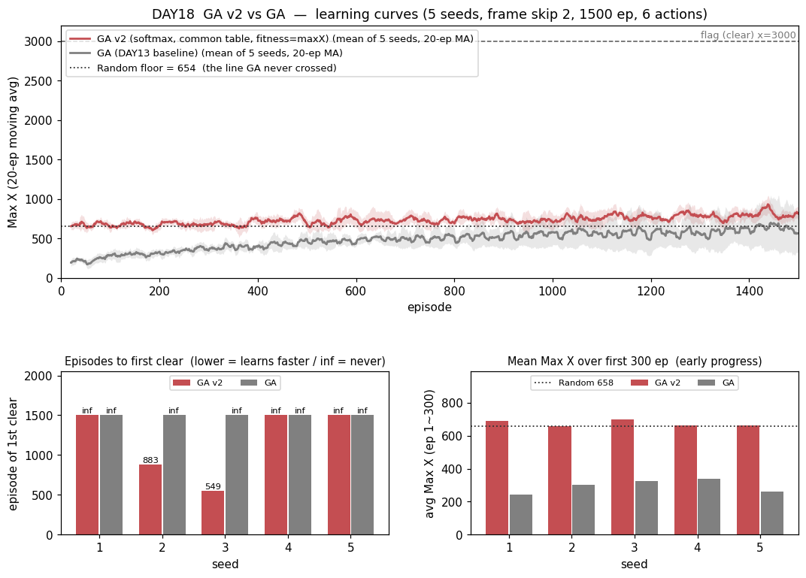
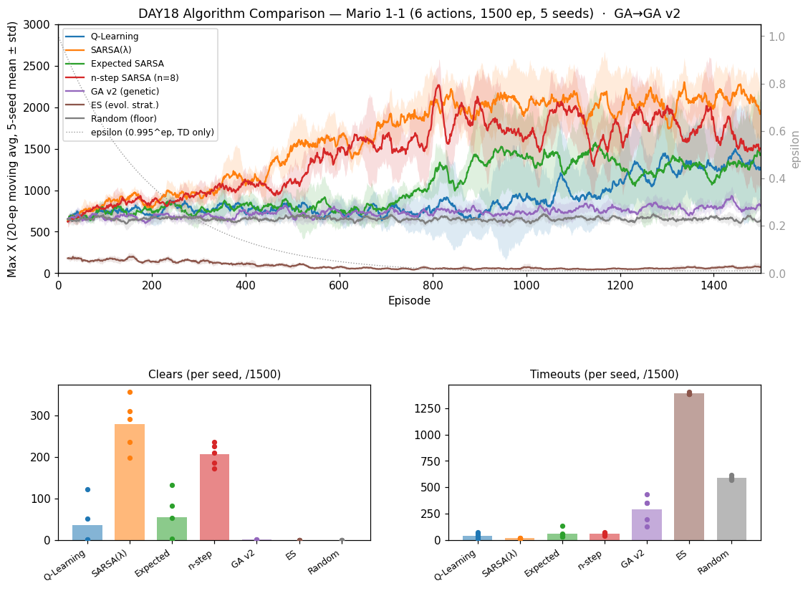

# [DAY18] 겁쟁이를 고치다 — GA v2 (세로 심화 ④)

> 🎯 **세로 심화 2막 네 번째 타자 — 이번엔 챕터에서 가장 창피했던 두뇌를 손본다.** [DAY13] GA는 **무학습 바닥선(Random)보다도 못한 유일한 학습기**였다(깃발 0 · 후반거리 603 < Random 654 · timeout 1122 = 챕터 최고). 당시 일지는 그 실패를 "진화가 나빠서"가 아니라 **이 조합(결정론 정책 · 빈약한 예산 대비 큰 파라미터 · timeout에 너그러운 적합도)의 합작**이라고 진단했다. 진단이 맞았다면, **셋을 고치면 최소한 바닥선은 넘어야 한다.** 이번 실험은 그 진단서 자체를 시험대에 올린다.

**배경** · 세로 심화 세 실험이 한 규칙을 가리켰다 — **신용 전파를 건드린 둘(λ·n-step)은 이겼고, 값의 편향을 건드린 하나(Double-Q)는 졌다.** 그런데 GA에는 애초에 "신용 전파"라는 개념이 없다. 판 전체를 스칼라 하나(적합도)로 요약해 버리기 때문이다. 그렇다면 진화에서 그 자리에 해당하는 것은 **"무엇을 적합도로 삼느냐"**다. GA가 무학습보다 못했던 건 학습 신호가 *약해서*가 아니라 **엉뚱한 걸 가리켜서**였다는 게 이번 가설의 뼈대다.

*가설은 실험 전에 먼저 쓴다(예측→검증).*

---

## 공통 설정 (baseline과 고정)

DAY10~17과 동일, **알고리즘만 GA → GA v2로 바꾼다.** baseline = [DAY13] GA(같은 시드 1~5 로그 재사용).

| 항목 | 값 |
|---|---|
| 예산 | **모집단 30 × 50세대 = 1500판** (DAY13과 동일) |
| 진화 연산자 | 엘리트 2 · 토너먼트 3 · 균등 교배 · 돌연변이(유전자별 5%, σ=0.5) · 초기화 σ=0.1 (**전부 DAY13과 동일**) |
| 프레임 스킵 · 에피소드 | 2 · 1500 |
| 행동 | **6개(긴 점프 OFF)** |
| 시드 반복 | 5회 — 결론용 지표는 5회 분포로 |

α·γ·ε은 GA 계열에 없다(탐험은 돌연변이와 — v2에선 — softmax가 맡는다).

---

## 🤔 왜 이 방향인가 — 진단서 셋을 그대로 처방으로

[DAY13]이 적어둔 실패 원인 셋에 **1:1로 대응하는 처방**을 낸다. 셋을 한 번에 바꾸는 건 "한 번에 하나씩" 원칙에서 벗어나지만, **진단이 "셋의 합작"이었으므로 하나씩 고치면 각각 바닥선 아래에 머물러 아무것도 배우지 못할 공산이 크다.** 먼저 "고치면 넘기긴 하나"를 한 묶음으로 답하고, **무엇이 주효했는지는 ablation으로 뒤에 가른다.**

| 진단 (DAY13) | 처방 (v2) |
|---|---|
| ⓐ **결정론 정책**(ε 없는 argmax) — 한 번 막히면 그 판 내내 같은 행동을 반복. 매 스텝 주사위를 굴리는 Random이 오히려 탈출했다. | **softmax 샘플링**(τ=1.0). 행동을 확률로 고르니 막혀도 빠져나올 여지가 생긴다. ε처럼 탐험률을 고정하지 않고 **가중치 크기 자체가 확신도**가 되므로, "얼마나 결정론적으로 굴지"를 진화가 스스로 정한다(가중치가 커질수록 argmax에 수렴). |
| ⓑ **파라미터 8,316개**(108×7 + 1080×7)를 1500 평가로 훑음 = 파라미터당 **0.18회**. | **`Q_위치`(7,560개) 제거 → `Q_공통`(756개)만 진화** = 11배 축소, 파라미터당 **2.0회**. 진화는 그래디언트가 없어 샘플 효율이 파라미터 수에 민감하다. 위치 무시 상태만으로도 정책은 표현된다 — [DAY7 트라이1]이 36칸만으로 깃발을 세 번 들었다. |
| ⓒ **적합도 = 보상 합**인데 timeout(−50)이 사망(−100)보다 덜 아파서, 진화가 **"안 죽고 버티되 멀리 안 가는 겁쟁이"**를 골랐다. | **적합도 = 그 판 도달 거리(maxX)**. 버티기는 점수를 못 준다 — 오직 멀리 간 개체만 살아남는다. 깃발은 maxX 최대라 자동으로 최고점. |

**측정 지표는 [DAY15]에서 도입한 자를 그대로 쓴다**(첫-클리어 판수 · 학습곡선 AUC · 초반 300판 평균) + 기존 지표(clear · 후반거리 · best · timeout). 단 GA는 TD와 달리 헤드룸이 크므로 **최종값(후반거리·바닥선 통과 여부)도 그대로 유효**하다.

---

## 변경
- `GeneticAlgorithmV2 implements Brain` 추가 — [DAY13] `GeneticAlgorithm`은 baseline으로 **그대로 남긴다**(비교군). 모집단 = 테이블 여러 벌이라 `TabularBrain`을 상속하지 않는 건 동일([DAY13]·`RandomBrain` 패턴).
  - **ⓐ softmax 정책**: `selectAction`이 `Q_공통` 값을 로짓으로 보고 확률 샘플링(오버플로 방지로 최댓값 차감). τ=1.0 고정 — 하이퍼파라미터를 늘리지 않는다.
  - **ⓑ 단일 테이블**: genome = `qCommon[108][7]` 하나(756 가중치). 교배·돌연변이·엘리트 복사 모두 이 한 벌에만.
  - **ⓒ 적합도 = maxX**: `learn`은 **보상을 아예 보지 않는다**(빈 구현). 대신 `Brain`에 **`default void observeEpisodeOutcome(int maxX)`**를 추가하고 `RLAgent`가 `endEpisode` 직전에 호출 — GA v2만 오버라이드해 적합도로 쓰고, 나머지 두뇌는 no-op이라 한 줄도 안 바뀐다(`learn`이 받는 건 상태 *인덱스*와 보상뿐이라 도달 거리를 알 수 없어 통로가 필요했다).
  - 세대 통계는 `[GAv2] gen=N best=… mean=… (fitness=maxX)` 로그.
- `-Dmario.algo=ga_v2`(별칭 `genetic_v2`) + `Main.createBrain` 분기. 비교는 동일하게 **6행동·1500판·시드 1~5**.

---

## 가설

① **바닥선 탈환** — 후반거리가 Random(654)을 넘는다. [DAY13]의 가장 뼈아픈 실패("학습기가 무학습보다 못함")가 *진화의 본질* 때문이 아니라 *구현 조합* 때문이었다면, 셋을 고친 v2는 최소한 654는 넘어야 한다. **이 실험의 본선.**

② **timeout 급락** — 1122(75%)에서 대폭 떨어진다. 처방ⓐ(softmax)가 "막혀서 그 판 내내 제자리" 구조를 직접 없애기 때문. [DAY17]에서 n-step이 MC의 timeout 시그니처(580)를 59로 지운 것과 같은 종류의 변화를 기대한다.

③ **깃발에 닿는다** — [DAY13]은 best 1632로 깃발(3000) 근처도 못 갔다. v2는 best가 크게 오르고, **clear > 0**도 가능하다(단 5시드 전부는 기대하지 않는다).

④ **그래도 TD 3형제에는 못 미친다** — 진화는 판 전체를 스칼라 하나로 요약해 **어느 행동이 좋았는지에 대한 신용 할당이 없다.** 세로 심화의 승자들(SARSA(λ) clear 279 · n-step 206)은 바로 그 신용 전파를 강화해서 이겼다. v2가 고치는 건 "신호가 엉뚱한 걸 가리키던 문제"지 "신호가 거칠다는 문제"가 아니므로, MC(clear 5) 언저리~그 이상은 몰라도 TD 상위권은 무리로 본다.

⑤ **초반부터 다르다** — 적합도가 maxX라 진화가 1세대부터 "멀리 간 개체"를 고른다. 초반 300판 평균이 [DAY13]보다 위일 것.

**⚠️ caveat (미리 적어둔다)**: 처방 셋을 한꺼번에 넣었으므로, **효과가 나더라도 ⓐ·ⓑ·ⓒ 중 무엇이 주효했는지는 이 실험만으로 가를 수 없다.** 결과가 좋으면 다음 실험에서 하나씩 되돌리는 ablation으로 분해한다(가장 유력한 단독 후보는 ⓒ 적합도 — 진단이 가장 직접적이었다).

---

## 결과 — 6행동·1500판·5시드 (GA baseline은 DAY10 같은 시드 재사용)

> maxX 교차검증(Java `[Episode]` ↔ Python `[Ep]`) 불일치 **0판**. 로그: `mario_training_logs/day18/ga_v2/`.

**새 지표(판정 우선) — mean ± std [min~max]**

| 새 지표 | **GA v2** | GA (baseline, DAY13) | 참고: Random(바닥선) |
|---|---|---|---|
| **첫-클리어 판수** ↓ | **716 ± 167 [549~883]** · **2/5** | **∞ (0/5 — 깃발 0)** | ∞ (0/5) |
| **전체 평균 Max X (AUC/N)** ↑ | **733 ± 37 [681~775]** | 479 ± 113 [402~703] | 655 ± 4 [648~661] |
| **초반 300판 평균 Max X** ↑ | **675 ± 17 [656~699]** | 294 ± 36 [244~339] | 658 ± 16 |

> ⚠️ GA는 clear 0이라 첫-클리어가 ∞ — [DAY16]·[DAY17]처럼 표본이 달라 *수치 비교*는 못 한다. **이 칸의 결론은 "v2가 깃발을 뽑았다(2/5), GA는 한 번도 못 뽑았다(0/5)"는 사실 자체다.**

**기존 지표 — mean ± std [min~max]** *(GA는 헤드룸이 커서 최종값도 그대로 유효)*

| 지표 | **GA v2** | GA (baseline, DAY13) | Random (바닥선, DAY10) |
|---|---|---|---|
| clear | **0.8 ± 1.0 [0~2]** (2/5 시드) | **0 ± 0** (전 시드 깃발 0) | 0 |
| **후반 300판 평균 Max X** | **791 ± 38 [731~839]** | **603 ± 227 [431~1053]** | **654 ± 17 [624~667]** ← 넘어야 할 선 |
| best Max X | **2626 ± 489 [1868~3161]** (2/5 깃발) | 1632 ± 536 [1138~2594] | 2109 ± 275 |
| **timeout** | **292 ± 112 [129~436]** | **1122 ± 190** (챕터 최고) | 588 ± 15 |
| dead_pit | **234 ± 92** | 41 ± 53 | 48 |



- **바닥선을 넘었다 — 그것도 분포째.** 후반거리 **791**(v2 최솟값 **731** > Random 최댓값 **667**)·AUC **733**(최솟값 681 > Random 최댓값 661). **다섯 시드가 Random과 한 점도 겹치지 않는다.** [DAY13]에서 "학습기가 무학습보다 못하다"던 창피한 자리는 **진화의 본질이 아니라 구현 조합** 탓이었음이 확정됐다. 진단서가 맞았다.
- **timeout 1122 → 292 (4분의 1).** Random(588)보다도 **낮다**. [DAY13] GA의 시그니처(전체 판의 75%를 제자리에서 시간 초과)가 사라졌다 — 처방ⓐ(softmax)의 직접적 증거다. 확률 정책은 막혀도 다음 주사위에서 빠져나온다.
- **깃발을 들었다.** best **3161**(만점)을 seed2·seed3이 찍었고, 두 시드가 각각 2번씩 클리어했다. [DAY13] GA는 best 1632로 **깃발 근처도 못 갔다**(구덩이 x1120을 겨우 넘는 수준). 클리어 판의 Python 로그를 보면 `pitclears=3` — 구덩이 셋을 다 넘었다.
- **dead_pit 41 → 234는 나빠진 게 아니라 "멀리 갔다"는 신호**다([DAY10]·[DAY17]에서 확립). 첫 구덩이가 x≈1120이라, 거기까지 못 가면 빠질 수도 없다. GA의 낮은 dead_pit(41)은 실력이 아니라 **도달 실패의 부산물**이었다.
- **세대 곡선은 우상향**(`[GAv2] gen=…`): 세대 평균 적합도가 **638 → 820~880**으로 올라간다. [DAY14] ES가 유일하게 *우하향*(퇴보)했던 것과 정반대 — **진화가 실제로 진화하고 있다.**

### ⚠️ 뜻밖의 관찰 — 확률 정책의 대가: 적합도가 노이즈가 된다

세대 best를 이어 보면 이상한 게 보인다(seed3):

```
gen=17 best=2227    gen=18 best=1416    gen=19 best=3161  ← 깃발!(ep549)
gen=20 best=1425    gen=21 best=1420    gen=22 best=1431  ← 도로 떨어짐
```

**깃발을 든 개체를 엘리트로 그대로 다음 세대에 복사했는데도, 그 개체가 다시는 3161을 못 낸다.** 이유는 처방ⓐ 자체에 있다 — **softmax는 확률 정책이라 같은 genome도 매 판 다른 궤적을 낸다.** 적합도는 **단 한 판의 표본**이므로, 3161은 "이 개체가 강해서"가 아니라 **"이 개체가 그 판에 운이 좋아서"**일 수 있다. 그 결과:

- 엘리트 보존이 *잘하는 개체*가 아니라 **운 좋았던 판**을 보존한다.
- 토너먼트 선택도 실력이 아니라 **운을 뽑는다**(선택압이 노이즈에 희석된다).
- 세대 best는 ~1420에 고착돼 보이는데, 이건 "전형적인 개체가 x1420에서 막힌다"는 뜻이고 3161은 가끔 터지는 운이다.

**처방ⓐ가 timeout을 고친 대가로 적합도에 분산을 얹은 것** — 이게 GA v2가 바닥선은 넘고도 TD 근처엔 못 간 유력한 이유이고, **다음 심화(GA v3)의 1순위 후보**다: **적합도를 여러 판 평균으로**(예: 개체당 3판 → 노이즈 1/√3). 다만 예산이 3배 드니 모집단·세대를 줄여야 하는 교환이다.

---

## 결론

- **가설 ① (바닥선 탈환) — 적중. 이 실험의 본선이자 DAY18의 결론.** 후반거리 791·AUC 733으로 **Random(654·655)을 분포째** 넘었다(다섯 시드 전부, 겹침 0). **진화 계보가 [DAY13] 이후 처음으로 "학습기다운" 자리로 돌아왔다.**
- **가설 ② (timeout 급락) — 강하게 적중.** 1122 → **292**(4분의 1, Random보다도 낮음). "막히면 그 판 내내 제자리"라는 결정론 정책의 병이 softmax로 구조적으로 사라졌다.
- **가설 ③ (깃발 도달) — 적중.** best 1632 → **3161**(만점), clear 0 → **2/5 시드**. "5시드 전부는 기대하지 않는다"던 예측까지 그대로 맞았다.
- **가설 ④ (TD 3형제엔 못 미침) — 적중.** clear **0.8** vs SARSA(λ) 279 · n-step 206 · ESARSA 55 · QL 36. 후반거리 **791** vs TD 1268~2079. **MC(823)에도 근소하게 못 미친다.** 예측한 이유 그대로다 — 진화는 판 전체를 **스칼라 하나**로 요약해 *어느 행동이 좋았는지*에 대한 신용 할당이 없다. v2가 고친 건 "신호가 엉뚱한 걸 가리키던 문제"였지 **"신호가 거칠다는 문제"가 아니다.**
- **가설 ⑤ (초반부터 다름) — 적중.** 초반 300판 평균 **675** vs GA **294**(2.3배). 적합도가 maxX라 **1세대부터** "멀리 간 개체"를 고른다 — 그래프에서 빨강(v2)은 시작부터 회색(Random) 선 위에 있고, 보라(GA)는 200 언저리에서 기어올라온다.
- **세로 심화 규칙, 네 번째 데이터점.** [DAY15] λ(승) · [DAY16] Double-Q(패) · [DAY17] n-step(승) · [DAY18] GA v2(승). **"강화의 방향이 그 환경의 실제 병목과 맞아야 이득"**이 또 확인됐다 — 다만 GA의 병목은 TD와 달랐다. TD의 병목이 *신용 전파 속도*였다면, **GA의 병목은 "적합도가 엉뚱한 걸 가리킴(버티기 보상)" + "막히면 못 빠져나옴"**이었고, 거기에 맞춘 처방이 정확히 그만큼 돌려줬다.
- **⚠️ caveat는 그대로 유효하다.** 처방 셋(ⓐ softmax · ⓑ 테이블 축소 · ⓒ 적합도=maxX)을 한꺼번에 넣었으므로 **무엇이 주효했는지는 이 실험만으로 못 가른다.** 다만 위 "뜻밖의 관찰"에서 ⓐ가 **timeout을 고치면서 동시에 적합도에 분산을 얹었다**는 증거가 나왔으므로, ablation을 하면 ⓐ의 양면성이 첫 표적이다.
- 한 줄: **"GA v2 = 진단서 셋을 고치니 진화도 바닥선을 넘고 깃발을 든다(timeout 1122→292 · best 1632→3161 · Random 분포째 상회) — 그러나 TD 근처엔 못 온다. 진화의 진짜 천장은 신용 할당의 부재이고, 확률 정책은 그 위에 적합도 노이즈까지 얹는다."**

### 알고리즘 비교 보드 — GA를 GA v2로 교체

[DAY15]·[DAY17]과 같은 규칙: **이긴 심화가 그 계보의 보드 대표를 교체한다**(진 심화는 [DAY16] Double-Q처럼 교체 없이 일지에만 남는다). GA v2는 baseline GA를 **전 지표에서** 이겼으므로 보드의 GA 행을 갈아끼운다(비교군 7개, maxX 교차검증 불일치 0):



- **보라(GA v2)가 회색(Random) 위에 올라앉았다.** [DAY13]까지 이 색은 **바닥선 아래**를 기던 유일한 학습기였다. 이제 Random 바로 위에서 우상향한다.
- 하지만 **TD 4형제와의 간격은 여전히 크다**(후반 791 vs 1268~2079). 그림이 말하는 바가 이 챕터의 요약이다 — **진화는 "고칠 수 있다". 다만 고쳐도 가치 기반 TD의 신용 전파를 이기진 못한다.**
- **Timeouts 패널이 가장 극적이다.** [DAY13]의 GA는 1122로 ES(1389) 다음으로 높았는데, GA v2는 **292로 Random(588)보다도 아래**, TD 무리(17~63) 쪽으로 내려왔다. 진화 두뇌가 이 구간에 들어온 건 처음이다.

> 세로 심화 지금까지: **SARSA(λ) 완승 · Double-Q 후퇴 · n-step SARSA 완승 · GA v2 완승(3승 1패).** 남은 후보: **GA v3(적합도 다판 평균 = 노이즈 제거)** · ES 진단 수정(보상지형·σ 스케줄) · Expected SARSA→tree-backup · QL→Watkins Q(λ)/Dyna-Q(**QL 계보는 [DAY16] 이후 아직 강화 성공 사례가 없다**).
