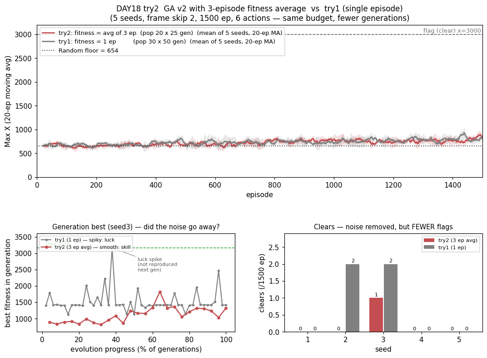

# [DAY18] 겁쟁이를 고치다 — GA v2 (세로 심화 ④)

> 🎯 **챕터에서 가장 창피했던 두뇌를 손본다.** [DAY13] GA는 **무학습 바닥선(Random)보다도 못한 유일한 학습기**였다(깃발 0 · 후반거리 603 < Random 654 · timeout 1122). 당시 진단은 "진화가 나빠서"가 아니라 **조합(결정론 정책 · 큰 파라미터 · timeout에 너그러운 적합도)의 합작**. 진단이 맞았다면 셋을 고치면 바닥선은 넘어야 한다 — **진단서 자체를 시험대에 올린다.**

**배경** · GA에는 "신용 전파"가 없다(판 전체를 스칼라 하나로 요약). 진화에서 그 자리는 **"무엇을 적합도로 삼느냐"** — GA가 무학습보다 못했던 건 학습 신호가 약해서가 아니라 **엉뚱한 걸 가리켜서**라는 게 이번 가설의 뼈대다.

*가설은 실험 전에 먼저 쓴다(예측→검증).*

---

## 공통 설정 (baseline과 고정)

DAY10~17과 동일, 알고리즘만 GA → GA v2. baseline = [DAY13] GA(같은 시드 1~5 재사용).

| 항목 | 값 |
|---|---|
| 예산 | **모집단 30 × 50세대 = 1500판** (DAY13과 동일) |
| 진화 연산자 | 엘리트 2 · 토너먼트 3 · 균등 교배 · 돌연변이(5%, σ=0.5) · 초기화 σ=0.1 (**전부 DAY13과 동일**) |
| 프레임 스킵 · 에피소드 · 행동 | 2 · 1500 · **6개** |
| 시드 반복 | 5회 — 결론은 분포로 |

---

## 트라이1 — 진단서 셋을 그대로 처방으로

### 🤔 왜 이 방향인가

셋을 한 번에 바꾸는 건 "한 번에 하나씩" 원칙 위반이지만, 진단이 "셋의 합작"이라 하나씩 고치면 각각 바닥선 아래에 머물 공산이 크다. 먼저 "고치면 넘나"를 답하고, 무엇이 주효했는지는 ablation으로 뒤에 가른다.

| 진단 (DAY13) | 처방 (v2) |
|---|---|
| ⓐ **결정론 정책** — 막히면 그 판 내내 반복(Random은 주사위로 탈출) | **softmax 샘플링**(τ=1.0). 가중치 크기가 곧 확신도 — "얼마나 결정론적으로 굴지"를 진화가 스스로 정함 |
| ⓑ 파라미터 8,316개 / 1500평가 = 파라미터당 **0.18회** | **`Q_공통`(756)만 진화** = 11배 축소, 파라미터당 2.0회. [DAY7]이 36칸으로도 깃발을 들었다 |
| ⓒ **적합도=보상합** — timeout(−50) < 사망(−100)이라 "버티는 겁쟁이"가 선택됨 | **적합도 = 그 판 maxX**. 멀리 간 개체만 살아남는다 |

측정은 [DAY15] 새 지표(첫-클리어·AUC·초반 300) + 기존 지표. GA는 헤드룸이 커서 최종값도 유효.

### 변경
- `GeneticAlgorithmV2 implements Brain` 추가(GA는 baseline으로 유지). ⓐ softmax 샘플링(τ=1.0) ⓑ genome=`qCommon[108][7]` 하나 ⓒ `learn`은 보상을 안 보고, **`Brain`에 `default void observeEpisodeOutcome(int maxX)` 추가** — `RLAgent`가 `endEpisode` 직전 호출, GA v2만 오버라이드(나머지 no-op).
- 세대 로그 `[GAv2] gen=N best=… mean=…`. `-Dmario.algo=ga_v2`(별칭 `genetic_v2`). 6행동·1500판·시드 1~5.

### 가설
- **① 바닥선 탈환(본선)** — 후반거리가 Random(654)을 넘는다.
- **② timeout 급락** — 1122에서 대폭↓ (softmax가 "막힘" 구조를 직접 제거).
- **③ 깃발에 닿는다** — best↑, clear > 0 가능(5시드 전부는 기대 안 함).
- **④ 그래도 TD엔 못 미침** — 진화는 신용 할당이 없다. v2가 고치는 건 "신호가 엉뚱한 걸 가리킴"이지 "신호가 거침"이 아니다.
- **⑤ 초반부터 다르다** — 1세대부터 "멀리 간 개체"를 고르니 초반 300도 GA보다 위.
- **⚠️ caveat**: 셋을 한꺼번에 넣어 **무엇이 주효했는지는 못 가른다**(ablation은 뒤로).

### 결과 — 6행동·1500판·5시드

> maxX 교차검증 불일치 **0판**. 로그: `mario_training_logs/day18/ga_v2/`.

**새 지표 — mean ± std [min~max]**

| 새 지표 | **GA v2** | GA (DAY13) | Random(바닥선) |
|---|---|---|---|
| **첫-클리어 판수** ↓ | **716 ± 167 [549~883]** · **2/5** | ∞ (0/5) | ∞ (0/5) |
| **전체 평균 Max X (AUC/N)** ↑ | **733 ± 37 [681~775]** | 479 ± 113 | 655 ± 4 [648~661] |
| **초반 300판 평균** ↑ | **675 ± 17** | 294 ± 36 | 658 ± 16 |

**기존 지표**

| 지표 | **GA v2** | GA (DAY13) | Random |
|---|---|---|---|
| clear | **0.8 ± 1.0 [0~2]** (2/5 시드) | 0 | 0 |
| 후반 300판 평균 | **791 ± 38 [731~839]** | 603 ± 227 | 654 ± 17 [624~667] |
| best Max X | **2626 ± 489** (2/5 깃발 3161) | 1632 ± 536 | 2109 ± 275 |
| timeout | **292 ± 112** | 1122 ± 190 | 588 ± 15 |
| dead_pit | 234 ± 92 | 41 ± 53 | 48 |

- **바닥선을 분포째 넘었다** — 후반거리 v2 최소 **731** > Random 최대 **667**(겹침 0). [DAY13]의 실패는 진화의 본질이 아니라 구현 조합 탓이었음 확정. **진단서가 맞았다.**
- **timeout 1122 → 292** — Random(588)보다도 낮다. 처방ⓐ의 직접 증거(확률 정책은 막혀도 다음 주사위로 탈출).
- **깃발**: seed2·3이 각 2회 클리어, best 3161(만점). GA는 근처도 못 갔다(1632).
- dead_pit 41→234는 "멀리 갔다" 신호([DAY10] 해석). 세대 평균 적합도 638→880 **우상향**(ES의 우하향과 정반대).

### ⚠️ 뜻밖의 관찰 — 확률 정책의 대가: 적합도가 노이즈다

seed3 세대 best: `gen19 best=3161(깃발!) → gen20 1425 → gen21 1420` — **깃발 든 개체를 엘리트로 복사했는데 다시는 3161을 못 낸다.** softmax는 확률 정책이라 같은 genome도 매 판 다른 궤적 → **적합도가 단 한 판의 표본**. 엘리트·토너먼트가 *실력*이 아니라 **운 좋았던 판**을 뽑는다. 처방ⓐ가 timeout을 고친 대가로 적합도에 분산을 얹은 것 — **다음 트라이의 설계도.**

### 결론 — 트라이1

- **가설 ①~⑤ 전부 적중.** ①바닥선 분포째 탈환(791, 겹침 0) ②timeout 1122→292 ③깃발 2/5·best 3161 ④TD엔 못 미침(clear 0.8 vs SARSA(λ) 279·후반 791 vs TD 1268~2079, MC 823에도 근소 미달) ⑤초반 675 vs 294.
- **세로 심화 네 번째 데이터점**: λ(승)·Double-Q(패)·n-step(승)·GA v2(승). GA의 병목은 TD(신용 전파)와 달리 **"적합도가 엉뚱한 걸 가리킴 + 막힘 탈출"**이었고, 거기에 맞춘 처방이 그만큼 돌려줬다.
- 한 줄: **"진단서 셋을 고치니 진화도 바닥선을 넘고 깃발을 든다 — 그러나 TD 근처엔 못 온다. 진화의 진짜 천장은 신용 할당의 부재, 확률 정책은 그 위에 적합도 노이즈까지 얹는다."**

---

## 트라이2 — 적합도의 노이즈를 지운다 (개체당 3판 평균)

### 🤔 왜 이 방향인가

트라이1의 "뜻밖의 관찰"이 설계도다: 적합도가 1판 표본이라 진화가 운을 뽑는다 → **같은 개체를 3판 굴려 평균**(노이즈 1/√3). **⚠️ 공짜가 아니다** — 예산 고정이라 `모집단×세대×평가판수=1500`:

| | 트라이1 | **트라이2** |
|---|---|---|
| 개체당 평가 | 1판 | **3판 평균** |
| 모집단 × 세대 | 30 × **50** | 20 × **25** |

**진짜 물음 = "적합도 정확도 ↔ 진화 스텝 수, 무엇이 더 값진가."**

### 변경
- `GeneticAlgorithmV2`에 `evalsPerGenome`·`populationSize` 파라미터(`endEpisode`가 K판 모아 평균 확정). `-Dmario.ga.pop=20 -Dmario.ga.evals=3`. **미지정=30·1=트라이1과 비트 단위 동일**(회귀 검증).
- 구현 검증: pop3·evals2로 돌려 6판마다 진화 + `best=1071`(=(1419+722)/2) 손계산 일치 ✅.

### 가설
- **① 엘리트가 재현된다(1순위)** — 세대 best 톱니(3161→1425)가 사라지고 유지·완만 상승.
- **② 본선(clear·후반거리) 상승** — 단 세대 절반 손해로 상쇄될 수도(①만큼 확신 없음).
- **③ timeout 유지(≈292)** ④ 초반은 낮거나 비슷(같은 판수에 세대 1/3) — 대신 후반 역전이 그림. ⑤ TD엔 못 미침.

### 결과 — 6행동·1500판·5시드

> 교차검증 불일치 0판. 로그: `mario_training_logs/day18/ga_v2_try2/`.

| 지표 | **트라이2 (3판 평균)** | 트라이1 (1판) | GA | Random |
|---|---|---|---|---|
| **clear** | **0.2 ± 0.4** · 1/5 | **0.8 ± 1.0** · 2/5 | 0 | 0 |
| 후반 300판 평균 | 772 ± 28 | 791 ± 38 | 603 | 654 |
| AUC | 721 ± 20 | 733 ± 37 | 479 | 655 |
| 초반 300판 | 660 ± 14 | 675 ± 17 | 294 | 658 |
| best | 2333 ± 450 | 2626 ± 489 | 1632 | 2109 |
| timeout | 336 ± 101 | 292 ± 112 | 1122 | 588 |
| **세대 best 궤적** | **부드러운 우상향**(840→1300) | **톱니 + 운 스파이크** | — | — |

- **노이즈는 정말 지워졌다(① 적중)** — 운 스파이크가 사라지고 부드러운 우상향. 처방은 의도대로 작동.
- **그런데 본선은 내려갔다(② 기각)** — clear 0.8→0.2(깃발 4회→1회), 거리도 일관되게 소폭 아래(분포는 겹침 = 무승부~소폭 열세).
- ③ timeout 336 유지·④ 초반 660 적중.

### 🤔 왜 노이즈를 지웠는데 깃발을 덜 드나 — 평균은 "대박"을 벌한다

깃발은 1500판에 0~2번 나오는 드문 사건 — "평균적으로 훌륭한" 정책이 아니라 **"가끔 크게 터지는"** 정책이 낸다. 트라이1은 운 좋게 3161을 낸 개체가 엘리트로 살아남아 **다시 터질 기회**를 얻었다. 트라이2는 3161·722·698이면 적합도 1527 — 안정적 1300 개체에게 밀린다. **평균이 대박의 꼬리를 눌러** 진화가 안전하고 평범한 정책으로 수렴. ⚠️ 세대 절반 손해와 **미분리**(가르려면 예산 3배 대조군) — 단 둘 다 같은 방향이고, clear 감소는 평균화로만 깔끔히 설명된다(세대 감소는 *깃발만* 골라 줄일 이유가 없다).

### 결론 — 트라이2

- ① 톱니 소멸 **적중** · ② 본선 상승 **기각** · ③④⑤ 적중.
- **핵심 — "통계적으로 옳은 처방"이 이 환경에선 손해.** 적합도의 분산은 잡음이자 **드문 대박을 발견·보존하는 통로**였다. **[DAY16] Double-Q와 같은 구조** — sparse-reward에선 낙관·분산·운이 버그가 아니라 기능.
- 한 줄: **"노이즈는 지웠지만 깃발은 덜 든다(4→1회) — 평균이 대박의 꼬리를 눌렀다."**

---

## DAY18 종합

| | 처방 | 결과 |
|---|---|---|
| **트라이1** | softmax(확률성 **추가**) · 파라미터 11배↓ · 적합도=maxX | **완승** — 바닥선 분포째 탈환 · timeout 1122→292 · 깃발 4회 |
| **트라이2** | 적합도 3판 평균(확률성 **제거**) | **소폭 후퇴** — 노이즈는 지웠으나 clear 4→1회 |

- [DAY13] 진단서가 옳았다 — 진화도 바닥선을 넘고 깃발을 든다. **그러나 천장은 여전히 신용 할당의 부재**(791 vs TD 1268~2079). 정확한 스칼라 하나도 여전히 스칼라 하나다.
- **sparse-reward에서 분산은 자원이다** — 확률성을 *넣어* 이기고(막힘 탈출), *빼서* 졌다(대박 꼬리 소실). *진단이 옳아도 처방이 틀릴 수 있다.*

**다음 후보**: ⓐ 예산 3배로 트라이2 재실행(두 원인 분리) ⓑ **적합도 max/상위분위**(꼬리를 살리며 노이즈만 줄이기) ⓒ ablation ⓓ ES에 같은 처방.

### 알고리즘 비교 보드 — GA를 GA v2로 교체

[DAY15]·[DAY17] 규칙: 이긴 심화가 계보 대표를 교체. **보드의 GA v2 = 트라이1 설정**(1판·30×50) — 트라이2는 트라이1을 못 이겨 대표를 못 바꾼다(같은 규칙이 DAY 안 트라이에도 적용).

- 보라(GA v2)가 회색(Random) 위로 올라앉았고, timeout은 292로 Random(588) 아래·TD 무리(17~63) 쪽에 진입 — 진화 두뇌 최초. 단 TD 4형제와의 간격은 여전히 크다: **진화는 "고칠 수 있다". 다만 고쳐도 TD의 신용 전파를 이기진 못한다.**

> 세로 심화 지금까지: **SARSA(λ) 완승 · Double-Q 후퇴 · n-step 완승 · GA v2 완승 (3승 1패).** 남은 후보: GA 적합도 max · ES 진단 수정 · tree-backup · **QL→Watkins Q(λ)**(QL 계보는 아직 강화 성공이 없다).
