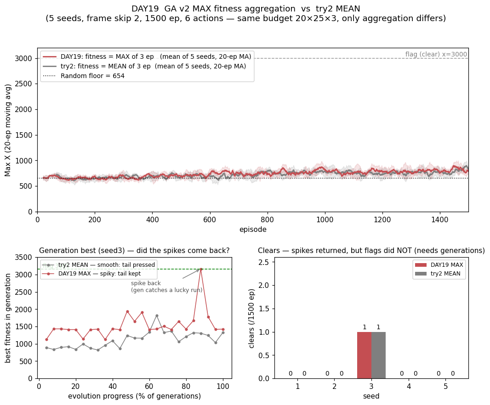
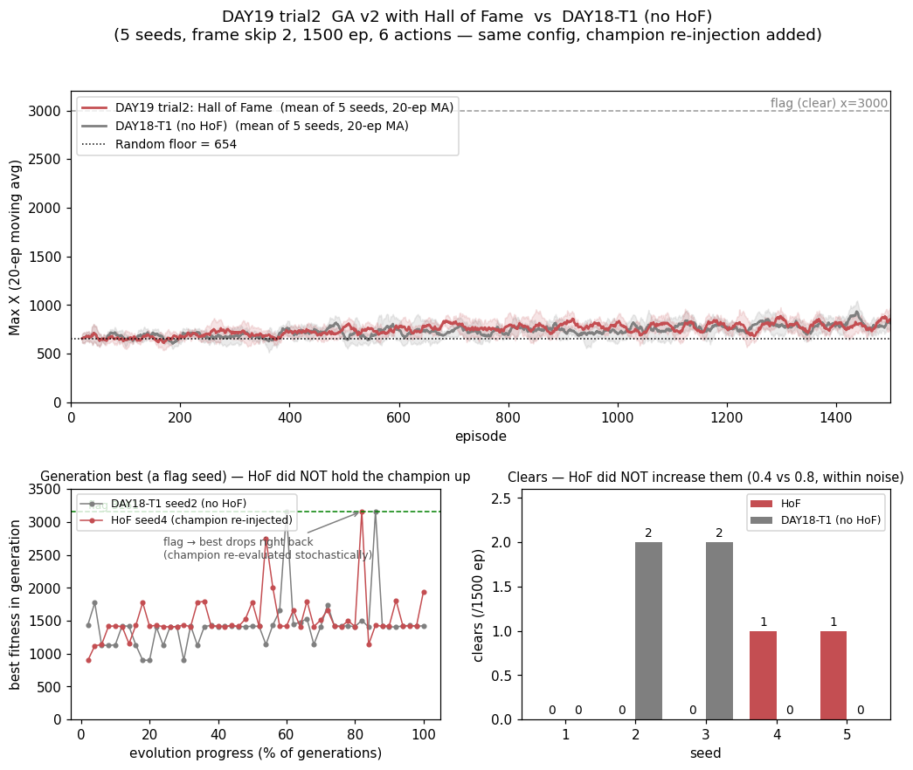

# [DAY19] 대박을 지키다 — GA v2 적합도 max 집계 (세로 심화 ⑤)

> 🎯 **[DAY18 트라이2]가 남긴 역설의 직접 처방.** 트라이2는 적합도를 **3판 평균**으로 바꿔 노이즈를 지웠다 — 그런데 **깃발이 4회→1회로 줄었다.** 깃발은 "평균적으로 훌륭한" 정책이 아니라 **"가끔 크게 터지는"** 정책이 내는데, 평균이 그 대박의 꼬리를 눌러버렸기 때문이다. DAY19는 그 교훈을 그대로 처방으로 옮긴다 — **평균 대신 max(최고 기록)로 집계**해 꼬리는 살리되, 여러 판을 줘 개체가 한 번은 잠재력을 보이게 한다.

**배경** · [DAY18] 트라이2에는 두 가지가 얽혀 있었다 — **평균화**(대박 꼬리 눌림)와 **세대 감소**(50→25). 일지의 caveat: *"둘 중 무엇이 주범인지 이 트라이만으로 못 가른다."* DAY19는 두 트라이로 이걸 닫는다:
> - **트라이1 — 집계만 max로** (예산 분할 20×25×3을 [DAY18] 트라이2와 똑같이 두고 집계만 평균→max). 세대 수(25)가 같으므로 차이는 오직 집계. max가 clear를 회복하면 범인은 평균화, 못 살리면 범인은 세대 감소.
> - **트라이2 — 명예의 전당** (예산 1500 그대로, GA 최고 구성 [DAY18] 트라이1에 *역대 최고 개체 영구 보존*만 추가). 트라이1이 "골인은 세대(로또 추첨 + 굳힐 시간)가 정한다"고 했으니, [DAY18]이 기록한 실패 — *깃발을 든 개체가 다음 세대에 사라짐* — 를 직접 고쳐 **골인을 더 자주** 낸다.

*가설은 실험 전에 먼저 쓴다(예측→검증).*

---

## 공통 설정 (baseline과 고정)

두 트라이 모두 **적합도 = maxX·집계 = max**. baseline = [DAY18] 트라이1(30×50×1 mean)·트라이2(20×25×3 mean), 같은 시드 1~5 로그 재사용. 예산 분할만 트라이별로 다르다(아래).

| 항목 | 값 |
|---|---|
| 정책·진화 연산자 | softmax(τ=1.0) · 공통표 756만 · 엘리트 2 · 토너먼트 3 · 균등 교배 · 돌연변이(5%, σ=0.5) (**전부 [DAY18]과 동일**) |
| 프레임 스킵 · 행동 · 시드 | 2 · 6개(긴 점프 OFF) · 5회 |

α·γ·ε은 GA 계열에 없다(탐험은 돌연변이와 softmax가 맡는다).

---

## 트라이1 — 대박을 지키다 (max 집계, 예산 그대로 20×25×3)

> **예산 분할: 모집단 20 × 25세대 × 3판 = 1500판** ([DAY18] 트라이2와 동일, 집계만 mean→max).

### 변경

- `GeneticAlgorithmV2`에 **적합도 집계 모드** `FitnessAggregation {MEAN, MAX}` 추가. `endEpisode`가 K판을 모아 MEAN(합/K)이나 MAX(최댓값)로 요약한다. **`evalsPerGenome=1`이면 둘이 같은 값**(단일 표본)이라 [DAY18] 트라이1과 비트 단위로 동일(회귀 안전).
- `-Dmario.ga.agg=mean|max`(미지정=mean = [DAY18] 트라이2 기본). 세대 로그도 `(fitness=maxX max of 3 ep)`로 표기.
- **구현 검증(추측 말고 측정)**: `pop=3, evals=2`에 알려진 maxX 시퀀스(개체0=100·300, 개체1=500·200, 개체2=400·400)를 먹여 — MAX는 `best=500 mean=400`, MEAN은 `best=400 mean=317`로 손계산과 정확히 일치. ✅

### 가설

① **깃발이 돌아온다 (본선 = clear 회복).** clear가 트라이2(0.2)보다 오르고 트라이1(0.8) 수준이거나 그 이상. max가 대박 꼬리를 살리므로 — **이 실험의 본선.** 단 **평균 거리(AUC·후반300)는 크게 안 오를 수 있다**: 깃발은 드문 사건이라 평균에는 거의 안 잡히고, max가 살리는 건 정확히 그 *드문 꼬리*다. **"clear는 오르는데 거리는 제자리"**면 가설이 가장 깔끔하게 맞은 것.

② **세대 best에 스파이크가 돌아온다.** 트라이2(mean)의 세대 best는 노이즈가 지워져 **부드러운 우상향**이었다. max는 트라이1(1판)처럼 **스파이크(대박)가 다시 보인다** — max가 운 좋은 판을 걸러내지 않고 오히려 붙잡기 때문.

③ **트라이2 caveat이 갈린다.** ①이 맞으면(max가 clear 회복) 트라이2 후퇴의 범인은 **"평균화"**로 확정된다(세대 수는 25로 동일하므로). ①이 틀리면(max도 후퇴) 범인은 **"세대 감소"** 쪽이다.

④ **timeout은 트라이1·2 수준(≈292~336) 유지.** timeout을 고친 건 softmax(처방ⓐ)이고 DAY19는 그걸 안 건드린다.

⑤ **그래도 TD엔 못 미친다.** 집계를 바꿔도 진화의 근본 한계(판 전체를 스칼라 하나로 요약 = 신용 할당 부재)는 그대로다.

**⚠️ 반대편 위험(미리 적어둔다)**: max는 낙관적·노이즈가 크다. 운 좋은 한 판을 실력으로 오인해 **고분산 개체가 모집단을 점령**하면, clear는 살아도 전형적 거리가 흔들릴 수 있다. 트라이2가 *너무 보수적*이었다면 max는 *너무 낙관적*일 위험 — 그 사이 어딘가가 정답일 수 있다.

---

### 결과 — 6행동·1500판·5시드

> maxX 교차검증 불일치 **0판**. 로그: `mario_training_logs/day19/ga_v2_max/`. baseline은 [DAY18] 로그 재사용.

| 지표 | **DAY19 max** | 트라이2 mean | 트라이1 (1판·50세대) |
|---|---|---|---|
| **clear** | **0.2 ± 0.4** [0~1] · 1/5 | 0.2 ± 0.4 [0~1] · 1/5 | **0.8 ± 1.0** [0~2] · 2/5 |
| 후반 300판 평균 Max X | **796 ± 19** [778~829] | 772 ± 28 [740~823] | 791 ± 38 |
| 전체 평균 Max X (AUC) | **738 ± 11** [721~751] | 721 ± 20 [690~741] | 733 ± 37 |
| 초반 300판 평균 | 662 ± 10 | 660 ± 14 | 675 ± 17 |
| best Max X | 2523 ± 405 [2005~3161] | 2333 ± 450 | 2626 ± 489 |
| **timeout** | **229 ± 27** [192~272] | 336 ± 101 | 292 ± 112 |
| dead_pit | 260 ± 19 | 201 ± 69 | 234 ± 92 |
| 첫-클리어 판수 | 1295 (1/5) | 925 (1/5) | 716 ± 167 (2/5) |
| **세대 best >1800 스파이크** | **평균 4개/25세대** | 0개/25세대 | (50세대·스파이크형) |

- **예측이 정반대로 뒤집혔다 (가설① 기각).** 나는 "max가 *깃발(꼬리)*을 살리고 *평균 거리*는 제자리"라 예측했는데, 실제는 **거리는 올랐고(AUC 721→738·후반 772→796, 게다가 std가 절반) 깃발은 그대로(clear 0.2)**였다. max는 body(전형적 거리)를 이겼고, tail(깃발)은 못 살렸다.
- **세대 best 스파이크는 정말 돌아왔다 (가설② 적중).** 그래프 하단 좌가 증거 — mean(회색)은 부드럽게 눌린 채였는데 max(빨강)는 1420 바탕에 **1941·1906·3161 스파이크**가 다시 튄다(>1800 스파이크 4개/25세대 vs mean 0개). **max는 운 좋은 판을 걸러내지 않고 오히려 fitness로 붙잡는다** — 꼬리는 확실히 살아났다.
- **그런데도 깃발은 안 돌아왔다 — 이게 핵심.** 스파이크(운)를 fitness에서 되살렸는데도 clear는 트라이2(0.2)와 똑같았다(둘 다 seed3 1회뿐, max는 그마저 ep1295로 늦음). **꼬리를 살리는 것만으로는 깃발이 안 는다.**
- **timeout이 오히려 최저 (가설④ 기각·좋은 쪽).** 229로 [DAY18] 트라이1(292)·트라이2(336)보다 낮다. max가 "한 번은 멀리 가는" 개체를 뽑으니 진화가 제자리 개체를 더 강하게 버렸다(dead_pit 260 최고 = 그만큼 구덩이까지 도달).

### 결론 — 트라이1

- **가설 ③ (caveat 갈림) — 적중, 이 실험의 수확.** 트라이2 후퇴에 얽혀 있던 "평균화 vs 세대 감소"가 갈렸다. **세대 수(25)를 트라이2와 똑같이 두고 집계만 max로 바꿨더니**: 거리·timeout은 회복됐지만(→ *집계*가 body에 영향) **clear는 회복 안 됨**(→ 깃발 감소의 범인은 *집계가 아니라 세대 감소*). 트라이1(50세대)만 clear 0.8인 건 세대가 두 배라 깃발 경로를 **더 일찍 주워 엘리트로 굳혀 반복**했기 때문 — max seed3은 gen22(ep1295)에 겨우 깃발을 처음 밟아 굳힐 세대가 안 남았다.
- **[DAY18]의 결론을 절반 정정한다.** 트라이2 일지는 후퇴를 *"평균이 대박 꼬리를 눌렀다"*로 읽었다. DAY19는 **꼬리 눌림은 사실이지만**(mean 세대 best가 부드러운 것 = 확증) **그게 clear 감소의 원인은 아니었다**고 바로잡는다 — 꼬리를 되살려도(max) clear는 그대로였으니까. **깃발은 집계가 아니라 세대(로또 추첨 횟수 + 굳힐 시간)가 정한다.**
- **그래도 max가 mean보다 낫다 (본선 body).** 같은 25세대에서 AUC·후반거리·timeout 모두 max ≥ mean이고 분산도 더 좁다. **꼬리가 걱정했던 "낙관적 노이즈로 불안정해짐"은 없었다** — 오히려 max는 트라이1(50세대)의 평균 거리를 **세대 절반으로 따라잡았다**(AUC 738≈733·후반 796≈791). 집계기로서 max가 mean보다 효율적이다.
- **가설 ⑤ (TD엔 못 미침) — 적중.** clear 0.2 vs SARSA(λ) 279·n-step 206. 진화의 천장(신용 할당 부재)은 그대로.
- **규칙②의 세밀화.** [DAY16]·[DAY18트2]에서 "sparse-reward에선 분산·운이 기능"이라 했다. DAY19가 한 겹 더 얹는다 — **운을 fitness에서 살리는 것(max)과 그 운을 깃발로 바꾸는 것(세대)은 다른 문제다.** 분산을 자원으로 쓰려면, 그 자원을 **탐색에 쓸 예산(세대)**도 함께 있어야 한다. 트라이1이 이겼던 진짜 이유는 노이즈(집계)가 아니라 세대였다.
- 한 줄: **"트라이1 max = 세대 best 스파이크(운)는 되살렸지만 깃발은 안 돌아왔다 — 깃발을 정하는 건 집계가 아니라 세대였다. 다만 집계기로선 max가 mean을 이긴다(같은 예산에 거리↑·timeout↓·분산↓)."** → **그렇다면 max에 세대를 돌려주면 깃발이 돌아와야 한다. 트라이2가 그걸 직접 시험한다.**

---

## 트라이2 — 명예의 전당 (Hall of Fame)

> **예산 분할: 모집단 30 × 50세대 × 1판 = 1500판** ([DAY18] 트라이1과 동일 — 명예의 전당 하나만 추가).

### 🤔 왜 이 방향인가 — [DAY18]이 기록한 실패를 직접 고친다

트라이1은 "골인을 정하는 건 세대(로또 추첨 횟수 + **굳힐 시간**)"라 했다. 그런데 예산 안에서 세대를 최대로 뽑은 구성은 **이미 [DAY18] 트라이1**(pop30×50세대×1판, clear 0.8)이다 — 세대를 더 늘리려면 pop이나 평가를 줄여야 하고, 그건 트라이1이 이미 "손해"임을 보였다. 그래서 예산을 늘리지 않고(1500 고정) **세대를 "굳히는" 쪽**을 손본다.

[DAY18]이 남긴 실패가 정확히 그 지점이었다:

> ⚠️ **[DAY18] 관찰**: 깃발(3161)을 든 개체를 엘리트로 보존했는데도 **다음 세대에 재현되지 않았다**(gen19 best=3161 → gen20 best=1425). softmax가 확률 정책이라 같은 genome도 매 판 다른 궤적 → 깃발을 밟은 개체가 다음 세대엔 낮은 점수를 받아 **모집단에서 사라진다.**

**명예의 전당(Hall of Fame)**은 이걸 직접 고친다 — 지금까지 나온 **역대 최고 적합도 개체(champion)를 박제해 매 세대 모집단에 강제로 재주입**한다. 그 유전자가 절대 유실되지 않고 매 세대 다시 골인을 시도한다. GA 최고 구성([DAY18] 트라이1)에 **이것 하나만** 더한 **단일 변수** 실험이다(예산·pop·세대 전부 동일).

**⚠️ 정직하게 미리 적어둔다 — "확실한 강화"는 장담 못 한다**: clear는 시드당 0~2회의 **드물고 노이즈 큰 신호**라([DAY8]·[DAY9] 교훈) 진짜 개선도 5시드 분포에 묻힐 수 있다. 또 champion은 "운 좋게 한 판 3161을 낸 개체"일 수 있어(반복 골인 개체가 아니라) 재주입해도 효과가 작을 수 있다. **실패를 정확히 겨냥하지만 성공은 열려 있다.**

### 변경

- `GeneticAlgorithmV2`에 **명예의 전당** — `champion`(역대 최고 개체 깊은 복사)을 `endEpisode`에서 갱신하고, `evolve`가 매 세대 `next[pop-1]`에 `champion.copy()`를 강제 주입. `-Dmario.ga.hof=true`(미지정=false = [DAY18]·트라이1 동작 유지, 회귀 안전). 세대 로그에 `, HoF` 표기.
- **구현 검증(추측 말고 측정)**: pop30×1로 2세대(60판) 직접 구동 — gen1 개체5에 유독 높은 maxX(3000)를 주니 champion으로 박제되고, gen2 세대 경계에서 재주입이 **크래시 없이** 돌며 로그에 `, HoF` 표기 확인. ✅
- 실행: `-Dmario.algo=ga_v2 -Dmario.ga.hof=true`(기본 pop30×1×50세대). 6행동·1500판·5시드. baseline = [DAY18] 트라이1(hof 없음) 로그 재사용.

### 가설

① **골인이 는다 (본선).** champion이 매 세대 살아남아 다시 골인을 시도하니, clear가 [DAY18] 트라이1(0.8)보다 오른다. **이 트라이의 본선** — 다만 위 caveat대로 "확실"까진 장담 못 한다.

② **세대 best의 "톱니 후 추락"이 사라진다.** [DAY18]에서 gen19 3161 → gen20 1425로 떨어지던 패턴이, champion 재주입으로 **한 번 오른 best가 유지**된다(세대 best 궤적에서 직접 보일 것).

③ **body(거리·timeout)는 [DAY18] 트라이1과 비슷.** 명예의 전당은 깃발 개체 보존을 노린 것이지 전형적 거리를 바꾸는 게 아니다 — 후반거리·AUC는 큰 변화 없을 것.

④ **그래도 TD엔 못 미친다.** 골인이 늘어도 진화의 천장(신용 할당 부재)은 그대로. clear가 올라도 SARSA(λ)(279)·n-step(206)과는 격차가 크다.

**⚠️ 반대 시나리오**: clear가 안 오르면 — champion이 "운 한 판" 개체라 재주입해도 반복 골인을 못 하거나, 재주입 하나가 pop30에서 희석되기 때문. 그러면 "골인은 개체 보존이 아니라 **정책의 확정성**(softmax τ) 문제"라는 다음 처방으로 넘어간다.

### 결과 — 6행동·1500판·5시드

> maxX 교차검증 불일치 **0판**. 로그: `mario_training_logs/day19/ga_v2_hof/`. baseline = [DAY18] 트라이1 재사용.

| 지표 | **HoF** | DAY18-T1 (no HoF) |
|---|---|---|
| **clear** | **0.4 ± 0.5** [0~1] · 2/5 (총 2회) | **0.8 ± 1.0** [0~2] · 2/5 (총 4회) |
| 후반 300판 평균 Max X | 793 ± 17 | 791 ± 38 |
| 전체 평균 Max X (AUC) | 748 ± 15 | 733 ± 37 |
| timeout | 239 ± 52 | 292 ± 112 |
| best Max X | 2552 ± 528 | 2626 ± 489 |
| 첫-클리어 판수 | 1172 (2/5) | 716 (2/5) |
| 골인 세대 | seed4=[41]·seed5=[38] (각 1회) | seed2=[30,43]·seed3=[19] (각 2회) |

- **골인이 늘지 않았다 (가설① 기각).** clear 0.4 vs 0.8 — 오히려 낮다(총 2회 vs 4회). 둘 다 2/5 시드가 깃발엔 닿았지만, baseline은 그 두 시드가 각 **2회** 골인한 반면 HoF는 각 **1회**뿐. 분포가 완전히 겹쳐 **무효(within noise)** — 미리 적어둔 caveat 그대로다.
- **세대 best의 "톱니 후 추락"이 그대로다 (가설② 기각 — 핵심).** 그래프 하단 좌: HoF seed4는 gen41에 3161(깃발)을 찍고 **바로 다음 세대 1138로 추락**한다. champion을 강제 재주입했는데도. 이유는 **champion이 매 세대 다시 확률적으로(softmax) 굴려지기 때문** — 유전자는 살아있어도 그 판에 골인을 놓치면 세대 best는 떨어진다. baseline seed2도 똑같이 spike-drop-spike(gen30·43)라, **HoF는 패턴을 전혀 못 바꿨다.**
- **body는 baseline과 같다 (가설③ 적중).** 후반거리 793≈791·AUC 748≈733·timeout 239 vs 292 모두 분포 겹침. 명예의 전당은 전형적 거리를 건드리지 않는다.
- **가설④ (TD 못 미침) 적중** — clear 0.4 vs SARSA(λ) 279.

### 결론 — 트라이2

- **가설 ① (골인 증가) — 기각. within noise.** clear가 오르기는커녕 노이즈 범위. 미리 등록한 caveat("clear는 드물어 5시드로도 안 갈린다")이 그대로 맞았다.
- **가설 ② (톱니 소멸) — 기각, 그런데 이게 수확이다.** HoF는 유전자를 **강제로 살렸는데도** 세대 best가 골인 직후 추락했다. **즉 [DAY18]의 진단이 미세하게 틀렸다** — "깃발을 든 개체가 다음 세대에 *사라진다*"가 아니라, **"그 개체가 다음 세대에 *다시 확률적으로 굴려져 골인을 놓친다*"**였다. 개체를 붙잡아둬도(HoF) 정책이 확률적(softmax τ=1.0)인 한 골인은 여전히 로또다. **진짜 병목은 개체 보존이 아니라 정책의 확정성이었다.**
- **GA는 이 예산에서 천장이다.** 트라이1(max 집계)·트라이2(명예의 전당) 둘 다 [DAY18] 트라이1(clear 0.8)을 못 넘었다. 진화의 근본 한계(신용 할당 부재)에 더해, 골인을 굳히려면 정책을 덜 확률적으로 만들어야 하는데 그건 또 탐색을 줄인다 — **이 트레이드오프가 GA의 벽이다.**
- 한 줄: **"명예의 전당 = 깃발 개체를 박제해 되살렸지만 골인은 안 늘었다(0.4 vs 0.8, within noise). 유전자를 붙잡아도 세대 best가 골인 직후 추락 — [DAY18]이 '개체가 사라진다'고 본 건 실은 '개체가 다시 확률적으로 굴려진다'였다. 병목은 보존이 아니라 정책의 확정성."**

---

## DAY19 종합

두 트라이가 **같은 결론의 두 얼굴**이다 — GA는 예산 1500 안에서 [DAY18] 트라이1(clear 0.8)이 천장이고, 그 위를 못 뚫는다.

| | 처방 | 결과 | 무엇을 배웠나 |
|---|---|---|---|
| **트라이1** | 적합도 집계 mean → **max** | body는 mean 이기나 clear 그대로(0.2) | 깃발은 집계가 아니라 **세대**가 정한다 |
| **트라이2** | **명예의 전당**(역대 최고 개체 박제·재주입) | clear 안 늚(0.4, within noise) | 병목은 개체 보존이 아니라 **정책의 확정성**(softmax) |

- **두 트라이 모두 "진단이 옳아도 처방이 빗나갈 수 있다"의 사례다.** 트라이1은 "대박 꼬리를 max로 살리면 clear가 는다"고 봤지만 세대가 진짜 병목이었고, 트라이2는 "깃발 개체를 붙잡으면 골인이 는다"고 봤지만 정책의 확률성이 진짜 병목이었다. **측정이 매번 진단을 한 겹씩 정정했다.**
- **clear는 결론용 지표로 너무 노이즈가 크다(다시 확인).** 시드당 0~2회라 [DAY8]·[DAY9]에서 배운 "작은 차이는 분산에 묻힌다"가 그대로 적용됐다. GA 강화 판정은 애초에 헤드룸이 부족했다.
- **세로 심화 규칙, 다섯 번째 데이터점.** [DAY15] λ(승)·[DAY17] n-step(승)·[DAY18] GA v2(승)·[DAY16] Double-Q(패)·**[DAY19] GA 집계·보존(무효)**. 진화 계보는 [DAY18]에서 한 번 크게 이겼고(바닥선 탈환), 그 위로는 이 예산에서 더 안 올라간다.
- **보드 미변경.** 트라이1·2 둘 다 [DAY18] 트라이1을 못 넘었다 → GA v2 대표는 **[DAY18] 트라이1 유지**([DAY16]·[DAY18 트라이2] 선례 = 진 심화는 대표를 못 바꾼다). DAY19는 이 일지에만 남는다.
- **GA 챕터를 닫는다.** 더 파면 수확 체감 — 다음은 계보를 바꿔 **`QL → Q(λ)`**(신용 전파 축, QL 계보의 첫 강화 성공 후보)로 유종의 미를 노린다. GA에서 못다 한 "정책 확정성(τ 어닐링)"은 미해결 후보로 남긴다.

---

## DAY19 종합

> _(트라이2 완료 후 채움 — 보드 판정·다음 후보 포함)_
