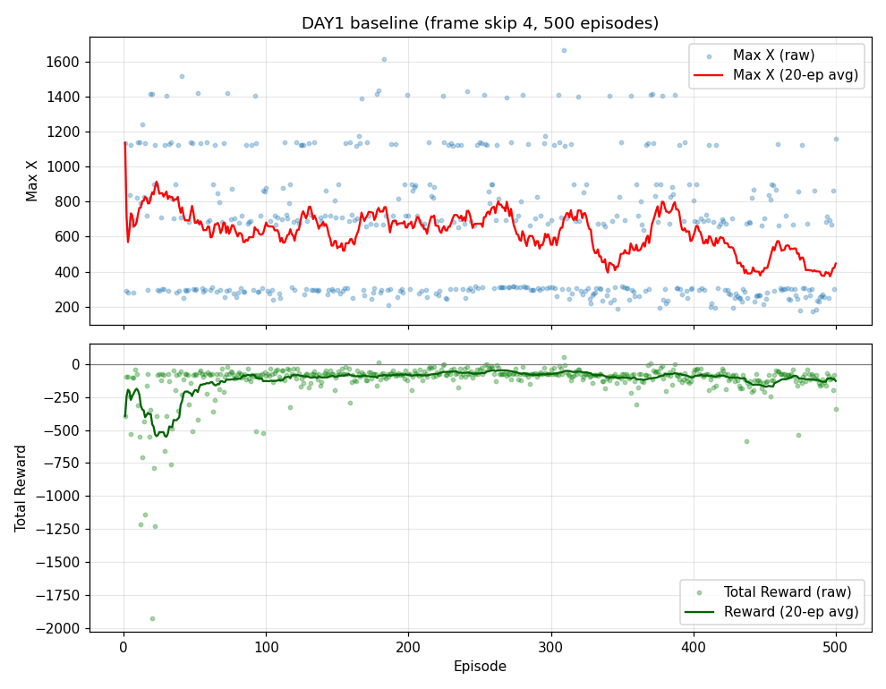

# [DAY1] 최초세팅 (Baseline)

날짜: 2026-06-18 · 500 에피소드 완주 (12분 29초, **한 판 ≈ 1.5초**)

> 이 폴더의 [실험일지 소개](실험일지-소개.md) 참고. 이 문서는 **기준점(baseline)** 이다.

---

## 변경 (이번 런 설정)

baseline 하이퍼파라미터 + **프레임 스킵 4** (속도 확보용으로만 추가, 학습 규칙은 그대로).

| 항목 | 값 |
|---|---|
| 알고리즘 | 테이블 Q-Learning |
| α / γ | 0.1 / 0.99 |
| epsilon | 1.0 → ×0.995/판 → 하한 0.01 |
| 상태 인코딩 | X 100px·30구간 + 적0/1 + 높이0/1 (실사용 ~120상태) |
| 보상 | 전진 +0.1×px / 후퇴 −5 / 사망 −100 / 시간초과 −50 / 클리어 +1000 |
| 프레임 스킵 | **4** (1행동=4프레임) |
| 에피소드 | 500 |

---

## 결과

### 구간별(50판) 집계

| 구간 | 평균 Max X | 평균 Reward | 최대 Max X | 조기사망(<350) |
|---|---|---|---|---|
| 1–50 | **760** | −339.9 | 1517 | 17/50 |
| 51–100 | 651 | −121.6 | 1421 | 21/50 |
| 101–150 | 609 | −92.1 | 1138 | 20/50 |
| 151–200 | 696 | −85.7 | 1614 | 19/50 |
| 201–250 | 671 | −69.5 | 1428 | 19/50 |
| 251–300 | 651 | **−66.1** | 1411 | 23/50 |
| 301–350 | 579 | −82.9 | **1667** | 28/50 |
| 351–400 | 649 | −96.1 | 1413 | 23/50 |
| 401–450 | 484 | −124.0 | 1125 | 27/50 |
| 451–500 | **480** | −119.2 | 1160 | **31/50** |

### 핵심 수치
- 전체 Max X: 평균 **623**, 최대 **1667**(ep309), 최소 173
- 전체 Reward: 평균 −119.7, 최대 **+52.4**(ep309), 최소 −1928.9(ep20)
- **보상이 양수인 판: 단 3개** (ep179·309·370 — 모두 탐험 구간)
- 한 판 평균 ~1.5초 (프레임 스킵 4 효과: 이전 ~10초 → **약 6~7배 빠름**)

---

## 해석 (정직하게)

**① 학습은 사실상 실패 — 오히려 후반에 더 못 감.**
- 그래프의 빨간선(Max X 이동평균)이 **초반(ep20~30)에 ~900으로 정점** 찍고, 후반으로 갈수록 **하락(450~500)**.
- 구간 평균 Max X: **760(1–50) → 480(451–500)** 로 **감소**. 조기사망(<350)은 **17 → 31** 로 **증가**.
- 즉 **epsilon이 낮아져 "배운 대로"(greedy) 움직일수록 더 일찍 죽었다.** 무작위 탐험이 우연히 더 멀리 갔다.

**② 보상이 −340 → −75로 "덜 나빠진" 건 전진 때문이 아니다.**
- 초반 −340은 무작위로 **후퇴(−5)를 남발**해서고, epsilon↓ 하며 후퇴가 줄어 −75 부근으로 수렴한 것.
- −75 / Max X≈290 조합은 **"오른쪽으로 걸어가 첫 구덩이에서 추락사"** 의 전형적 서명. (전진 +25 후 사망 −100 ≈ −75)

**③ 왜 이런가 (원인 가설)**
- **상태 인코딩이 너무 거칠다.** X를 100px 단위로만 보고 **구덩이 위치·점프 타이밍을 표현 못 한다** → greedy 정책이 매번 **같은 자리(첫 구덩이 ~x290)** 에서 죽음.
- 그래프 raw 점들이 **~290 / ~700 / ~1130 / ~1400** 가로줄로 뭉치는 건 1-1의 **고정된 사망 지점**들.
- 보상 비대칭(후퇴 −5 고정)도 초반 변동을 키움.

---

## 결론
- baseline은 **"오른쪽으로 가기"는 학습**했지만 **"장애물 통과"는 학습 못 함.**
- **표 기반 + 거친 상태 인코딩의 한계**가 명확히 드러남. greedy 정책이 무작위보다 못한 건 *상태 구분력 부족*의 신호.
