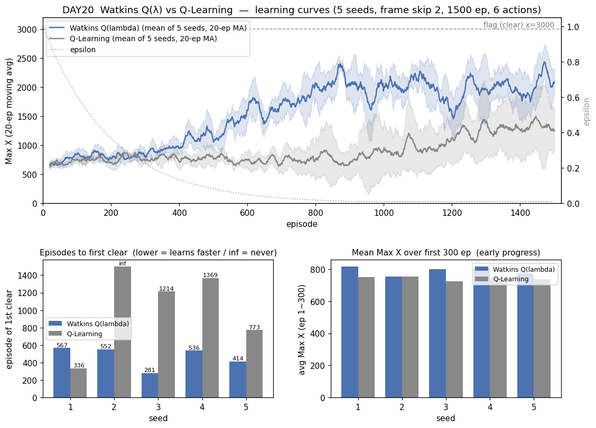
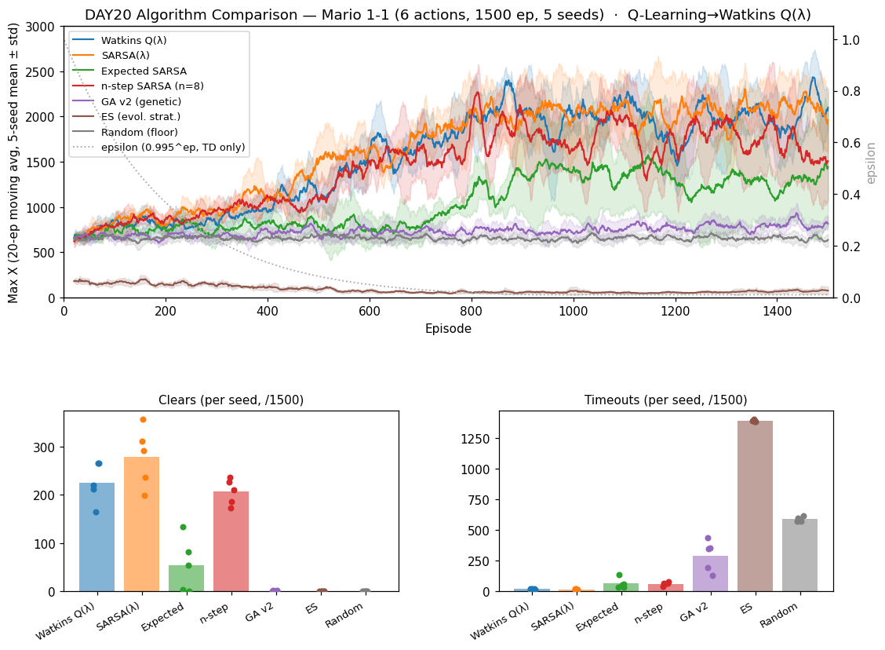

# [DAY20] 흔적에 가위를 — Watkins Q(λ) (세로 심화 ⑥)

> 🎯 **세로 심화 2막 마지막 타자 — QL 계보의 유종의 미.** 세로 심화 다섯 실험을 겹치면 규칙 하나가 남았다: **신용 전파를 건드린 강화(λ·n-step)는 이겼고, 값의 편향을 건드린 강화(Double-Q)는 졌다.** 그런데 정작 기준 학습기 QL 계보는 [DAY16] Double-Q가 후퇴한 뒤 **아직 강화 성공 사례가 없다.** 그래서 마지막 실험은 그 승리 공식을 QL에 그대로 적용한다 — **Q-Learning → Watkins Q(λ)**: 적격흔적을 얹되, off-policy답게 **탐험한 순간 흔적을 자른다.**

**배경** · [DAY15] SARSA(λ)는 적격흔적으로 SARSA를 분포째 압도했고(clear 279 vs 23), [DAY17] n-step은 MC를 압도했다(206 vs 5). 둘 다 같은 축 — **sparse-reward 1-1에서 깃발 신용을 과거로 빨리 되돌리는 것**이 진짜 병목이었다. QL에 흔적을 얹는 교과서적 방법이 Watkins Q(λ)인데, SARSA(λ)와 달리 공짜가 아니다: QL의 학습 목표는 "탐욕 정책의 가치"라서, **실제로 걸은 길(흔적)이 탐욕 정책을 벗어나는 순간(탐험) 그 앞으로는 신용을 전파하면 안 된다** → 흔적을 끊는다(Watkins cut).

*가설은 실험 전에 먼저 쓴다(예측→검증).*

---

## 공통 설정 (baseline과 고정)

DAY10~17과 동일, **알고리즘만 QL → Watkins Q(λ)로 바꾼다.** baseline = [DAY10] Q-Learning(같은 시드 1~5 로그 재사용).

| 항목 | 값 |
|---|---|
| 상태·테이블 | 두 테이블(공통 108 + 위치 1080), α=0.1 · γ=0.99 |
| epsilon | 1.0 → ×0.995/판 → 하한 0.01 |
| 프레임 스킵 · 에피소드 | 2 · 1500 |
| 행동 | **6개(긴 점프 OFF)** |
| 시드 반복 | 5회 — 결론용 지표는 5회 분포로 |
| **추가되는 것** | **적격흔적 λ=0.9 (replacing trace) + Watkins cut** — 다음 행동이 greedy면 흔적 γλ 감쇠, 탐험이면 전부 절단 |

---

## 🤔 왜 이 방향인가 — 그리고 SARSA(λ)와 무엇이 다른가

**왜 λ인가.** 1-step QL은 TD 오차를 직전 상태에만 반영한다. 깃발 +1000이 출발선까지 스며들려면 에피소드를 수없이 반복해야 한다(느림). 적격흔적은 최근 밟은 상태들에 "책임 꼬리표"를 남겨 **한 번의 TD 오차를 꼬리표만큼 과거로 한꺼번에 되돌린다** — [DAY15]에서 이 처방이 이 환경의 정답임이 이미 증명됐다.

**왜 자르나(Watkins cut).** SARSA(λ)는 on-policy라 "실제로 걸은 길"과 "배우려는 정책"이 같아 흔적을 마음껏 잇는다. QL은 off-policy — 배우려는 건 **탐욕 정책**의 가치인데 흔적은 **실제 걸은 길**을 따른다. 에이전트가 탐험(비탐욕 행동)을 하는 순간 그 뒤의 경험은 더는 탐욕 정책의 경험이 아니므로, 그 앞의 흔적으로 전파하면 목표가 오염된다. 그래서 **다음 행동이 greedy면 흔적을 γλ로 감쇠해 잇고, 탐험이면 0으로 끊는다.**

**양날의 검 — 이게 이번 관전 포인트다.** cut 덕에 off-policy 목표는 깨끗하지만, ε가 큰 초반엔 탐험이 잦아 흔적이 몇 스텝 못 가 끊긴다 → λ의 이득이 초반에 제한될 수 있다. ε가 하한(0.01)에 닿은 후반엔 거의 안 끊겨 SARSA(λ)처럼 작동할 것이다.

판정은 [DAY15]에서 도입한 새 지표 우선(첫-클리어 판수 · 학습곡선 AUC · 초반 300판 평균), 기존 지표(clear·후반거리·best·timeout)도 보고.

---

## 변경

- `QLambda extends QLearning` 추가 — 부트스트랩(max)은 물려받고 `learn`·`endEpisode`만 오버라이드([DAY15] SARSALambda 패턴). 두 테이블 흔적 `eCommon`·`eLocal`, replacing trace, 활성 목록으로 전체 스윕 회피, 매 스텝 `Q += α/2·δ·e` — 여기까지 SARSA(λ)와 동일. **유일한 추가 = Watkins cut**: 다음 행동의 값이 max와 같으면(동점 포함 = greedy) `e ← γλ·e`, 아니면(탐험) `e ← 0`.
- `-Dmario.algo=q_lambda`(별칭 `qlambda`) + `Main.createBrain` 분기. λ 손잡이는 SARSA(λ)와 공유(`-Dmario.lambda`, 기본 0.9).
- **구현 사전 검증(추측 말고 측정, [DAY17] 선례)**: 같은 (s,a,r,s',a') 시퀀스를 먹여 — ① **λ=0 → QLearning과 Q테이블 완전 일치**(흔적이 즉시 끊겨 1-step과 동일) ② **항상 greedy만 걷는 시퀀스 + λ=0.9 → SARSALambda와 완전 일치**(cut 미발동 + max=greedy 행동값이라 부트스트랩도 동일). 둘 다 최대 오차 0.000000000000. 경계가 기존 두뇌와 비트 단위로 같으므로 중간(탐험 섞인 실전)의 cut 동작도 신뢰. 임시 검증 클래스는 확인 후 삭제.

## 가설

- **① QL을 분포째 이길 것(1순위 예측).** 신용 전파 축은 이 환경에서 2전 2승(λ·n-step) — 같은 축을 QL에 적용했으니 첫-클리어↓·AUC↑·clear↑가 분산을 넘을 것. 이기면 **QL 계보 첫 강화 성공**이자 "신용 전파 축 3승"으로 규칙①이 완성된다.
- **② 단 SARSA(λ)(clear 279·AUC 1627)에는 못 미칠 것.** cut이 탐험 때마다 흔적을 끊어 유효 전파 길이가 SARSA(λ)보다 짧다. n-step(206·1431)이 "창이 흔적보다 덜 부드러워" 밀린 것처럼, Q(λ)도 "흔적이 잘려서" 그 아래 어딘가일 것.
- **③ 초반 300판은 QL과 비슷할 것.** ε≈1일 땐 거의 매 스텝이 탐험이라 흔적이 짧게 끊긴다 → 초반 이득 제한. (단 초기 테이블이 전부 0이라 **동점=greedy 판정**이 많아 생각보다 덜 끊길 수도 — 부차 관전 포인트.)
- **④ timeout은 QL(43)과 비슷하거나 낮을 것.** off-policy 성질은 그대로 + 신용 전파가 빨라지면 "끝내기"를 더 일찍 배운다(SARSA→SARSA(λ)에서 97→17로 준 전례).
- **⑤ 왜 이길 것으로 보나(Double-Q와 반대 예측).** Double-Q는 병목이 아닌 축(값의 편향)을 건드려 후퇴했다. Q(λ)는 **증명된 병목(신용 전파)을 건드린다** — 강화의 방향이 병목과 맞으니 이득이 나야 한다(규칙①). 빗나가면 "cut이 이 환경에선 흔적의 이득을 다 갉아먹는다"는 새 발견이 된다.

## 결과 — 6행동·1500판·5시드 (QL baseline은 DAY10 같은 시드 재사용)

> maxX 교차검증(Java `[Episode]` ↔ Python `[Ep]`) 불일치 **0판**. 로그: `mario_training_logs/day20/qlambda/`.

**새 지표(판정 우선) — mean ± std [min~max]**

| 새 지표 | **Watkins Q(λ)** | Q-Learning (baseline) | 방향 |
|---|---|---|---|
| **첫-클리어 판수** | **470 ± 109 [281~567] · 5/5** | 923 ± 403 [336~1369] · 4/5 | Q(λ) 2배 일찍 · 전 시드 |
| **전체 평균 Max X (AUC/N)** ↑ | **1554 ± 79 [1475~1690]** | 894 ± 159 [718~1117] | **분포째 분리** (min 1475 > max 1117) |
| **초반 300판 평균 Max X** | **791 ± 24 [753~816]** | 742 ± 11 [724~754] | Q(λ) 소폭 위 |

**기존 지표 — mean ± std [min~max]**

| 지표 | **Watkins Q(λ)** | Q-Learning (baseline) |
|---|---|---|
| clear | **225 ± 38 [164~265]** | 36 ± 48 [0~123] |
| 후반 300판 평균 Max X | **2005 ± 143 [1792~2208]** | 1284 ± 414 [907~2027] |
| best Max X | **3161 ± 0 (5/5 깃발)** | 3023 ± 276 (4/5 깃발) |
| timeout | **17 ± 4 [11~22]** | 43 ± 21 [13~71] |
| dead_pit | 404 ± 62 | 293 ± 108 |

- **분포째 승리 — 분산 신기루가 아니다.** clear는 Q(λ) 최소 164 > QL 최대 123, AUC는 최소 1475 > 최대 1117로 **두 분포가 아예 안 겹친다.** 첫-클리어도 5/5 전 시드가 깼고(QL 4/5) 평균 2배 일찍(470 vs 923). best 3161 만점(5/5 깃발).
- **그래프의 갈림점은 ~ep 300.** ε이 높은 초반엔 두 곡선이 붙어 있다가, ε이 내려가면서 Q(λ)만 가파르게 우상향해 후반 ~2000에 안착(QL은 ~1300). [DAY15] SARSA(λ)의 그림과 같은 꼴.
- **timeout 43→17** — SARSA(λ)(17)와 정확히 같은 수준까지 떨어짐. 신용 전파가 빨라지면 "끝내기"를 일찍 배운다는 전례 재현.
- **dead_pit ↑(293→404)** = 멀리 갔다 신호([DAY10] 해석 재확인).

**cut의 값은 어디서 청구됐나 — SARSA(λ)·n-step과 비교** (판정 아닌 참고, 같은 시드):

| 지표 | SARSA(λ) [DAY15] | **Watkins Q(λ)** | n-step SARSA [DAY17] |
|---|---|---|---|
| 첫-클리어 | **230 ± 94 [98~346]** | 470 ± 109 [281~567] | 385 ± 125 |
| 초반 300판 | **856 ± 22 [830~892]** | 791 ± 24 [753~816] | 828 ± 21 |
| AUC | 1627 ± 100 | 1554 ± 79 | 1431 ± 40 |
| clear | 279 ± 56 [199~357] | 225 ± 38 [164~265] | 206 ± 24 |
| timeout | 17 ± 3 | 17 ± 4 | 59 ± 13 |

- **본선(clear·AUC)은 SARSA(λ)와 분포가 겹쳐** 우열 확정 불가 — TD-λ 상단권에 같이 섰다.
- 그런데 **초반은 분포째 밀린다**: 초반 300판 Q(λ) 최대 816 < SARSA(λ) 최소 830, 첫-클리어도 2배 늦다(470 vs 230, 분포 거의 안 겹침). **ε이 큰 초반 = 탐험이 잦음 = 흔적이 자주 잘림** — cut의 비용이 정확히 예측된 자리(초반)에서만 청구되고, ε이 하한으로 내려간 중·후반엔 흔적이 안 끊겨 SARSA(λ)를 따라잡는다.

## 결론

- **가설 ① (QL을 분포째 이김) — 적중.** clear 225 vs 36·AUC 1554 vs 894, 둘 다 min>max로 분포 완전 분리. **QL 계보 첫 강화 성공** — [DAY16] Double-Q의 후퇴를 같은 계보에서 설욕했다. 이로써 **신용 전파 축은 3전 3승**(SARSA(λ)·n-step·Q(λ)), 값의 편향 축은 0승 1패(Double-Q) — 세로 심화 규칙①("강화의 방향이 그 두뇌의 실제 병목과 맞아야 이득")이 세 번째 검증으로 완성됐다.
- **가설 ② (SARSA(λ)엔 못 미침) — 부분 적중.** 방향은 전 지표에서 SARSA(λ) 아래지만 본선(clear·AUC)은 분포가 겹쳐 확정 못 한다. **뚜렷한 열세는 초반뿐**(첫-클리어 470 vs 230·초반 300판 분포째 아래) — cut의 비용은 실재하되, 생각보다 싸다.
- **가설 ③ (초반 300은 QL과 비슷) — 절반 빗나감(좋은 쪽).** 비슷하기는커녕 소폭 위(791 vs 742). 부차 관전 포인트가 맞았다: 초기 테이블이 전부 0이라 **동점=greedy 판정** 덕에 초반 탐험이 흔적을 생각만큼 못 끊는다(값이 갈라진 뒤에야 cut이 본격 발동). "cut 때문에 초반 이득 전무"라는 이론적 우려보다 실전이 후했다.
- **가설 ④ (timeout ≈ QL 이하) — 적중.** 43→17, SARSA(λ)와 동수.
- **가설 ⑤ (병목과 맞는 축이라 이길 것) — 적중.** [DAY16]과 완벽한 대조: 같은 QL에서 편향을 지우면 주저앉고(clear 1), 신용 전파를 얹으면 날아오른다(clear 225). **무엇을 건드리느냐가 전부다.**
- 한 줄: **"Q(λ)=흔적에 가위를 들려줘도 신용 전파의 이득은 살아남는다 — QL 계보 첫 강화 성공, 신용 전파 축 3승 완성. cut의 값은 ε이 큰 초반(첫-클리어 470 vs 230)에서만 청구된다."**

### 마스터 보드 반영

[DAY15]·[DAY17] 선례(이긴 심화가 계보 대표를 교체) 그대로 — [알고리즘 비교 보드](./[비교]%20알고리즘%20비교%20보드.md)의 **Q-Learning 자리를 Watkins Q(λ)로 교체**한다. 보드 그래프도 `images/day20-algorithm-comparison.png`(QL 자리에 Q(λ) 파랑)로 갱신([DAY18] 안 덮음 — 시점별 파일 분리 원칙).

> 세로 심화 최종 성적: **4승**(SARSA(λ)·n-step·GA v2·Q(λ)) **1패**(Double-Q) + GA 후속 3건 무효. 이긴 넷의 공통점 — **그 두뇌의 실제 병목**(TD 셋=신용 전파, GA=적합도 방향·막힘 탈출)을 건드렸다. 진 하나는 병목이 아닌 축(값의 편향)을 건드렸다. 세로 심화 2막 종료 — 남은 것은 회고 문서.
