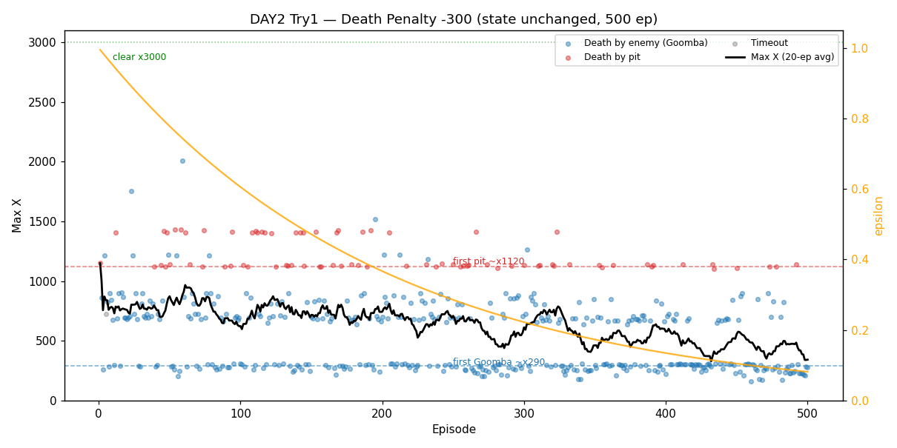
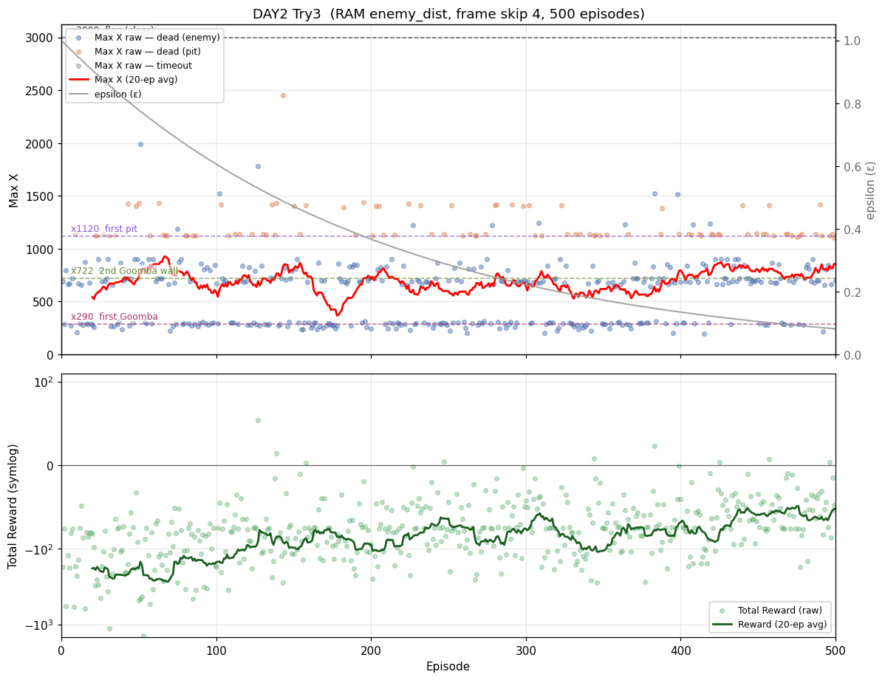

# [DAY2] 진짜 1차 관문 — 굼바 넘기

> 🎯 **진짜 1차 관문 — 굼바 넘기**: x290의 벽을 한 번에 하나씩 넘는다.

**배경** · DAY1은 500판을 돌려도 마리오가 ~x290에서 반복해 죽었다. (상세: [\[DAY1\] 최초세팅](<[DAY1] 최초세팅.md>))

**이번** · 그 x290 벽을 트라이마다 하나씩 공략한다.

*각 트라이는 변경/가설/결과/결론으로 적고, 가설은 실험 전에 먼저 쓴다(예측→검증).*

---

## 공통 설정 (트라이 간 고정)

DAY1 baseline과 동일하게 두고, **트라이마다 딱 한 가지만** 바꾼다.

| 항목 | 값 |
|---|---|
| 알고리즘 | 테이블 Q-Learning (α=0.1 / γ=0.99) |
| epsilon | 1.0 → ×0.995/판 → 하한 0.01 |
| 프레임 스킵 | 4 |
| 에피소드 | 500 |
| 측정 지표 | **Max X 추세**(우상향이 목표) · **사망 원인 분해**(dead_enemy/dead_pit 비율) · Total Reward 추세 |

> 그래프는 CLAUDE.md "학습 그래프 구현 규칙"을 따른다(epsilon 보조축 · 기준선 · 사망 원인 구분 등).

---

## 트라이 1 — 낙사 페널티만 키우기 (대조군)

### 🤔 왜 이 방향인가

**관찰** · DAY1은 마리오가 ~x290에서 반복해 죽었고, 그 원인을 "첫 구덩이 추락"으로 *추측*했다.

**추론** · 정말 구덩이가 범인이라면, 상태(인식)를 손대기 전에 **보상만으로** 회피를 유도할 수 있는지부터 보는 게 가장 싼 검증이다(대조군). 게다가 사망을 낙사/적으로 갈라 찍으면, "정말 구덩이에서 죽는가"라는 그 추측 자체를 **측정으로 확인**할 수 있다.

**결정** · 상태는 그대로 두고 **낙사 페널티만 −100→−300**으로 키운다. 동시에 사망 원인 로그(`dead_pit`/`dead_enemy`)를 도입한다.

### 변경
- **상태 인코딩은 그대로 둔다** (이게 이 트라이의 핵심: 상태는 안 건드림).
- Python `compute_reward`: 사망을 **낙사(dead_pit) / 적(dead_enemy)** 로 구분하고,
  **낙사 페널티만 −100 → −300** 으로 키운다. (적 사망·시간초과는 그대로)
- 측정용: 종료 시 원인 로그(낙사율 집계).

### 가설
- 구덩이를 *못 본다*가 문제라면, **낙사 시 점수를 더 크게 깎으면** 마리오가
  구덩이를 더 피하려 해서 **낙사율이 줄고 Max X 가 늘어날까?**
- 즉, *상태를 바꾸지 않고 보상(페널티)만으로* 구덩이 회피를 학습할 수 있는지 확인한다.

### 결과 (500판 완주)



#### ① 🔍 (예상 밖 발견) 사망 원인을 측정해보니 — DAY1 예측이 틀렸다!

낙사/굼바를 구분하려고 종료 원인 + `endY`(죽는 순간 마리오 높이)를 로그로 찍었더니,
사망 지점이 **또렷한 밴드**로 갈렸다. 500판 사망 원인 집계: **굼바 420(84%) · 낙사 79(15.8%) · 시간초과 1.**

| 사망 위치(maxX) | status | endY | 정체 |
|---|---|---|---|
| **~250–312** | `dead_enemy` | **79 (지상)** | **첫 굼바** |
| ~640–723 | `dead_enemy` | 79 | 적/장애물 |
| ~810–899 | `dead_enemy` | 79 | 적/장애물 |
| **~1106–1145** | `dead_pit` | **251–255 (추락)** | **첫 구덩이(낙사 54건)** |
| **~1401–1433** | `dead_pit` | 251–255 | 둘째 구덩이(낙사 25건) |

- **x250~312 사망은 예외 없이 전부 `dead_enemy`(endY=79, 지상).** 이 구간에 `dead_pit`은 **하나도 없다.**
  → **x290은 구덩이가 아니라 "첫 굼바"였다.**
- 낙사(`dead_pit`, endY≈253) 79건은 **전부 x1106 이후**(평균 maxX 1220). 즉 **첫 구덩이는 ~x1120**.

→ **DAY1의 "첫 구덩이(~x290) 추락사" 해석은 틀렸다.** 죽는 *위치*만 보고 *원인*을 추측한 게 함정.
(보상 −75가 추락이든 굼바든 같은 값이라 더 헷갈렸다.) **"마리오가 어떻게 죽는지"를 측정하는 코드
한 줄이 DAY1 내내 잘못 지목한 범인을 바로잡았다.**

#### ② 낙사 페널티(−100 → −300) 효과 — 개선 없음

| 구간(100판) | 평균 Max X | 낙사(pit) | 굼바(enemy) | 조기사망(<350) |
|---|---|---|---|---|
| 1–100 | **769** | 17 | 82 | 26 |
| 101–200 | 747 | 28 | 72 | 33 |
| 201–300 | 625 | 15 | 85 | 44 |
| 301–400 | 570 | 12 | 88 | 46 |
| 401–500 | **439** | 7 | 93 | **70** |

- **Max X 추세가 769 → 439 로 하락.** DAY1 baseline(760 → 480)과 **거의 동일한 "음의 학습"** — 낙사 페널티를 3배로 키웠지만 양상이 그대로다. 그래프에서도 **epsilon(주황)이 낮아질수록 Max X 평균(검정)이 따라 내려간다**(greedy일수록 더 일찍 죽음, DAY1과 같은 패턴).
- **낙사 횟수는 후반 17 → 7 로 줄었지만**, 이는 페널티로 *회피를 배운 게 아니라* **굼바(x290)에서 죽어 구덩이(x1120)에 도달조차 못 했기 때문**이다. 근거: 같은 구간 **조기사망(<350)이 26 → 70 으로 급증** → 멀리 가는 판 자체가 사라짐.
- **x1120까지 도달한 판은 여전히 낙사**(그래프의 빨간 점이 1120·1410 밴드에 그대로). 페널티 −300이 추락을 막지 못했다.
- 전체: Max X 평균 **630**(DAY1 623과 사실상 동일), 양수 보상 판 **단 1개**(ep195, +28.2).

### 결론
- **낙사 페널티를 3배(−100 → −300)로 키워도 Max X·낙사 양상은 baseline과 사실상 같다.** → *상태를 바꾸지 않고 보상(페널티)만으로* 구덩이 회피를 학습하지는 못했다.
- 데이터가 가리키는 두 가지 이유: ① 진짜 1차 벽은 **굼바(x290)** 라 대부분 거기서 죽어, 페널티가 적용될 구덩이(x1120)까지 가지도 못한다. ② 도달한 판도 상태가 구덩이를 구분 못 해(ⓐ) 점프 타이밍 자체를 학습할 수 없다.
- **가장 큰 수확은 따로 있다**: "사망 원인을 측정"한 것만으로 DAY1의 핵심 가정을 바로잡았다 — 진짜 1차 관문은 **굼바**다.
- → **다음 트라이는 이 발견을 반영해 "굼바 공략"으로 잡는다.**

---

## 트라이 2 — 굼바 공략 

### 🤔 왜 이 방향인가

**관찰** · 트라이1에서 진짜 1차 벽은 **굼바(x290)** 로 밝혀졌다. 상태엔 이미 적 신호(`enemy_near`)가 있는데도 거기서 반복해 죽는다.

**추론** · 신호가 있는데 못 넘는다면, 곧장 무언가를 바꾸기 전에 **"왜 못 넘는지"부터 진단**해야 한다(아래 진단).

**결정** · 진단 결과에 맞춰 딱 한 가지만 바꾼다.

### 진단 

x230~330 구간에서 `enemy_near` 값과 행동을 로그로 찍어봤다(`[diag]`). 결과:

```
[diag] x=236 enemy_near=True  y= 79 action=4
[diag] x=261 enemy_near=True  y=107 action=5
[diag] x=290 enemy_near=True  y=103 action=1
[diag] x=327 enemy_near=True  y= 98 action=0   ← 굼바 지난 뒤에도 True
```

- **① `enemy_near`는 잘 켜진다 (신호 누락 아님).** x230~330 **전 구간이 예외 없이 `True`** 였다.
  → "굼바를 못 본다"는 문제는 아니다.
- **② 그런데 상태값이 True/False 뿐이라 "거리"를 모른다 ← 진짜 문제.** x236(굼바 멀다)도 True, x290(코앞)도 True,
  x327(이미 지남)도 True. AI 눈엔 이 100px가 **전부 같은 상태**라, *코앞일 때만 점프*하는 타이밍을 학습할 수 없다.
  실제로 점프(action 2/3/5)는 하는데 타이밍이 안 맞아 x273·293에서 죽는다.

| 가능성 | 판정                           |
|---|------------------------------|
| `enemy_near`가 안 켜진다 | ❌ 아님 — 항상 True               |
| **켜지지만 거리를 몰라 타이밍 불가** | ✅ **가능성 높음** (100px 내내 True) |

### 변경 (진단 결과 → 거리 단계화로)
- **`enemy_near`(True/False) → 굼바까지 "거리 4단계"** 로 바꾼다: **없음(0) / 멂(1) / 가까움(2) / 위험함(3)**.
- 구현 파이프라인:
  - `mario_env_server.py`: `detect_enemy_near` → **`detect_enemy_distance`** (마리오 앞을 거리 구간으로 나눠 가장 가까운 굼바의 단계를 반환)
  - `GameState.java`: `boolean enemy_near` → `int enemy_dist`
  - `StateEncoder.java`: 적 비트(0/1) → **거리 단계(0~3)** 반영 → 상태 수 120 → **240**
- 보상·다른 인코딩(xZone·yZone)은 **그대로** (한 번에 하나만).

### 가설
- 굼바까지 거리를 4단계로 상태에 넣으면, AI가 **"위험함(코앞)" 상태에서만 점프를 학습**할 수 있을까?
- 그래서 첫 굼바(x290)를 넘어 **Max X 가 그 너머로 늘고, 굼바 조기사망(<350)이 줄어들까?**

### 결과 — 또 하나의 반전: 적 신호가 "마리오"를 보고 있었다 🙃

거리 4단계를 구현해 `[diag]` 로 찍어보니 **0과 3만** 나오고 멂(1)·가까움(2)이 안 나왔다.
왜인지 파려고 **굼바 갈색 픽셀의 실제 화면 위치(`goombaScreenX`)** 를 같이 찍었더니 — 결정적 단서가 나왔다.

```
마리오 레벨 x=162  →  goombaScreenX = 109-116
마리오 레벨 x=242  →  goombaScreenX = 114-127
마리오 레벨 x=330  →  goombaScreenX = 115-124
```

- **마리오가 170px 전진하는 내내 "굼바"의 화면 위치는 ~120에 고정.** 진짜 굼바라면 다가갈수록
  화면에서 가까워져(값이 변해)야 하는데, **화면 한자리에 붙박이** = 스크롤 중 화면 중앙에 고정된 **마리오 자신**.
- 마리오가 **점프하면(y 79→154)** `goombaScreenX` 도 같이 들썩였다 → 굼바가 아니라 마리오를 따라다닌다.
- 그래서 `enemy_dist` 가 **늘 3** 이었다(마리오가 항상 위험 구간에 있으니). 탐지가 가까운 구간부터 검사 →
  마리오를 먼저 잡고 3 반환 → **진짜 굼바는 검사조차 안 됨.**

원인: `_is_enemy_brown` 의 갈색 조건에 **마리오의 갈색 부분(머리·신발 등)이 걸리고**, 스캔 시작점(화면 110)이
마리오 위치(~120)와 겹친다. **굼바가 아니라 마리오를 굼바로 오인**한 것.

> **충격적 함의**: 이 탐지는 baseline 의 `enemy_near` 와 **같은 함수**다. 즉
> **DAY1부터 줄곧 "적" 신호는 굼바가 아니라 마리오를 감지하고 있었다.**
> AI는 **굼바를 한 번도 제대로 본 적이 없다** — 상태의 적 비트는 처음부터 *항상 켜진 가짜 신호*였다.
> x290에서 계속 죽은 게 당연하다(코앞인지 알려주는 신호가 없었으니).

### 결론
- **거리 단계화의 효과는 측정조차 불가능했다** — 거리를 매길 "적 신호" 자체가 가짜(마리오)였기 때문.
- 근본 원인은 **픽셀 휴리스틱**. 이 추측 방식이 우리를 **두 번** 속였다: DAY1의 "구덩이 오해" + 지금의 "마리오 오인".
- → **적 위치를 픽셀로 추측하지 말고, 게임 메모리(RAM)에서 직접 읽는다.** 신호부터 진짜로 만든 뒤,
  그 위에서 거리 단계화를 다시 시도한다. (아래 트라이 3)

---

## 트라이 3 — 적 좌표를 RAM에서 직접 읽기

### 🤔 왜 이 방향인가

**관찰** · 트라이2에서 픽셀 휴리스틱(`_is_enemy_brown`)이 굼바가 아니라 **마리오를 굼바로 오인**하고 있었다 — DAY1부터 줄곧 가짜 신호였다.

**추론** · 화면 픽셀로 객체 위치를 *추측*하는 방식이 우리를 두 번 속였다(구덩이 오해 → 마리오 오인). 추측을 버리고 **게임 메모리(RAM)에서 좌표를 직접 읽어야** 신호가 진짜가 된다.

**결정** · nes-py의 `env.ram`에서 적 슬롯의 실제 좌표를 읽어 마리오와의 거리를 계산한다.

### 변경
- `mario_env_server.py`: 픽셀 스캔(`_is_enemy_brown`)을 **버리고** RAM(2KB)에서 적 슬롯을 직접 읽는다.
  - `get_ram(env)`: `JoypadSpace` 래퍼 안쪽 nes-py 환경의 `.ram`(없으면 `.unwrapped.ram`) 접근.
  - `nearest_enemy_ahead`: SMB 적 슬롯 5개를 훑어 **활성 슬롯**(`0x0F~0x13`≠0)의 전역 x(`0x6E~0x72`*256 + `0x87~0x8B`)를 구하고, 마리오 앞(dx≥0)인 것 중 최솟값(px) 반환.
  - `detect_enemy_distance`: 그 거리를 4단계로 매핑 — 위험함(3) 0~24px / 가까움(2) 24~48 / 멂(1) 48~96 / 없음(0) 그 너머.
- 마리오 전역 x = `info["x_pos"]`(= RAM `0x6D`*256 + `0x86`)와 **같은 좌표계**라 그대로 뺀다.
- Java 쪽 `enemy_dist` 파이프라인(`GameState` int · `StateEncoder` 0~3 · 상태수 240)은 **그대로 재사용**. 보상·다른 인코딩도 그대로(한 번에 하나만).

### 가설
- 이제 상태가 **진짜 굼바까지의 거리**를 담으면, AI가 "위험함(코앞)"에서만 점프해 첫 굼바를 넘을 수 있을까?
- 다만 첫 굼바는 **위치가 고정(x≈290)** 이라 `xZone`(100px)이 이미 그 위치를 거칠게 대리하고 있었다.
  그래서 `enemy_dist` 는 "새 정보"라기보다 **xZone을 더 잘게 쪼갠 것**에 가깝다 →
  **예측: 첫 굼바엔 극적인 변화가 없을 것이다.** (이 예측이 맞는지 데이터로 본다.)

### 결과 — ① 신호는 드디어 진짜가 됐다

`[diag]` 로 RAM이 읽는 적 거리(`nearestPx`)를 마리오 전진과 함께 찍어보니, 트라이2와 **정반대**였다:

```
x183 → nearestPx 161 ... x224 → 103 ... x285 → 19 ... x294 → 8 → 충돌(dead_enemy)
x276 → 1  →  x279 → none   (굼바를 밟거나 지나치면 슬롯이 비활성 → none)
x269(점프로 마리오 정지) → nearestPx 20→18→15→13→10→8  (굼바가 다가오는 게 잡힘)
```

- 마리오가 다가갈수록 거리가 **단조 감소**(트라이2는 ~120 고정), 충돌은 거리 4~8px에서, 통과 후 `none`.
- **픽셀로는 못 잡던 "굼바의 움직임"까지 추적**된다 → RAM 좌표가 진짜 굼바를 가리킨다는 직접 증거.

### 결과 — ② 500판 학습: 굼바를 "자주" 넘지만 "항상"은 아니다



| 지표 | 값 |
|---|---|
| 첫 굼바(x>330) 통과율 | 전체 **65%** · 전반 ep1–50 **66%** · 후반 ep451–500 **80%** |
| 사망 원인 | 굼바 402(80.4%) · 구덩이 97(19.4%) · 시간초과 1 |
| best Max X | **2450** (ep143, 깃발 3000의 82%) |

**maxX 구간 분포 (500판)**

| 구간 | 판수 | 정체 |
|---|---|---|
| ~330 | 175 (35.0%) | **첫 굼바(x290) 벽** — 못 넘고 죽음 |
| 330–720 | 107 (21.4%) | 첫 굼바 넘김 |
| 720–900 | 108 (21.6%) | **2차 굼바대**(x722 25회·x898 15회 반복 사망) |
| 1120대 | 68 (13.6%) | **첫 구덩이** 낙사(endY≈253) |
| 1160+ | 39 (7.8%) | 그 너머 (둘째 구덩이 ~1410 등) |

- **굼바를 절반 이상(65%) 넘는다.** DAY1의 "x290 반복 사망"보다 분명히 멀리 간다.
- **그런데 greedy(후반)인데도 ~330 벽이 안 사라진다** — 후반에도 20%(전체 35%)가 첫 굼바에서 죽음.
  Q-Table이 "첫 굼바 앞에서 점프"를 **확신하진 못했다.**
- 전반 66% → **후반 80%** 로 통과율이 **올랐다.** DAY1·트라이1에서 greedy로 갈수록 Max X 평균이
  *내려가던*("음의 학습") 것과 대비된다 → 진짜 거리 신호가 점프 학습에 **약간은 기여**했다.
- 새 벽이 또렷이 보인다: **x722·x898 (후속 굼바)**, **x1120·x1410 (구덩이)**.

### 결론
- **예측은 절반 맞고 절반 빗나갔다.** "첫 굼바엔 극적 변화 없을 것"은 맞았다(후반에도 첫 굼바 벽 잔존).
  하지만 통과율이 전반보다 **소폭 올라**(66→80%), "전혀 차이 없다"는 아니었다 —
  `enemy_dist`의 더 세밀한 해상도가 점프 타이밍 학습을 조금 도왔다.
- **가장 큰 의미는 "신호를 진짜로 만든 것"** 이다. 트라이2까지 AI는 굼바를 본 적이 없었는데(가짜 신호),
  이제 처음으로 **진짜 굼바 거리**를 본다. 이로써 병목이 **"인식" → "보상·탐험·타이밍"** 으로 옮겨갔다.
- 남은 문제: ① 첫 굼바 점프를 *확신*하게 만들기(보상이 "굼바 넘기"를 직접 가리키지 않음, ε 탐험 빈도, FRAME_SKIP 타이밍 해상도) ② 그 너머 2차 굼바·구덩이.
- → **다음 트라이는 "인식은 됐으니 행동을 강화"** — 보상 셰이핑(굼바 처치/통과 보너스)이 1순위 후보.

> ⚠️ 검증이 끝났으므로 `[diag]` 임시 로그는 제거했다(종료 원인 로그 `[Ep N] status=…` 는 측정용으로 유지).

---

## DAY2 종합

DAY1의 숙제(“x290에서 반복 사망”)를 **한 번에 하나씩** 파고든 결과, 정작 바뀐 것은 *문제를 보는 눈*이었다.

| 트라이 | 바꾼 것 | 결과 | 핵심 |
|---|---|---|---|
| **1** | 낙사 페널티 −100→−300 (상태 불변) | 효과 없음 (Max X 769→439, baseline과 동일) | 부산물로 **사망 원인 측정** 도입 → **x290은 구덩이가 아니라 굼바** |
| **2** | `enemy_near`→`enemy_dist` 거리 4단계 | 측정 불가 | 픽셀 탐지가 **굼바가 아니라 마리오를 보고 있었음**(DAY1부터 가짜 신호) |
| **3** | 적 거리를 **RAM에서 직접** 읽기 | 굼바 통과율 65%·후반 80% | 신호가 **처음으로 진짜**가 됨 → 병목이 인식→행동으로 이동 |

### DAY1 대비 — 무엇이 나아졌나

같은 보상·epsilon·프레임 스킵에서 **상태의 적 신호만 가짜→진짜로** 바꾼 결과다(상태 수 120→240).

| 지표 | DAY1 baseline | DAY2 트라이3 | 변화 |
|---|---|---|---|
| Max X 평균(500판) | ~623 | **692** | +11% |
| 후반(greedy) 100판 추세 | 760 → **480** (하락) | 641 → **796** (상승) | **방향 반전** |
| 후반 조기사망(<350판) | 70 (트라이1, baseline 동일 양상) | **16** | 1/4로 감소 |
| best Max X | ~1660 | **2450** | 깃발의 55%→82% |

- **가장 큰 변화는 "학습 방향의 반전"이다.** DAY1의 고질병은 *epsilon이 낮아질수록(greedy) Max X가 오히려 하락*하는 것이었다(CLAUDE.md 그래프 회고의 핵심). 트라이3에선 이게 뒤집혀 — **후반 100판에서 평균이 641→796으로 오르고, 조기사망이 41→16으로 줄었다.** 즉 *greedy 정책이 실제로 더 멀리 간다* = AI가 학습한 Q값이 처음으로 "전진에 도움이 되는" 방향이다.
- **이유**: DAY1~트라이2의 적 신호는 가짜(항상 켜짐)라, greedy로 굳어질수록 *잘못된 확신*만 강화됐다. 트라이3는 진짜 굼바 거리를 보므로, greedy가 굳을수록 **맞는 행동(코앞에서 점프)** 쪽으로 모인다.
- **단, "해결"은 아니다.** 첫 굼바를 *항상* 넘진 못하고(후반 20% 사망), 그 너머 2차 굼바·구덩이가 그대로 남아 있다. 나아진 것은 **방향과 폭**이지, 관문 돌파가 아니다.

- **관통하는 교훈 — 픽셀 휴리스틱이 두 번 속였다.** DAY1의 "구덩이 오해"와 트라이2의 "마리오 오인"은
  **같은 픽셀 추측**에서 나왔고, 둘 다 **측정**(`endY` / `goombaScreenX` / RAM)으로 잡혔다.
  *"AI가 무엇을 보고 어떻게 죽는지"를 직접 재는 코드 한 줄*이 매번 범인을 바로잡았다.
- **현재 위치**: 마리오는 첫 굼바를 절반 이상 넘고(best x2450), 다음 벽은 **2차 굼바(x722·898)와 구덩이(x1120·1410)** 다.
  첫 굼바조차 *항상* 넘진 못한다(후반 20% 사망).
- **다음 방향(DAY3 후보)**: 인식은 진짜가 됐으니 **행동을 강화** — 보상 셰이핑(굼바 처치/통과 보너스), 점프 타이밍 해상도(yZone·FRAME_SKIP).