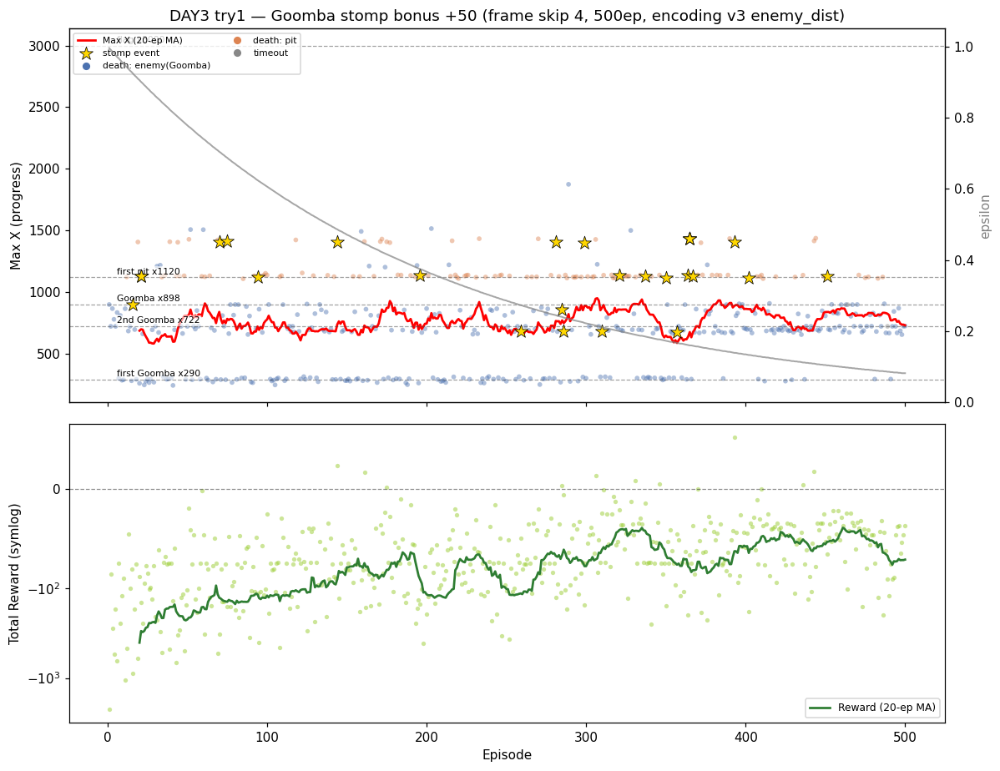

# [DAY3] 인식에서 행동으로 — 굼바 밟기 보상

> **DAY2에서 남은 숙제**: 적 거리를 RAM에서 진짜로 읽게 됐지만(상세: [\[DAY2\] 진짜 1차 관문 - 굼바 넘기](<[DAY2] 진짜 1차 관문 - 굼바 넘기.md>)), **첫 굼바를 *항상* 넘진 못한다**(후반 20%·전체 35%가 ~330에서 사망).
> 이 문서는 **보상 셰이핑으로 굼바 넘기를 직접 보상**해 그 벽을 넘는 기록이다.
> 각 트라이는 `변경 / 가설 / 결과 / 결론` 으로 적고, **가설은 실험 *전에* 먼저** 쓴다(예측→검증).

---

## 공통 설정 (트라이 간 고정)

DAY2와 동일하게 두고, **트라이마다 딱 한 가지만** 바꾼다.

| 항목 | 값 |
|---|---|
| 알고리즘 | 테이블 Q-Learning (α=0.1 / γ=0.99) |
| epsilon | 1.0 → ×0.995/판 → 하한 0.01 |
| 프레임 스킵 | 4 |
| 에피소드 | 500 |
| 상태 인코딩 | xZone(100px·30) × enemy_dist(0~3) × yZone(0~1) ≈ 240상태 (DAY2 트라이3 그대로) |
| 측정 지표 | Max X · 첫 굼바 통과율 · 사망 원인(enemy/pit) · 밟기 횟수(stomps) · Total Reward |

---

## 트라이 1 — 굼바 밟기(stomp) 보너스

### 변경
- 마리오 앞 가까이(≤48px) 있던 굼바를 **밟으면 +50** (Python `mario_env_server.py`, Java 무관).
- 감지(RAM): 직전 스텝 마리오 앞 활성 적 슬롯이 이번 스텝 **비활성+생존**이면 밟음. 뛰어넘기·부딪혀 죽음은 제외 → *밟기만* 보상.
- 측정: 종료 로그 `stomps=N` + 임시 `[stomp] x=` 로 진짜 굼바에서 잡히는지 검증.

### 가설
- 밟기에 +50을 직접 주면 "굼바 앞 점프-밟기"를 더 학습해 통과율(DAY2 65%·후반 80%)이 오를까?
- +50 = 사망(−100)의 절반 → 성공률 2/3 넘어야 이득(무모한 돌진 억제).

### 결과 ① 밟기 감지는 진짜다
밟기 26회 위치가 전부 실제 굼바와 일치(첫 굼바 201~307 · 2차 638~893 · 그 너머 1081~1297). DAY2 "마리오 오인" 같은 가짜 신호 아님.

### 결과 ② 수치는 좋아졌다

| 지표 | DAY2 트라이3 | **DAY3 트라이1** | 변화 |
|---|---|---|---|
| 첫 굼바 통과율(전체) | 65% | **75%** | ▲ |
| 첫 굼바 통과율(후반 100판) | 80% | **93%** | ▲▲ |
| 평균 Max X(500판) | 692 | **764** | ▲ +10% |
| 사망: 굼바 / 구덩이 / 시간초과 | 402 / 97 / 1 | 373 / **125** / 2 | 구덩이↑ |
| best Max X | 2450 | 1874 | ▼ |

- 통과율 추세 **68 → 65 → 68 → 82 → 93%**: greedy(ε↓)일수록 상승 = 학습 방향 정상.
- 구덩이 사망↑(97→125)은 첫 굼바를 더 넘어 구덩이까지 **도달**한 결과 = 병목이 뒤로 밀림.
- best는 2450→1874로 떨어졌으나, 1160+ 도달 비율은 7.8%→8.2%로 동일.

### 결과 ③ 🙃 밟는 게 아니라 뛰어넘는다
- 밟기는 통과 376판 중 **23판(6%)** 뿐 — 94%는 뛰어넘어 통과.
- 보너스가 6%만 발동했는데 통과율↑ → "굼바 앞 점프"의 Q값이 올라 **밟기든 뛰어넘기든 '점프'로 일반화**됐다.
- 즉 "밟기"를 노렸는데 실제론 "점프 타이밍"이 강화됨(의도와 다른 작동). 단일 실행이라 분산과 완전 분리는 못 함.

### 결론
- **수치 개선은 분명**(통과율 65→75%·후반 93%, 평균 Max X +10%). 감지도 진짜.
- 단 **의도(밟기)와 다르게 점프 일반화로 작동** — DAY1·2에 이은 "측정해보니 예상과 달랐다".
- 새 병목: **2차 굼바(720~905) 24.6% · 첫 구덩이(~1120) 19.8%.**
- → 다음 트라이: **정확히 밟기 유도** (보너스를 키워 밟기 비율이 오르는지 본다).

> 그래프: 금색 별(★)=밟기 발생 ep(26회로 드묾) · 회색=epsilon(우축) · 파란점=굼바사망 · 주황점=구덩이낙사 · 빨간선=Max X 20판 이동평균.

---
