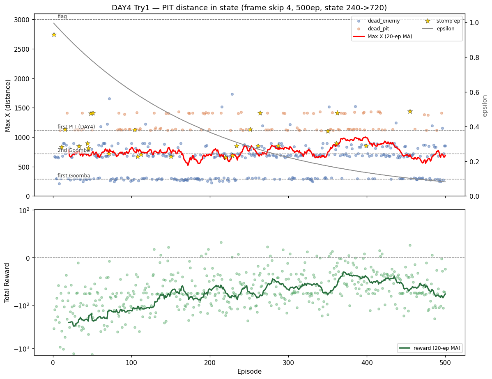
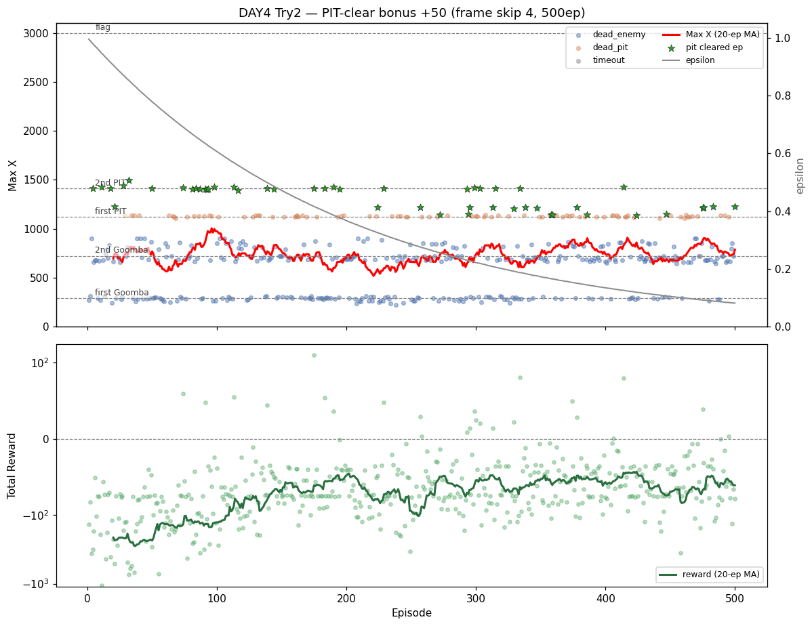

# [DAY4] 발밑의 함정 — 구덩이 거리 인식

> **DAY3에서 남은 숙제**: 첫 굼바는 거의 넘게 됐지만(후반 93%) 병목이 뒤로 밀려
> **2차 굼바(x720~905) 24.6% · 첫 구덩이(x≈1120) 19.8%** 가 새 벽이 됐다.
> (상세: [\[DAY3\] 인식에서 행동으로](<[DAY3] 인식에서 행동으로 - 굼바 밟기 보상.md>))
> 이 문서는 **구덩이**를 공략한다 — 굼바에서 통한 패턴(거리를 숫자로 줘서 피하게)을 발밑 지형에 복제한다.
> 가설은 실험 *전에* 먼저 쓴다(예측→검증).

---

## 공통 설정 (트라이 간 고정)

DAY3와 동일, **트라이마다 딱 한 가지만** 바꾼다.

| 항목 | 값 |
|---|---|
| 알고리즘 | Q-Learning (α=0.1 / γ=0.99) |
| epsilon | 1.0 → ×0.995/판 → 하한 0.01 |
| 프레임 스킵 / 에피소드 | 4 / 500 |
| 굼바 밟기 보너스 | +50 (DAY3 값 유지) |
| 측정 지표 | **첫 구덩이(x≈1120) 통과율** · **낙사(dead_pit) 비율** · Max X · 사망 원인 |

---

## 트라이 1 — 구덩이 거리 인식

### 변경
- **Python**: 바닥 타일맵을 읽어 마리오 앞 빈 칸(구덩이)까지 거리를 단계화하는 `detect_pit_distance` 추가.
  (굼바의 `detect_enemy_distance`와 대칭)
- **검증 먼저**: 상태에 박기 *전에* 임시 `[pit]` 로그로 x≈1120에서 거리값이 진짜 반응하는지 확인 → 끝나면 제거.
  (픽셀이 두 번 속인 교훈 — 추측 말고 측정)
- 검증되면 → `GameState`에 `pit_dist`, `StateEncoder`에 차원 추가. 단계 수는 검증 후 결정(상태 폭증 주의).
- 보상·다른 인코딩은 그대로(한 번에 하나만).

### 가설
- **1순위 = 감지가 진짜인지 검증.**
- 효과는 제한적일 수 있다 — 구덩이는 위치 고정(x≈1120)이라 `xZone`이 이미 대리한다(DAY2 굼바 enemy_dist와 같은 논리).
- 단 구덩이는 **회복 불가 + 타이밍이 빡세서** "코앞"을 아는 게 굼바보다 결정적일 수도. → 통과율↑·낙사↓ 나오나?

### 결과 — 신호는 진짜, 효과는 제한적 (가설 적중)

**① 감지는 진짜다.** `[pit]` 로그에서 pitDist가 `96→80→…→16`으로 단조 감소, 구덩이 위에선 `None`,
지면은 행11·12가 `84`로 꽉 참. 낙사(`dead_pit endY≈253`)와 위치 일치. maxX 교차검증 불일치 **0**.

**② 그런데 수치는 거의 안 바뀌었다.**

| 지표 | DAY3 트라이1 | **DAY4 트라이1** | |
|---|---|---|---|
| 평균 Max X | 764 | **756** | ≈ |
| 낙사(dead_pit) | 125 | **116** | 소폭▼ |
| 굼바 사망 | 373 | 384 | ≈ |
| 첫 굼바 통과율 | 75% | 72% | ≈ |
| best Max X | 1874 | **2742** | ▲(단일 분산) |

- **첫 구덩이 도달 124판(25%) 중 통과 52%** — 절반은 상태로 구덩이를 *알고도* 빠진다.
- **후반 greedy인데 안 오른다**: 100판 낙사 `21→28→19→32→16`, 첫구덩이 통과 `10→16→11→16→11` — 추세 없이 진동.
  그래프 빨간 MA선도 ε↓에도 평평. DAY2 굼바(enemy_dist)는 후반 통과율이 올랐던 것과 대비.

### 결론
- **가설대로 "효과 제한적"이 맞았다.** pit_dist는 진짜 신호지만 낙사·통과율을 뚜렷이 못 바꿨다.
  이유도 예측대로 — 구덩이는 위치 고정(x≈1120)이라 **xZone이 이미 대리**하고 있었다(DAY2 enemy_dist 데자뷰).
- **진짜 병목은 "인식"이 아니라 "점프 제어"다.** 도달판의 절반만 통과 = 코앞인 걸 알려줘도 *타이밍·거리를 못 맞춘다.*
  굼바는 점프만 하면(밟든 뛰든) 넘지만, 구덩이는 점프 시작 위치가 어긋나면 무조건 추락 → 제어 한계가 더 부각.
  DAY3 "밟기는 보상이 아니라 상태/제어 문제"와 같은 결론에 다시 도달.

---

## 트라이 2 — 구덩이 통과 보너스 (+50)

### 변경
- 구덩이를 무사히 건너면 **+50** (`PIT_CLEAR_BONUS`, 굼바 밟기와 통일). 다른 건 그대로.
- 감지(굼바 밟기와 대칭): 앞에 나타난 구덩이의 절대 x를 기억 → 마리오가 폭 너머(+32px)까지 가고도
  생존(`not done`)이면 통과. 빠지면 `dead_pit`이라 보너스 안 들어감 → **넘은 경우만** 보상.
- 측정: `pitclears=N` + 임시 `[clear]` 로그로 검증.

### 가설
- 트라이1에서 "병목은 인식이 아니라 제어"였다. 그럼 **통과 자체를 보상해도 효과는 제한적**일 것.
- 단 굼바 밟기와 달리 특정 행동이 아니라 "통과라는 결과"를 보상하므로 약간은 다를 수도.
- **효과 있으면**: 보상으로도 밀어줄 수 있음. **없으면**: 제어가 병목이라는 진단 재확인. 어느 쪽이든 결론.

### 결과 — 감지는 진짜, 통과율은 오히려 내렸다

**① 감지 검증 통과.** `[clear]`가 첫 구덩이(`pit@1108 crossed at x=1142`)·둘째 구덩이(`pit@1376→1415`)에서만
찍힘. `Ep4 dead_pit maxX=1416 pitclears=1`처럼 "첫 구덩이는 넘고 둘째에서 빠짐"도 정합. 빠진 구덩이엔 보너스 안 들어감.

**② 그런데 수치는 나아지지 않았다 (오히려 약간 ▼).**

| 지표 | 트라이1 | **트라이2 (+50 통과보너스)** | |
|---|---|---|---|
| 평균 Max X | 756 | 737 | ≈ |
| 낙사(dead_pit) | 116 | 120 | ≈ |
| 첫 구덩이 통과(>1145) | 64판(13%) | **46판(9%)** | ▼ |
| **도달판 중 통과율** | 52% | **35%** | ▼ |
| best Max X | 2742 | 1493 | ▼(단일 분산) |

- 통과 보너스를 받은 판은 49판(10%)인데, **통과율 자체는 52→35%로 떨어졌다.**
- 후반 greedy로 가도 통과판이 `15→8→8→11→7`로 늘지 않음. 보너스가 학습을 끌어올리지 못했다.

### 결론
- **가설 적중(더 강하게): 통과를 보상해도 통과율은 안 올랐다(오히려 약간 ▼, 단일 실행 분산 감안).**
- 이유는 트라이1과 같다 — **넘으려면 이미 제어가 돼야 하는데**, 보너스는 그 제어를 만들어주지 못한다.
  결과(+50)를 칭찬해도 그 결과를 *낼 수단*이 없으면 헛돈다. DAY3 트라이2(밟기 보너스 키워도 밟기 무변화)와 똑같은 구조.
- 오히려 ▼ 한 정황: 제어가 안 되는데 보너스가 "구덩이 돌진"을 부추겨 더 자주 빠진 것으로 보인다(DAY3 밟기 보너스 키웠을 때 불안정과 유사). 단 단일 실행이라 분산일 수도.
- **인식(트라이1)도 보상(트라이2)도 구덩이를 못 뚫었다.** 두 방향이 다 막혔으니, 남은 병목은 **제어(공중 상태 인지·점프 정밀도)** 로 좁혀진다.
