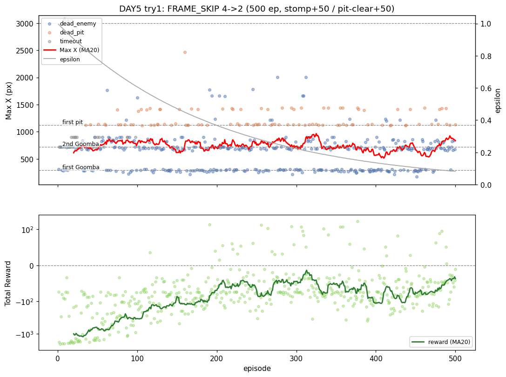
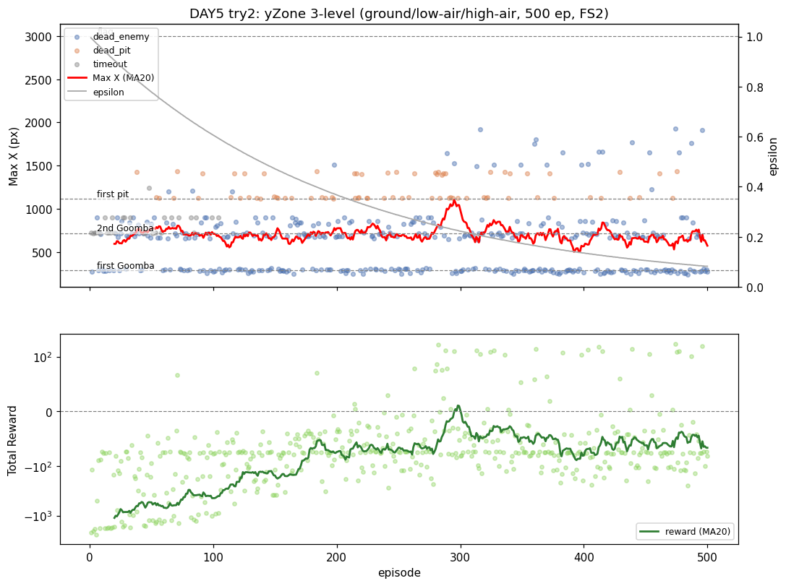
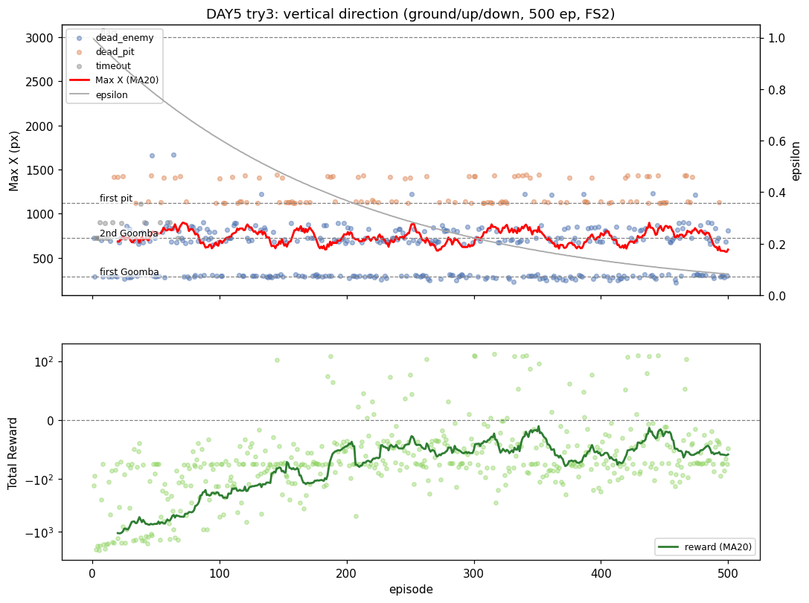

# [DAY5] 둔한 발 — 프레임 스킵 줄이기

> 🎯 점프 제어를 직접 손본다.

**배경** · DAY4까지 인식(구덩이 거리)·보상(통과 보너스) 둘 다 구덩이를 못 뚫었다. 남은 병목은 **제어 — 점프 정밀도**. (상세: [\[DAY4\] 발밑의 함정](<[DAY4] 발밑의 함정 - 구덩이 거리 인식.md>))

*가설은 실험 전에 먼저 쓴다(예측→검증).*

---

## 공통 설정 (트라이 간 고정)

DAY4와 동일, **트라이마다 딱 한 가지만** 바꾼다.

| 항목 | 값 |
|---|---|
| 알고리즘 | Q-Learning (α=0.1 / γ=0.99) |
| epsilon | 1.0 → ×0.995/판 → 하한 0.01 |
| 에피소드 | 500 |
| 보상 보너스 | 굼바 밟기 +50 · 구덩이 통과 +50 (DAY3·4 유지) |
| 상태 인코딩 | xZone × pit_dist × enemy_dist × yZone (DAY4 그대로) |
| 측정 지표 | 첫 구덩이(x≈1120) 통과율 · 낙사 비율 · Max X · 사망 원인 |

---

## 트라이 1 — 프레임 스킵 4 → 2

### 🤔 왜 이 방향인가
점프 한 번이 4프레임 한 덩어리라 너무 듬성듬성 — 코앞인 줄 알면서도 타이밍을 못 맞추는 것 아닐까. 제어 해상도를 높인다.

### 변경
- `FRAME_SKIP` 4 → 2 (`mario_env_server.py`, Java 무관). 점프 궤적을 더 잘게 제어, 대신 한 판 ~2배 느려짐.

### 가설
- 제어 해상도를 높이면 통과율↑·낙사↓? 부작용: 스텝이 잘아져 도달 거리 손해 가능. 효과 있으면 병목=제어(해상도), 없으면 상태(공중 인지) → yZone.

### 결과

비교 기준 = 같은 보상에서 FS4였던 DAY4 트라이2.

| 지표 | DAY4-T2 (FS4) | **DAY5-T1 (FS2)** | |
|---|---|---|---|
| 평균 Max X | 737 | 741 | ≈ |
| 낙사(dead_pit) | 120 | **100** | ▼ |
| 첫 구덩이 통과 | 46판(9%) | 56판(11%) | 소폭▲ |
| **도달판 중 통과율** | 35% | **48%** | ▲ |
| best Max X | 1493 | 2466 | ▲(단일 분산) |

- 도달중 통과율 35→48%·낙사↓ — 가설 방향과 부합. 단 평균 Max X는 그대로(스텝이 잘아져 전진폭 손해가 상쇄, 예측한 부작용).
- 후반 greedy로도 안 오른다(100판 통과 4→14→16→12→10, MA 평평).

### 결론
- **부분 적중** — 해상도 효과는 *조금* 있다(병목=제어 방향은 맞음). 단 FRAME_SKIP만으론 벽을 못 뚫는다 — AI는 *언제 뛸지* 모른다(공중인지조차 상태로 모름).
- → 다음: **yZone을 살려 공중 상태를 상태에 넣는다.**

> 그래프: 파란점=굼바사망 · 주황점=낙사 · 회색=timeout/ε(우축) · 빨간선=20판 MA. 기준선: 290/722/1120/3000.

---

## 트라이 2 — yZone 살리기 (공중 상태 인지)

### 변경
- **yZone 2단계 → 3단계**: 지상(`y<100`) / 낮은 공중(`100~150`) / 높은 공중·정점(`≥150`). 상태 720→1080.
- 임계는 **측정으로 확정**: 종료 로그에 `minY`/`maxY` 추가 → 실측 지상 79·점프 정점 160~199.

### 가설
- 공중 상태를 알면 점프 타이밍을 배워 통과율↑·낙사↓? **실패해도 분기점**: 안 넘으면 "공중인 줄 몰라서"가 아니라 상승/하강 타이밍(②) 문제.

### 결과 — 신호는 살았지만 통과율은 안 올랐다

| 지표 | 트라이1 | **트라이2 (yZone 3단계)** | |
|---|---|---|---|
| 평균 Max X | 741 | 701 | ▼ |
| 낙사 | 100 | **73** | ▼ |
| 첫 구덩이 도달 | 117(23%) | 98(20%) | ▼ |
| 첫 구덩이 통과 | 56(11%) | 53(11%) | ≈ |
| **도달판 중 통과율** | 48% | **54%** | ▲ 소폭 |

- 신호는 진짜(전 판 점프·yZone 0→1→2 변화 확인). 그런데 거의 다 약간 ▼ — 상태 +50%인데 학습은 500판 그대로라 희박해진 정황.

### 결론
- **가설 기각 + 분기 확정.** 공중을 정확히 알려줘도 통과율 불변 → 못 넘는 이유는 "공중인 줄 몰라서(①)"가 **아니다.**
- 남은 건 **② 상승/하강 타이밍** — 높이 스냅샷은 같은 높이를 두 번 지나 ②를 못 푼다. → 수직 *방향*을 넣는다.

---

## 트라이 3 — 수직 방향 인식 (높이 → 방향 교체)

### 변경
- **yZone(높이 3단계) → vy_dir(방향 3단계)**: 지상·정지(0)/상승(1)/하강(2). 상태 1080 유지(높이를 버리고 방향을 얻음).
- 방향은 RAM 추측 없이 `Δy = 현재y − 직전y`로 계산(y_pos는 위로 갈수록 큼). 임시 `[vy]` 로그로 점프 시 1↔2 전환 검증 후 제거.

### 가설
- 같은 높이의 상승/하강이 갈리면 통과율↑? 효과 있으면 ②가 병목 확정, 없으면 상태 정보로는 구덩이를 못 푼다.

### 결과 — 신호는 진짜, 통과율은 또 불변

`[vy]` 검증: `79→84→93→108`(상승 1) → `108→99→89→79`(하강 2), 정점에서 정확히 전환 ✅.

| 지표 | 트라이2 (높이) | **트라이3 (방향)** | |
|---|---|---|---|
| 평균 Max X | 701 | 730 | ▲ 소폭 |
| 첫 굼바 통과 | 64% | 68% | ▲ |
| 첫 구덩이 도달 | 98(20%) | 121(24%) | ▲ |
| 첫 구덩이 통과 | 53(11%) | 54(11%) | ≈ |
| **도달판 중 통과율** | 54% | **45%** | ▼ |

- 방향은 전진·굼바엔 약간 도움 — 더 자주 도달하고, 더 자주 빠진다(낙사 113).
- **세 트라이 도달중 통과율: 48% · 54% · 45%** — 전부 ~50%에서 진동.

### 결론
- **가설 기각.** ②(상승/하강)도 결정적 병목이 아니다.
- **DAY5 종합: 제어 상태 3종(해상도·높이·방향) 모두 구덩이 ~50% 벽을 못 넘었다.** "보상·인식으로 제어 못 풂"(DAY3·4)이 제어 *상태 정보*에도 적용.
- 남은 병목은 상태가 아니라 더 아래 — **테이블 QL + 6이산 행동 + 점프 물리의 표현력, 또는 500판·1080상태 학습 예산.** 다음은 상태 추가가 아니라 *알고리즘/행동/예산*.
- (셋 다 단일 실행이라 45~54% 차이는 분산일 수 있음 — 견고한 건 "어느 것도 뚜렷이 못 올림".)
