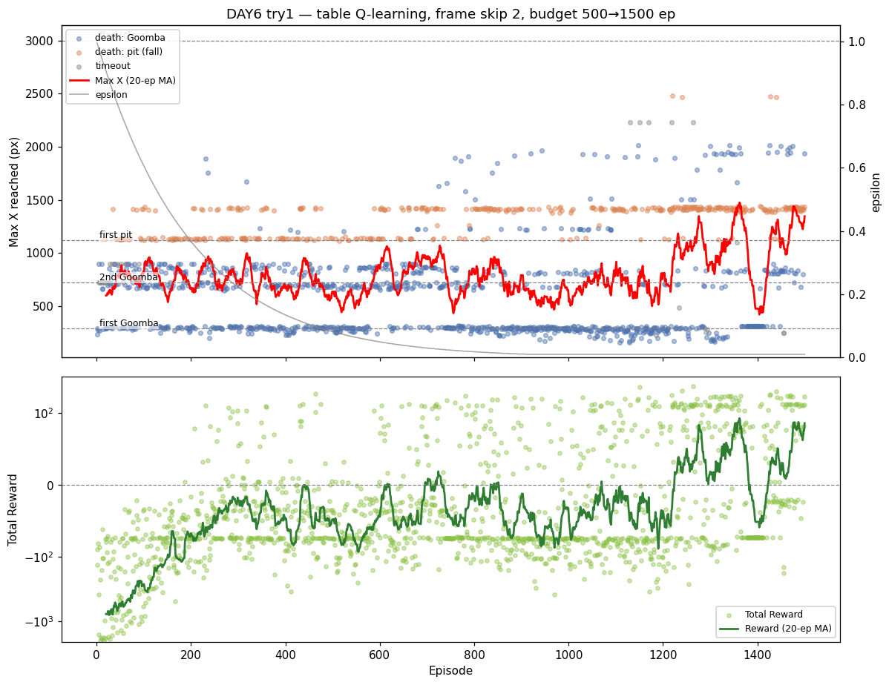

# [DAY6] 상태가 아니라 엔진 — 예산·행동·알고리즘

> **DAY5까지의 결론**: 제어 상태 3종(해상도·높이·방향) 모두 구덩이 **도달중 통과율 ~50% 벽**을 못 넘었다.
> "보상·인식·제어 상태로 제어 못 풂"이 확정됐다. (상세: [\[DAY5\] 둔한 발](<[DAY5] 둔한 발 - 프레임 스킵 줄이기.md>))
> 남은 병목은 상태가 아니라 **엔진** — 학습 예산 / 행동 공간 / 알고리즘.
> 이 문서는 **가장 싼 것부터** 친다: ① 예산 → 안 되면 ② 행동 → 안 되면 ③ 알고리즘.
> 가설은 실험 *전에* 먼저 쓴다(예측→검증).

---

## 공통 설정 (트라이 간 고정)

DAY5와 동일, **트라이마다 딱 한 가지만** 바꾼다.

| 항목 | 값 |
|---|---|
| 알고리즘 | 테이블 Q-Learning (α=0.1 / γ=0.99) |
| epsilon | 1.0 → ×0.995/판 → 하한 0.01 |
| 프레임 스킵 | 2 (DAY5 트라이1 값 유지) |
| 보상 보너스 | 굼바 밟기 +50 · 구덩이 통과 +50 (DAY3·4 값 유지) |
| 상태 인코딩 | xZone × pit_dist × enemy_dist × vy_dir ≈ 1080상태 (DAY5 트라이3 그대로) |
| 측정 지표 | 첫 구덩이(x≈1120) 통과율 · 낙사(dead_pit) 비율 · Max X · 사망 원인 |

---

## 트라이 1 — 학습 예산 늘리기 (500 → 1500판)

### 변경
- `MAX_EPISODES` 500 → 1500 (`Main.java`, Python 무관). ε 감쇠(×0.995)는 그대로 — 후반 더 오래 greedy로 굳히는 효과.

### 가설
- DAY5에서 상태를 240→1080(+4.5배)로 키우면서도 학습은 500판 그대로였다. 칸은 늘었는데 채울 경험이 부족했던 것 아닐까?
- 예산을 늘리면 구덩이 도달중 통과율(~50%)이 오를까?
- **실패해도 분기점**: 더 학습해도 안 넘으면 → 병목은 예산이 아니라 **행동/알고리즘**(②③으로). DAY5 "분산일 수도" 의심도 함께 해소(더 많은 판 = 분산↓).

### 결과 — ~50% 벽이 뚫렸다 (가설 입증)



비교 기준은 같은 설정(FS2·상태 1080)에서 500판이던 **DAY5 트라이3**.

| 지표 | DAY5 트라이3 (500판) | @500판 | @1000판 | **@1500판** |
|---|---|---|---|---|
| 평균 Max X | 730 | 744 | 733 | **795** |
| best Max X | 1671 | 1889 | 1962 | **2477** |
| 첫 굼바 통과(>330) | 68% | 69% | 64% | 63% |
| 첫 구덩이 도달(≥1120) | 24% | 26% | 26% | **33%** |
| 첫 구덩이 통과(>1145) | 11% | 9% | 14% | **24%** |
| **도달중 통과율** | 45% | 33% | 55% | **74%** |
| pitclears 누적 | — | 69 | 225 | **576** |
| clear | 0 | 0 | 0 | **0** |

**100판 구간별 도달중 통과율 — ε 감쇠와 정확히 맞물린다:**

```
ep   1- 500 : 26·12·47·33·42%   ← 진동 (DAY5가 본 구간 = "~50% 벽")
ep 601- 900 : 74 → 80 → 95%     ← ε이 하한(0.01)에 닿으며 greedy로 굳음
ep 901-1500 : 95·92·97·95·96·95% ← 600판 내내 95% 안정 유지
ep1201-1500 : 평균 Max X 1022·978·1156 ↑ + 도달률도 ~55%로 동반 상승
```

- **DAY5의 "~50% 벽"은 학습 예산 부족이었다.** 500판에서 멈춘 DAY5는 ε이 굳기 *전*(진동 구간)만 봤다. 600판 이후 도달중 통과율이 95%로 뛰고 **600판 내내 유지** — 단발 운이 아님.
- **중간(1000판) 우려도 해소**: 그때는 "도달하면 넘지만 도달률은 안 늚(26%)"이었으나, 1500판에선 ep1201~ 평균 Max X·도달률(33%)까지 **동반 상승**. 굼바도 더 안정적으로 넘어 구덩이까지 더 자주 도달.
- best 2477(구덩이 한참 너머)까지 갔으나 **clear=0** — 깃발(3000)엔 못 닿음.

### 결론
- **가설 입증: DAY5 "~50% 벽"의 정체는 학습 예산 부족이었다.** 상태를 1080으로 키운 만큼 500판으론 greedy 정책이 못 굳었던 것. 판수를 3배로 주니 도달중 통과율 45→74%(후반 95%), 통과 11→24%로 명확히 넘어섰다. 트라이2·3(행동·알고리즘)으로 갈 것 없이 트라이1에서 벽을 뚫음.
- **단 한계**: ① **clear=0** — best 2477에서 멈춤, **구덩이 너머 ~2500이 새 병목.** ② ε 하한 고정이라 정책 다양성 없음(굳은 단일 경로). ③ 단일 실행 — 95% 유지가 견고하나 절대수는 1회 분산 포함.
- → DAY6의 핵심 교훈: **"보상·인식·제어 상태로 제어 못 풂"(DAY3·4·5)이 곧 "안 풀린다"는 아니었다 — 같은 알고리즘도 예산을 주면 굳는다.** 다음 병목은 상태가 아니라 **구덩이 너머 새 구간(~2500)** 으로 이동. (트라이2 행동·트라이3 알고리즘은 미실행 — 보류.)

---
