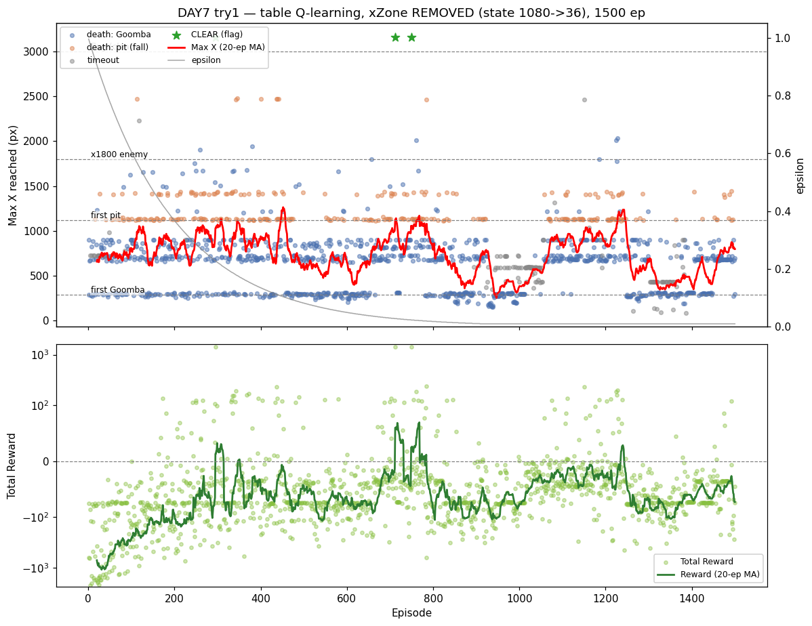
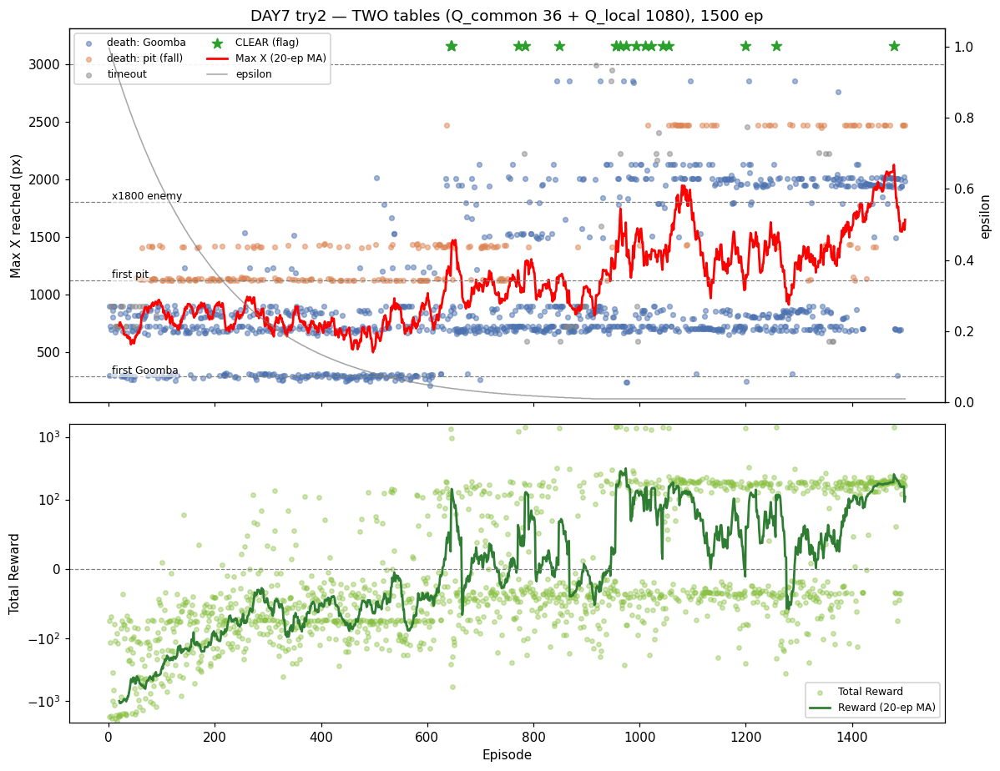

# [DAY7] 한 번 배워 어디서나 — 위치 독립 일반화

> 🎯 **한 번 배워 어디서나** — 굼바를 위치 독립으로 일반화한다.

**배경** · DAY6은 예산을 늘려 구덩이를 95% 넘었으나, 새 병목 x1750~2000 적에서 20%에 막혔다. (상세: [\[DAY6\] 상태가 아니라 엔진](<[DAY6] 상태가 아니라 엔진 - 예산·행동·알고리즘.md>))

**측정** · 관문별 통과율이 제각각 = 일반화 실패

| 첫 굼바 | 2차 굼바 | 구덩이 | x1800 |
|:-:|:-:|:-:|:-:|
| 61% | 76% | 95% | **20%** |

**범인** · 상태의 `xZone` — 같은 "굼바 가까움"도 x290·x1800이 다른 칸이라 학습이 안 옮겨간다.

**이번** · `xZone`을 빼 "굼바=넘기"를 위치와 무관하게 가르친다.

*가설은 실험 전에 먼저 쓴다(예측→검증).*

---

## 공통 설정 (트라이 간 고정)

DAY6과 동일, **트라이마다 딱 한 가지만** 바꾼다.

| 항목 | 값 |
|---|---|
| 알고리즘 | 테이블 Q-Learning (α=0.1 / γ=0.99) |
| epsilon | 1.0 → ×0.995/판 → 하한 0.01 |
| 프레임 스킵 | 2 |
| 에피소드 | 1500 (DAY6 값 유지) |
| 보상 보너스 | 굼바 밟기 +50 · 구덩이 통과 +50 |
| 측정 지표 | **관문별 통과율(첫 굼바·2차·구덩이·x1800)** · Max X · 사망 원인 |

---

## 트라이 1 — 위치 빼기 (상태 1080 → 36)

### 🤔 왜 이 방향인가

**관찰** · DAY6 측정에서 관문별 통과율이 제각각이었다(첫 굼바 61% · x1800 20%). 같은 굼바인데 위치마다 천차만별 = "굼바=넘기"를 **위치별로 따로 암기**했다는 뜻.

**추론** · 범인은 상태 인덱스에 든 `xZone`이다. 그런데 마리오가 점프할지 정할 때 정말 필요한 건 "내가 몇 m 지점인가"가 아니라 **"눈앞에 뭐가 얼마나 가까운가"** — 그건 `enemyDist`·`pitDist`·`vyDir`가 위치와 무관하게 이미 알려준다. 즉 `xZone`은 일반화를 막는 방해물이다.

**결정** · `xZone`을 뺀다. 모든 위치의 굼바 경험이 한 칸에 합쳐져, 첫 굼바에서 배운 점프가 x1800에도 전이된다. (위치로만 구별되는 상충 구간이 있으면 손해 = perceptual aliasing → 그땐 트라이2.)

### 변경
- `StateEncoder`에서 **`xZone` 제거**. 상태 = `pitDist(3) × enemyDist(4) × vyDir(3)` = **36칸**.
- 인덱스 = `pitDist*12 + enemyDist*3 + vyDir`. `STATE_SIZE` 1080→36. (Java만, Python 무관)

### 가설
- 위치를 빼면 x290·x1800의 "굼바 가까움"이 **같은 칸**이 된다 → 첫 굼바에서 배운 점프가 x1800에 전이.
- **x1800 통과율이 첫 굼바 수준(~61%)으로 오를까?** + 상태가 30배 작아져 학습도 빨라질까?
- **실패해도 분기점**: 통과율이 *떨어지면* → 1-1에 "위치로만 구별되는 상충 굼바 구간"이 있다는 뜻(안대 부작용 = perceptual aliasing). 그러면 → 트라이2(두 테이블)로 위치 보정.

### 결과 — 일반화는 대성공, 그런데 후반이 진동한다



비교 기준은 같은 1500판이던 **DAY6 트라이1**(위치 포함, 1080칸).

| 지표 | DAY6 (1080칸) | **DAY7 트라이1 (36칸)** | |
|---|---|---|---|
| **clear (깃발)** | **0** | **3** 🏁 | ▲▲ |
| best Max X | 2477 | **3161** (깃발) | ▲ |
| x1800 통과율 | 20% | **59%** (22도달) | ▲▲ |
| pitclears 누적 | 576 | 244 | ▼* |
| 평균 Max X | 795 | **734** | ▼ |
| timeout 사망 | 27 | **132** | ▲ (나쁨) |

\* pitclears↓는 후반 붕괴로 구덩이 도달 자체가 줄어든 결과.

**① 가설 적중 — 일반화가 깃발을 뚫었다.** DAY6에서 20%였던 x1800을 **59%**로 넘고, **깃발을 3번 클리어**(ep295·712·749, 모두 maxX 3161)했다. xZone을 빼니 첫 굼바에서 배운 점프가 x1800에도 전이됐고, 상태가 36칸으로 작아 학습도 빨라(이미 ep295에 첫 클리어) DAY6이 1500판에도 못 한 깃발을 뚫었다.

**② 그런데 ε이 굳은 뒤 후반이 롤러코스터처럼 진동한다.**

```
ep701-800 : 평균 955 · timeout  0 · clear 2 · 첫굼바 87%  ← 정점
ep901-1000: 평균 467 · timeout 27 ·          첫굼바 57%  ← 붕괴
ep1001-1100: 평균 679 · timeout 44                       ← 붕괴 지속
ep1101-1200: 평균 912 · timeout  6 · 첫굼바 98%           ← 회복
ep1301-1400: 평균 411 · timeout 38 · 첫굼바 47%           ← 또 붕괴
ep1401-1500: 평균 665 · timeout  0                        ← 회복
```

- timeout이 0↔44를 오가며 **붕괴↔회복을 반복**. 붕괴 구간엔 첫 굼바(x290)조차 못 넘고 x400~470에서 멈춰 시간만 흘린다.
- 이 진동이 평균 Max X를 갉아먹어, **clear는 3번인데 평균은 오히려 DAY6보다 낮다**(795→734).

### 결론
- **일반화 가설은 명백히 입증됐다.** xZone 제거로 x1800 통과율 20→59%, **깃발 클리어 0→3회**(7일 만의 첫 클리어). "굼바는 어디서든 넘는 것"을 위치 독립으로 가르치니, 첫 굼바 학습이 맵 전체로 전이됐다. **"안대 부작용(통과율 하락)"은 없었다** — 1-1엔 위치로만 구별되는 상충 굼바가 없다.
- **단 새 부작용: ε이 굳은 뒤 정책이 진동한다.** 36칸이 너무 작아, 한 칸의 Q값이 timeout 페널티(−50)와 전진 보상 사이에서 흔들리면 그 칸을 공유하는 많은 상황이 **한꺼번에 멈춤(timeout)** 으로 무너지고, ε≈0이라 탐험으로 빠져나오지도 못한다. 일반화가 학습은 빠르게 시켰지만, 같은 이유로 **망가질 때도 크게 망가진다**(칸 공유의 양날).
- → **트라이2(두 테이블)의 필요성이 데이터로 드러났다.** 일반화(`Q_공통`)는 얻되, 진동하는 칸을 `Q_위치`로 분리·안정화하면 "빠른 일반화 + 안정성"을 둘 다 챙길 수 있는지 본다. ("안대 부작용"이 아니라 **"36칸 진동"**이 트라이2로 가는 진짜 이유가 됐다.)
- (단일 실행 — clear 3·진동 폭은 1회 분산 포함. 견고한 건 "일반화로 깃발을 뚫었다 + 36칸은 후반이 불안정하다".)

---

## 트라이 2 — 두 테이블 합치기 (공통 + 위치)

> 트라이1에서 일반화 이득은 확인하되 "안대 부작용"이 보이면 진행. (사용자 발안 — coarse/tile coding)

### 변경
- Q-Table을 **둘**로: `Q_공통[36]`(위치 무시 = `encodeCommon`) + `Q_위치[1080]`(위치 포함 = `encodeLocal`).
- 행동 선택·갱신 모두 **두 점수를 합산**(`Q(s,a) = qCommon[c][a] + qLocal[l][a]`).
- TD 오차 δ를 **양쪽에 α/2씩** 적용(타일 코딩 — 합산 Q의 실효 학습률 발산 방지). `StateEncoder`·`QLearning`·`RLAgent` 수정, Python 무관.

### 가설
- `Q_공통`은 모든 위치의 굼바 경험이 합쳐져 "굼바=점프"를 빠르게·강하게 학습 → **일반화**.
- `Q_위치`는 특정 지점에서만 예외를 덧칠 → 트라이1의 **"36칸 진동"을 분리·안정화**.
- 트라이1보다 일반화(clear)는 지키고 **후반 timeout 진동은 줄어들까?**

### 결과 — 두 테이블이 트라이1을 압도한다



| 지표 | 트라이1 (36칸) | **트라이2 (두 테이블)** | |
|---|---|---|---|
| **CLEAR (깃발)** | 3 | **17** 🏁 | ▲ 5.7배 |
| 평균 Max X | 734 | **1098** | ▲ +50% |
| **timeout (진동)** | 132 | **46** | ▼ 1/3 |
| 구덩이 통과율 | 42% | **78%** | ▲▲ |
| x1800 통과 | 59% (22도달) | 38% (**320도달**) | 도달 14배 |
| best Max X | 3161 | 3161 | = |

**① 진동이 잡히고 후반이 우상향한다** (트라이1은 후반 467로 붕괴했던 자리):

```
ep 901-1000: 평균 1284 · timeout 7 · clear 5
ep1001-1100: 평균 1559 · timeout 4 · clear 4
ep1401-1500: 평균 1844 · timeout 0 · clear 1   ← 최고점
```

- 후반 timeout이 트라이1(27·44) → 트라이2(7·4)로 억제되고, **붕괴 없이 평균이 1844까지 우상향**.
- **@500판엔 느렸다**(clear 0, x1800 0도달 — 1080칸 재등장 + α/2 탓). 그러나 600판 이후 자리잡으며 트라이1을 **전 지표에서 추월**.
- x1800은 통과율(38%)만 보면 트라이1(59%)보다 낮으나, **도달이 22→320판으로 14배** 폭증(앞 구간이 안정돼 더 자주 도달) → 절대 통과수는 압도.

### 결론
- **가설 완전 입증 — 두 테이블이 답이다.** `Q_공통`이 일반화를 지켜 **clear 3→17**, `Q_위치`가 진동 칸을 분리·안정화해 **timeout 132→46·붕괴→우상향**. "빠른 일반화 + 안정성"을 둘 다 얻었다. 트라이1의 두 약점(느린 학습은 아니고 *후반 진동*)이 정확히 보정됐다.
- **사용자 발안(두 테이블 = tile/coarse coding)의 승리.** "위치 있는 정보·없는 정보를 둘 다 주고 합치자"는 직관이 DQN·함수근사로 가는 정석 기법이었고, 데이터가 그대로 증명했다.
- 비용: 코드가 조금 복잡(두 테이블·α 분할)하고 @500까진 느리다. 하지만 굳은 뒤 격차가 압도적이라 분산으로 보기 어렵다.

---

## DAY7 종합 — 위치를 "빼고" → "되살려 합치다"

| 트라이 | 상태 구성 | clear | 평균 Max X | timeout | 핵심 |
|---|---|---|---|---|---|
| **1** | 위치 제거 (36칸) | 3 | 734 | 132 | 일반화로 **첫 클리어**, 단 36칸 진동 |
| **2** | 공통 36 + 위치 1080 | **17** | **1098** | **46** | 일반화 유지 + 진동 안정화 = **압승** |

- **DAY6→7의 사슬**: 예산(DAY6)이 구덩이를 풀자 새 병목 x1800이 드러났고 → 측정하니 "위치별 암기"(xZone) → 위치를 빼니(트라이1) 일반화로 깃발을 뚫었으나 진동 → 위치를 *되살려 합치니*(트라이2) 둘 다 잡혔다.
- **관통 교훈**: 같은 정보(위치)도 **"넣느냐 빼느냐"의 이분법이 아니라 "어떻게 합치느냐"**가 답이었다. 위치를 빼면 일반화하나 불안정, 넣으면 암기, **공통+위치로 합치면 둘 다**. 테이블 Q-Learning에 머문 채로도 tile coding 한 겹으로 함수근사의 일반화 이득을 맛봤다.
- **현재 위치**: 1-1을 1500판 중 17회 클리어, 후반 평균 Max X 1844(깃발 3000의 61%)로 꾸준히 우상향. 더 끌어올리려면 다음은 행동 공간(긴 점프)·예산·또는 1-1 졸업(다른 스테이지)이 후보.
