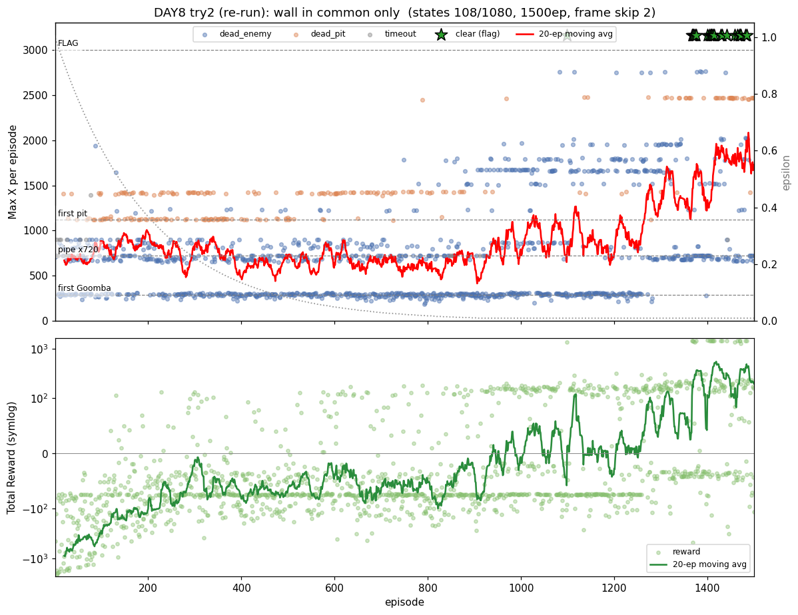

# [DAY8] 투명벽을 보다 — 토관(앞 벽) 거리 인식

> 🎯 **투명벽을 보다** — 상태에 없던 토관(파이프)을 "앞 벽 거리"로 보게 한다.

**배경** · DAY7은 두 테이블(공통+위치)로 1-1을 1500판 중 17회 클리어, 후반 평균 Max X 1844까지 올렸다. (상세: [\[DAY7\] 한 번 배워 어디서나](<[DAY7] 한 번 배워 어디서나 - 위치 독립 일반화.md>))

**측정** · 그런데 토관(파이프)이 상태 어디에도 없다 — `enemy_dist`·`pit_dist`·`vy_dir` 셋 다 토관을 모른다.

**범인** · 토관 앞에 서면 굼바도 구덩이도 없고 지상이라 상태가 **"평지"와 똑같은 칸**이 된다. 점프할 이유를 학습할 신호가 없어 토관은 **"투명벽"** — 앞에서 오른쪽만 밀다 막혀 timeout.

**이번** · 굼바·구덩이 거리화와 **같은 패턴**으로, 마리오 앞 벽까지 거리를 RAM 타일맵에서 읽어 신호로 준다.

*가설은 실험 전에 먼저 쓴다(예측→검증).*

---

## 공통 설정 (트라이 간 고정)

DAY7과 동일, **트라이마다 딱 한 가지만** 바꾼다.

| 항목 | 값 |
|---|---|
| 알고리즘 | 두 테이블 Q-Learning (공통+위치 합산, TD오차 α/2 분할 / α=0.1 · γ=0.99) |
| epsilon | 1.0 → ×0.995/판 → 하한 0.01 |
| 프레임 스킵 | 2 |
| 에피소드 | 1500 (DAY6~ 값 유지) |
| 보상 보너스 | 굼바 밟기 +50 · 구덩이 통과 +50 |
| 측정 지표 | **토관 도달중 통과율** · 관문별 통과율 · Max X · timeout · clear |

---

## 트라이 1 — 앞 벽(토관) 거리 인식 (공통 36→108 · 위치 1080→3240)

### 🤔 왜 이 방향인가

**관찰** · DAY7 일지가 다음 병목으로 "토관이 상태에 없어 투명벽 → 토관 앞 점프 반복/timeout"을 1순위로 지목했다.

**추론** · 토관은 굼바(적 슬롯)·구덩이(빈 지면)와 같은 *물리 장애물*인데 거리 신호만 없다. 마리오가 점프할지 정할 때 필요한 건 "앞에 넘어야 할 벽이 얼마나 가까운가"이고, 그건 굼바·구덩이를 RAM에서 읽은 것과 **똑같이** 타일맵에서 읽을 수 있다.

**결정** · "앞 벽 거리"(`wall_dist`)를 상태에 추가한다. 구덩이가 "지면 행이 **비었다**"였다면, 토관은 그 반대 — 지면 위로 **솟은 블록**.

### 변경
- Python: `nearest_wall_ahead`/`detect_wall_distance` — 마리오 앞 칸의 지면 표면 위 행이 채워졌으면 벽으로 보고 거리를 3단계(0 없음/1 가까움/2 코앞)로. 구덩이 함수와 대칭.
- Java: `GameState.wall_dist` 추가, `StateEncoder.encodeCommon`에 편입.
  - 공통 `36 → 108` (= 3벽 × 3구덩이 × 4굼바 × 3방향), 위치 `1080 → 3240` (× xZone 30).
  - 인덱스 = `wallDist*36 + pitDist*12 + enemyDist*3 + vyDir`.

### 검증 — 추측 말고 측정 (row 11 함정)

상태에 넣기 전, `[wall]` 임시 로그로 신호가 진짜인지 먼저 봤다(픽셀 휴리스틱이 DAY1·2를 두 번 속인 교훈).

- **1차(`WALL_ROW=11`, 지면 바로 위로 가정)** → **출발선 x≈40 평지에서 dist=2가 매 판 떴다(가짜).** 원인: 평지 지면이 **두 칸 두께(행11·12 모두 흙)**라 행11은 벽이 아니라 지면 자체였다. (`GROUND_ROW` 주석에 "행11·12 동일하게 지면"으로 이미 적혀 있던 함정.)
- **2차(`WALL_ROW=10`, 지면 표면 위 첫 빈칸)** → 출발선 가짜가 사라지고, **장애물 위치(x≈430·590·720)에서만 dist 1→2 단조 증가 후 통과 시 0 복귀.** 굼바·구덩이 검증과 같은 단조 패턴. 특히 x≈720 토관 앞에서 dist 1↔2가 길게 진동 = **"투명벽에 막혀 헤매는" 현상을 신호가 그대로 포착**.

→ 신호가 진짜임을 확인하고 상태에 편입, `[wall]` 임시 로그는 제거.

### 가설
- 토관 앞이 이제 "평지"와 다른 칸이 된다 → 마리오가 토관 앞에서 **점프를 학습** → 토관 앞 timeout 감소.
- 굼바·구덩이처럼 **위치 독립**(`Q_공통`)이라, 첫 토관에서 배운 점프가 뒤 토관들에도 전이될까?
- **실패 분기**: 통과율이 안 오르면 → 병목이 인식이 아니라 제어(긴 점프 등 행동 공간)거나, 상태 3배 증가(108·3240)가 1500판 예산을 초과한 것.

### 결과 — 첫 실행은 후퇴처럼 보였으나, 재학습하니 뒤집혔다

같은 코드(108·3240)를 두 번 돌렸더니 **결과가 정반대였다.**

| 지표 | DAY7 트2 (36·1080) | 트1 첫 실행 | **트1 재학습** |
|---|---|---|---|
| CLEAR (깃발) | 17 | **1** | **24** |
| 평균 Max X | 1098 | 714 | 884 |
| greedy 토관 통과율 | — | 78% | 84% |
| 1001~1500 평균 | — | 753 | **1066** (clear 19) |
| best Max X | 3161 | 3161 | 3161 |

**① 토관 timeout 해소는 두 실행 모두 일관**(greedy 통과율 78%·84%, timeout이 ε 높은 초반에만 — 아래 패널에서 보인다). 토관 인식 자체는 분산과 무관하게 견고하다.

**② 그런데 clear가 1 vs 24다.** 첫 실행은 ep500~600에서 붕괴해 clear 1에 그쳤고(그래서 처음엔 "상태 3배 → 예산 부족 후퇴"로 해석했다), 재학습은 후반(1001~1500 평균 **1066**)에 우상향해 **clear 24 — DAY7 원본(17)보다도 높다.** 같은 코드인데 단일 실행 운에 따라 결론이 통째로 뒤집힌다.

### 결론
- **"트라이1이 후퇴했다"는 첫 실행의 분산 아티팩트였다.** 재학습하니 트라이1(108·3240)도 멀쩡히 clear 24를 낸다. "상태 3배 = 예산 부족 후퇴"라는 그럴듯한 인과는 단일 실행으론 입증되지 않는다.
- **견고한 건 토관 인식뿐**(통과율 78~84%·timeout 해소). clear·평균 같은 최종 성적은 분산이 너무 커 한 번으론 못 가린다. → 트라이2도 같은 잣대(여러 실행)로 본다.

---

## 트라이 2 — wall을 공통에만 (위치 3240 → 1080 복귀)

### 🤔 왜 이 방향인가

**관찰** · 트라이1의 후퇴 원인은 상태 3배 폭증인데, 그 대부분은 `Q_위치`(1080→3240)였다.

**추론** · 토관은 "어디서 만나든 똑같이 넘는 것" = **위치 독립** 신호다. 그렇다면 위치 독립을 담당하는 `Q_공통`에만 넣으면 충분하고, `Q_위치`에까지 넣은 건 예산만 먹은 **순수 낭비**다. (트라이1에서 토관 통과율 78%가 나온 건 `Q_공통`이 일했다는 증거 — `Q_위치`의 wall 칸은 기여 없이 비용만 냈다.)

**결정** · `wall_dist`를 `Q_위치` 인코딩에서 **뺀다**. 공통은 108 유지(토관 학습), 위치는 36×30=**1080으로 복귀**(DAY7과 동일).

### 변경
- `StateEncoder`: `encodeLocal`이 벽을 뺀 공통부(`localFeature`, 36)만 쓰도록 분리. `encodeCommon`은 벽 포함(108) 유지.
- 위치 `3240 → 1080`. 전체 비용이 DAY7 수준으로 복귀(공통만 72칸 늘어난 셈). Java만, Python 무관.

### 가설
- 토관 통과(트라이1의 통과율 78%·timeout 해소)는 `Q_공통`이 그대로라 **지켜진다**.
- 위치 테이블이 작아져 예산이 충분 → 트라이1이 붕괴한 501~1000 구간이 **안 무너지고**, clear·평균이 트라이1(1·714)을 넘는다.

### 결과 — 트라이1과 사실상 동률 (분산 안에서)

트라이2도 두 번 돌렸다. **여기서도 첫 실행 vs 재학습 분산이 똑같이 크다.**

| 지표 | 트2 첫 실행 | **트2 재학습** | (참고) 트1 재학습 |
|---|---|---|---|
| CLEAR | 3 | **23** | 24 |
| 평균 Max X | 756 | 882 | 884 |
| greedy 토관 통과율 | 76% | 80% | 84% |
| pitclears 누적 | 588 | **778** | 384 |
| 1001~1500 평균 | 672 | **1236** | 1066 |

**① 트라이2도 clear 3(첫) vs 23(재학습)으로 요동친다.** 트라이1과 똑같은 분산 폭.

**② 재학습끼리 비교하면 트라이1(24)과 트라이2(23)가 사실상 동률**(평균 884 vs 882). 위치 테이블을 1080으로 줄인 게 clear·평균에선 손해도 이득도 아니다 — 분산에 묻혀 차이가 안 보인다. (단 **pitclears는 트2가 778 > 트1 384로 두 실행 모두 일관되게 높아**, 작은 위치 테이블이 구덩이 학습엔 유리할 가능성은 남는다 — 역시 1회씩이라 단정 불가.)

### 결론
- **ⓐ(wall을 공통에만)는 "더 낫다"고도 "같다"고도 단정 못 한다.** 재학습에선 트라이1과 동률, 첫 실행에선 트라이1보다 위 — 분산 범위가 트라이 간 차이보다 크다. 설계상 ⓐ가 더 깔끔한 건 맞지만(위치 독립 신호를 위치 테이블에 넣을 이유가 없다), 그게 성적으로 증명되진 않았다.

---

## DAY8 종합 — 단일 실행으론 트라이를 못 가린다

각 트라이를 2회씩, 총 4회 돌린 결과:

| 실행 | 상태(공통·위치) | clear | 평균 Max X | 토관 통과율 |
|---|---|---|---|---|
| 트1 첫 | 108 · 3240 | 1 | 714 | 78% |
| **트1 재** | 108 · 3240 | **24** | 884 | 84% |
| 트2 첫 | 108 · 1080 | 3 | 756 | 76% |
| **트2 재** | 108 · 1080 | **23** | 882 | 80% |

- **clear가 1~24로 요동친다.** 같은 코드의 두 실행 차이(트1: 1↔24)가 트라이 간 차이(트1재 24 ↔ 트2재 23)보다 **훨씬 크다. 분산 ≫ 효과.** 처음에 "트라이1 후퇴 → 트라이2가 개선"이라는 깔끔한 서사를 썼지만, 재학습하니 둘 다 clear 23·24로 동률이고 DAY7 원본(17)보다도 높았다 — 서사 자체가 분산이 만든 신기루였다.
- **견고한 결론 둘**: ① 토관 인식은 됐다 — 통과율 76~84%·greedy timeout 해소가 **4회 모두 일관**(DAY7의 "투명벽" 병목 해결). ② DAY8 어느 구성도 DAY7 대비 **후퇴는 아니다**(재학습 clear 23·24 ≥ DAY7 17).
- **못 가리는 것**: 트라이1 vs 트라이2 vs DAY7의 우열. 단일 실행으론 분산에 묻힌다.
- **이번 가장 큰 교훈**: **트라이를 단일 실행으로 비교하지 마라 — 분산부터 재라.** 첫 실행만 봤다면 "상태 3배 → 후퇴"라는 그럴듯하지만 틀린 인과를 확정할 뻔했다(DAY1이 죽는 위치만 보고 사인을 단정한 함정의 *통계판*). 앞으로 결론용 지표는 여러 시드의 평균·분포로 본다.
- **다음 후보**: ⓐ 시드 N회로 트라이별 분포 확정(정석) / ⓑ 행동 공간(긴 점프) / ⓒ 1-1 졸업(다른 스테이지).
