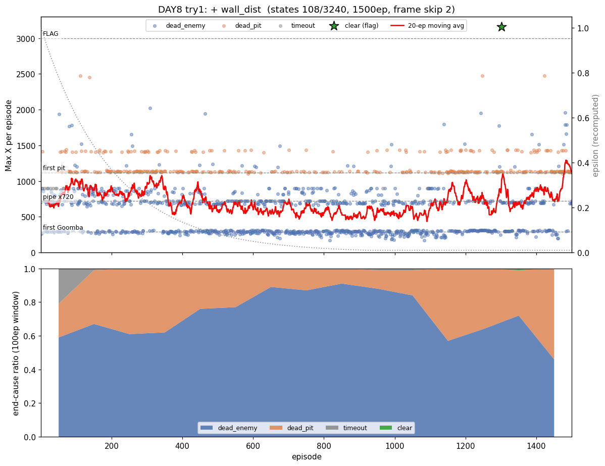

# [DAY8] 투명벽을 보다 — 토관(앞 벽) 거리 인식

> 🎯 **투명벽을 보다** — 상태에 없던 토관(파이프)을 "앞 벽 거리"로 보게 한다.

**배경** · DAY7은 두 테이블(공통+위치)로 1-1을 1500판 중 17회 클리어, 후반 평균 Max X 1844까지 올렸다. (상세: [\[DAY7\] 한 번 배워 어디서나](<[DAY7] 한 번 배워 어디서나 - 위치 독립 일반화.md>))

**측정** · 그런데 토관(파이프)이 상태 어디에도 없다 — `enemy_dist`·`pit_dist`·`vy_dir` 셋 다 토관을 모른다.

**범인** · 토관 앞에 서면 굼바도 구덩이도 없고 지상이라 상태가 **"평지"와 똑같은 칸**이 된다. 점프할 이유를 학습할 신호가 없어 토관은 **"투명벽"** — 앞에서 오른쪽만 밀다 막혀 timeout.

**이번** · 굼바·구덩이 거리화와 **같은 패턴**으로, 마리오 앞 벽까지 거리를 RAM 타일맵에서 읽어 신호로 준다.

*가설은 실험 전에 먼저 쓴다(예측→검증).*

---

## 공통 설정 (트라이 간 고정)

DAY7과 동일, **트라이마다 딱 한 가지만** 바꾼다.

| 항목 | 값 |
|---|---|
| 알고리즘 | 두 테이블 Q-Learning (공통+위치 합산, TD오차 α/2 분할 / α=0.1 · γ=0.99) |
| epsilon | 1.0 → ×0.995/판 → 하한 0.01 |
| 프레임 스킵 | 2 |
| 에피소드 | 1500 (DAY6~ 값 유지) |
| 보상 보너스 | 굼바 밟기 +50 · 구덩이 통과 +50 |
| 측정 지표 | **토관 도달중 통과율** · 관문별 통과율 · Max X · timeout · clear |

---

## 트라이 1 — 앞 벽(토관) 거리 인식 (공통 36→108 · 위치 1080→3240)

### 🤔 왜 이 방향인가

**관찰** · DAY7 일지가 다음 병목으로 "토관이 상태에 없어 투명벽 → 토관 앞 점프 반복/timeout"을 1순위로 지목했다.

**추론** · 토관은 굼바(적 슬롯)·구덩이(빈 지면)와 같은 *물리 장애물*인데 거리 신호만 없다. 마리오가 점프할지 정할 때 필요한 건 "앞에 넘어야 할 벽이 얼마나 가까운가"이고, 그건 굼바·구덩이를 RAM에서 읽은 것과 **똑같이** 타일맵에서 읽을 수 있다.

**결정** · "앞 벽 거리"(`wall_dist`)를 상태에 추가한다. 구덩이가 "지면 행이 **비었다**"였다면, 토관은 그 반대 — 지면 위로 **솟은 블록**.

### 변경
- Python: `nearest_wall_ahead`/`detect_wall_distance` — 마리오 앞 칸의 지면 표면 위 행이 채워졌으면 벽으로 보고 거리를 3단계(0 없음/1 가까움/2 코앞)로. 구덩이 함수와 대칭.
- Java: `GameState.wall_dist` 추가, `StateEncoder.encodeCommon`에 편입.
  - 공통 `36 → 108` (= 3벽 × 3구덩이 × 4굼바 × 3방향), 위치 `1080 → 3240` (× xZone 30).
  - 인덱스 = `wallDist*36 + pitDist*12 + enemyDist*3 + vyDir`.

### 검증 — 추측 말고 측정 (row 11 함정)

상태에 넣기 전, `[wall]` 임시 로그로 신호가 진짜인지 먼저 봤다(픽셀 휴리스틱이 DAY1·2를 두 번 속인 교훈).

- **1차(`WALL_ROW=11`, 지면 바로 위로 가정)** → **출발선 x≈40 평지에서 dist=2가 매 판 떴다(가짜).** 원인: 평지 지면이 **두 칸 두께(행11·12 모두 흙)**라 행11은 벽이 아니라 지면 자체였다. (`GROUND_ROW` 주석에 "행11·12 동일하게 지면"으로 이미 적혀 있던 함정.)
- **2차(`WALL_ROW=10`, 지면 표면 위 첫 빈칸)** → 출발선 가짜가 사라지고, **장애물 위치(x≈430·590·720)에서만 dist 1→2 단조 증가 후 통과 시 0 복귀.** 굼바·구덩이 검증과 같은 단조 패턴. 특히 x≈720 토관 앞에서 dist 1↔2가 길게 진동 = **"투명벽에 막혀 헤매는" 현상을 신호가 그대로 포착**.

→ 신호가 진짜임을 확인하고 상태에 편입, `[wall]` 임시 로그는 제거.

### 가설
- 토관 앞이 이제 "평지"와 다른 칸이 된다 → 마리오가 토관 앞에서 **점프를 학습** → 토관 앞 timeout 감소.
- 굼바·구덩이처럼 **위치 독립**(`Q_공통`)이라, 첫 토관에서 배운 점프가 뒤 토관들에도 전이될까?
- **실패 분기**: 통과율이 안 오르면 → 병목이 인식이 아니라 제어(긴 점프 등 행동 공간)거나, 상태 3배 증가(108·3240)가 1500판 예산을 초과한 것.

### 결과 — 토관은 잡았으나 전체가 후퇴한다 (맞는 신호, 부족한 예산)



| 지표 | DAY7 트라이2 (36·1080) | **DAY8 트라이1 (108·3240)** | |
|---|---|---|---|
| CLEAR (깃발) | **17** | **1** (ep1302) | ▼▼ |
| 평균 Max X | 1098 | **714** | ▼ |
| timeout | 46 | **24** | ▽ |
| greedy 토관 도달중 통과율 | _(미측정)_ | **78%** | — |
| best Max X | 3161 | 3161 | = |

구간별 추세(평균 Max X · clear · timeout):

```
ep   1- 500: 평균 807 · clear 0 · timeout 22  (ε 탐험 구간)
ep 501-1000: 평균 580 · clear 0 · timeout  1  ← 붕괴
ep1001-1500: 평균 753 · clear 1 · timeout  1  ← 부분 회복 (best 3161)
```

**① 목표였던 토관 timeout은 잡혔다.** greedy 구간(ε≈0.01, 501~1500판)에서 timeout이 **각 500판당 단 1회**, 토관(x720) 도달중 통과율 **78%**. 아래 패널에서 timeout(회색)이 ε 높은 초반에만 있고 greedy 후 사라지는 게 보인다. DAY7이 걱정한 "토관 앞 막혀 시간만 흘림"은 해소됐다 — 신호가 일했다.

**② 그러나 전체 성적은 DAY7 트라이2를 전면 후퇴한다.** clear 17→1, 평균 1098→714. 위 패널 이동평균(빨강)이 ep500~600에서 **붕괴**(580)했다가 부분 회복(753)하는 진동을 보인다. DAY7 트라이2가 600판 이후 우상향했던 자리다.

**③ 원인은 예산 부족이 거의 확실하다.** wall_dist를 공통·위치 양쪽에 넣으며 상태가 **3배(36·1080 → 108·3240)** 로 폭증했는데 예산은 1500판 그대로다. DAY6에서 입증된 "상태↑인데 예산 그대로 → Q가 덜 채워진 채 ε≈0으로 greedy 고착" 패턴 그대로 — dead_enemy가 72%로 늘고(미학습 칸에서 앞 굼바조차 못 넘음) 붕괴↔회복이 그 증거다.

### 결론
- **인식은 성공, 예산이 발목.** 토관 신호 자체는 진짜고(검증 + timeout 해소가 증거) 의도한 병목을 풀었다. 그러나 같은 신호를 **공통+위치 양쪽**에 넣어 상태가 곱으로 3배가 됐고, 1500판으론 그 큰 테이블을 못 채워 **신호의 이득이 예산 비용에 묻혔다**.
- **교훈: "신호의 가치"와 "상태 비용"은 별개다.** 좋은 신호도 상태 차원을 곱으로 늘리면(특히 위치 테이블까지) 예산이 따라가야 본전이다. 토관을 보게 한 건 옳았으나, 비용 관리를 빠뜨렸다.
- → **트라이2 후보가 데이터로 나왔다**: ⓐ 예산↑(`MAX_EPISODES` 1500→↑, DAY6식) 또는 ⓑ **wall_dist를 Q_위치에서 빼 공통(108)에만** 둬 3240을 도로 줄이기. 토관은 위치 독립 장애물이라 ⓑ가 비용 대비 합리적 — 둘 중 무엇이 "토관 통과는 지키며 전체 성적을 DAY7 위로" 올리는지 본다.

---

## DAY8 종합 — 맞는 신호, 틀린 예산

| 트라이 | 상태 | clear | 평균 Max X | timeout | 핵심 |
|---|---|---|---|---|---|
| **1** | 공통108 + 위치3240 | 1 | 714 | 24 | 토관 timeout 해소(통과율 78%)·단 상태 3배로 예산 부족 → 전체 후퇴 |

- **DAY7→8의 사슬**: DAY7이 토관을 "투명벽"으로 지목 → 타일맵에서 "앞 벽 거리"를 읽어(검증 중 row11=지면 함정을 측정으로 정정) 상태에 편입 → 토관 timeout은 잡았으나 상태 폭증으로 전체가 후퇴.
- **관통 교훈**: 새 신호의 효과(timeout↓)와 그 비용(상태 ×3 → 예산 부족)은 따로 본다. 인식을 늘릴 땐 *예산도 같이* 늘리거나 *상태 비용을 아끼는*(공통에만 두기) 설계가 필요하다. 다음(트라이2)에서 둘 중 하나로 균형을 맞춘다.
