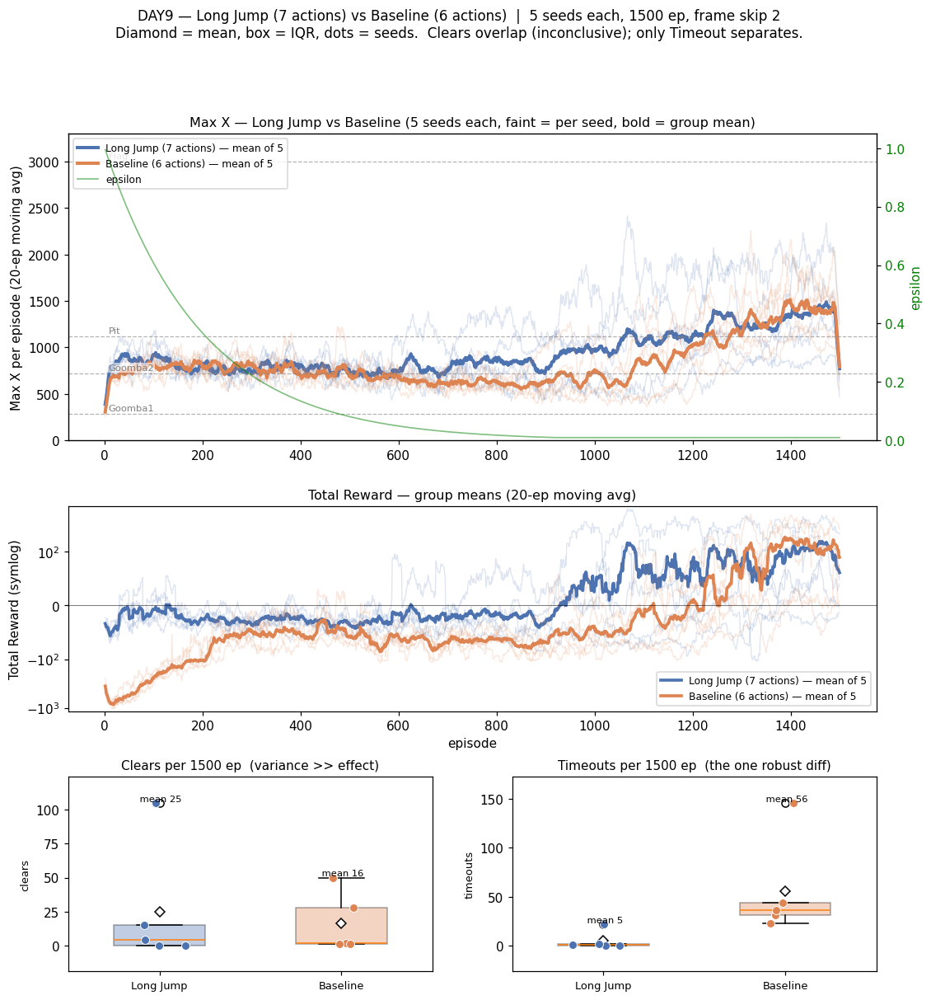

# [DAY9] 운이 아니라 실력으로 — 시드 N회 + 긴 점프

> 🎯 **운이 아니라 실력으로** — 분산을 먼저 재는 도구(저장·시드 N회)를 깔고, 그 위에서 첫 진짜 실험(긴 점프)을 한다.

**배경** · DAY8의 가장 큰 교훈은 "**단일 실행으론 트라이를 못 가린다**"였다 — 같은 코드인데 clear가 1↔24로 요동쳤다(분산 ≫ 효과). 결론용 지표는 여러 시드의 평균·분포로 봐야 한다. (상세: [\[DAY8\] 투명벽을 보다](<[DAY8] 투명벽을 보다 - 토관(앞 벽) 거리 인식.md>))

**문제** · 그러려면 두 가지가 없다 — ① Q-Table을 매 실행 백지에서 시작(메모리만, 저장 없음)이라 이어학습·수렴 관찰 불가, ② 시드를 고정·반복 돌릴 장치가 없어 분포를 못 잰다.

**이번** · 비교 *도구*부터 깐다(저장/로드 + 시드 N회 하니스). 그 위에서 DAY8이 남긴 다음 후보 ⓑ **행동 공간(긴 점프)**을 **처음으로 여러 시드로 평가**한다 — 단일 실행 신기루를 만들지 않는 첫 실험.

*가설은 실험 전에 먼저 쓴다(예측→검증).*

---

## 공통 설정 (트라이 간 고정)

DAY8과 동일, **트라이마다 딱 한 가지만** 바꾼다.

| 항목 | 값 |
|---|---|
| 알고리즘 | 두 테이블 Q-Learning (공통 108 + 위치 1080 합산, TD오차 α/2 분할 / α=0.1 · γ=0.99) |
| epsilon | 1.0 → ×0.995/판 → 하한 0.01 |
| 프레임 스킵 | 2 |
| 에피소드 | 1500 |
| 보상 보너스 | 굼바 밟기 +50 · 구덩이 통과 +50 |
| **시드 반복** | **5회 — 결론용 지표는 모두 5회 평균·분포로** |
| 측정 지표 | clear · 평균 Max X · 관문별 통과율 · timeout (모두 **시드별 분포**로) |

---

## 깔아둔 도구 (실험 아님)

트라이 전에 분포를 잴 도구를 먼저 만들었다 — DAY8 "분산부터 재라"의 직접 대응.

- **Q-Table 저장/로드** (`-Dmario.save/load`) — 매 실행 백지였던 걸 보존·이어학습.
- **시드 고정 + 병렬 하니스** (`-Dmario.seed`·`-Dmario.port`) — 5시드를 포트 나눠(9991~9995) 동시에, 한 묶음 ~15분.
- **행동 캡** (`-Dmario.actions`) — 긴 점프만 끈 매칭 베이스라인용(트라이1 결과에서 사용).

이게 깔려야 트라이1을 단일 실행이 아니라 **5시드 분포**로 적을 수 있다 — DAY8에서 못 했던 것.

---

## 트라이 1 — 긴 점프 행동 추가

### 🤔 왜 이 방향인가

**관찰** · DAY4~5에서 구덩이가 "보상·인식으론 못 풀리고 **병목은 제어**"로 확정됐고, 6이산행동의 점프는 A를 `FRAME_SKIP`(2프레임)만 누르는 *짧은 점프* 하나뿐이다. 토관(DAY8)·넓은 구덩이는 이 점프로는 사거리가 안 닿을 수 있다.

**추론** · SMB의 점프 높이·거리는 A를 **누르는 길이**로 정해진다. 지금 행동 집합엔 "길게 눌러 멀리/높이" 뛰는 선택지가 아예 없다 → 못 넘는 장애물은 보상을 아무리 줘도 *물리적으로* 못 넘는다(DAY3 "밟기는 보상 아닌 물리가 정한다"의 연장).

**결정** · **긴 점프 행동**(A를 `FRAME_SKIP`보다 길게 유지하는 매크로 행동)을 행동 집합에 하나 추가한다. 6 → 7행동.

### 변경
- **Python** · `CUSTOM_MOVEMENT`에 7번째 `["right", "A"]` 추가하되, 그 행동일 때만 A를 `LONG_JUMP_FRAMES=8` 프레임(= `FRAME_SKIP` 2의 4배) 유지 = "더 멀리/높이 뛰기"(temporally-extended/매크로 행동). 일반 행동은 `FRAME_SKIP`(2) 그대로. 버튼 조합은 짧은 점프(RIGHT_JUMP)와 동일한 `right+A`라, 차이가 *점프 길이 하나*로만 격리된다.
- **Java** · `Action`에 `RIGHT_LONG_JUMP(6)` 추가, `ACTION_SIZE` 6 → 7. 두 Q-Table의 행동 차원이 자동으로 7로 늘어난다(`StateEncoder` 상태 칸 수는 불변 — 108·1080 그대로).

### 가설
- 긴 점프가 짧은 점프로 못 넘던 장애물(큰 토관·넓은 구덩이)을 넘게 해 **관문 통과율·clear↑**.
- **부작용 가능성** · ① 행동 7개로 탐색 공간↑ → 1500판 예산 내 학습이 느려질 수 있다(상태는 그대로지만 행동 차원 +17%). ② 긴 점프 남발 → 굼바 위 착지 실패나 구덩이 *건너뛰어* 추락 등 새 사망.
- **평가 방식(이번의 핵심)** · clear·평균 Max X를 **시드 N회 분포**로 본다. "올랐다"는 *분포가 겹치지 않을 때만* 말한다 — DAY8처럼 단일 실행 운으로 결론 내지 않는다.

### 결과 — 매칭 베이스라인과 5시드씩 비교

도구가 깔린 덕에 **처음으로 분포로** 봤다. 5시드 병렬(포트 9991~9995)이 예상보다 빨라 **한 묶음 ~15분** → 긴 점프(7행동)와 **매칭 베이스라인(6행동)을 각각 5시드** 돌렸다. 베이스라인은 `-Dmario.actions=6`으로 긴 점프만 끄고 나머지는 전부 동일(같은 시드 1~5).

| 지표 | 긴점프(7행동) | 베이스(6행동) | 판정 |
|---|---|---|---|
| **clear** | 24.8 ± 40.5 · `[0,0,4,15,105]` | 16.4 ± 19.7 · `[1,1,2,28,50]` | **판정 불가**(분포 완전 겹침) |
| 평균 Max X | 943 ± 157 | 831 ± 97 | 겹침 |
| 말500 Max X | 1207 ± 395 | 1082 ± 239 | 겹침 |
| **best Max X** | 2797 ± 468 | **3161 ± 0** | **베이스 우위**(5시드 전부 깃발 도달, 긴점프는 2시드 미달) |
| **timeout** | **5 ± 8.5** | 56 ± 45.5 | **긴점프 명확히 낮음**(유일하게 안 겹침) |

- 관문 통과율(첫굼바 95 vs 92% · 2차굼바 68 vs 66% · 구덩이 52 vs 50%)은 **사실상 동일**(오차범위 내).
- **두 그룹 모두 seed4 하나가 평균을 끌어올린 이상치**(긴점프 105·베이스 50 clear). 나머지 시드는 한 자릿수~수십. → 이 환경은 **시드(난수) 영향 ≫ 행동공간 영향.**

### 결론 — 막힘은 풀었지만 도달엔 무효

- **가설 기각.** 긴 점프는 clear·평균·관문 통과율 전부 분포가 겹쳐 "개선"이라 못 한다.
- **견고한 차이는 timeout뿐**(5 vs 56). 막힌 벽은 넘게 됐지만 더 멀리·clear로 이어지진 않았고, best Max X는 오히려 베이스가 5시드 *전부* 깃발(긴점프는 2시드 미달) — 7행동 탐색 부담이 일부 시드를 덜 여물게 한 정황.
- **N=5의 값** · 단일 실행이면 seed4(105 clear)만 보고 "대박"이라 **오판**했을 것. 분산이 효과를 덮을 땐, 덮는다는 사실 자체가 결론이다(DAY8 교훈의 재현).

---

## DAY9 종합

- 도구 3종(저장·시드병렬·행동캡)이 깔려 **트라이를 5시드 분포로 재는 게 ~15분 비용**이 됐다 — DAY8 "분포부터 재라"의 실현.
- **가장 큰 발견**: 이 환경은 **시드 영향 ≫ 행동공간 영향**(두 그룹 다 seed4만 폭발). 앞으로 5시드 분포 없이는 어떤 트라이도 판정 불가.
- **다음 후보**: 긴 점프 *사용빈도* 로깅(실제 쓰는지 미확인) / 1500판 예산 ↑ / 1-1 졸업 / 알고리즘 근사.