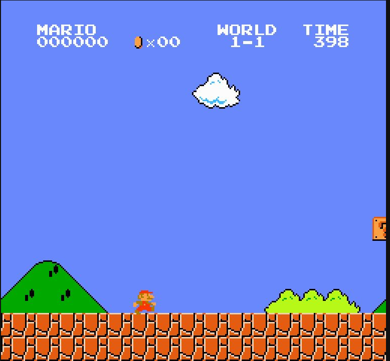

# [회고] 열두 개의 두뇌, 하나의 깃발 — 프로젝트 마무리

> 모든 것이 시작된 곳 — World 1-1 출발선, x=40. 스무 번의 DAY 동안 열두 개의 두뇌가 여기 섰고,
> 그중 아홉이 x=3161(깃발)에 닿았다. 닿지 못한 셋은 Random·GA(v1)·ES다. 이 문서는 그 여정의 마침표다.

---

## 여정 한눈에 — 3막 구조

| 막 | DAY | 무엇을 했나 | 결말 |
|---|---|---|---|
| **1막 — 한 우물** | 1~9 | Q-Learning 하나를 **한 변수씩** 심화: 보상→인식(RAM)→행동→제어→예산→일반화(두 테이블)→토관→검증법(5시드) | 🏁 첫 깃발(DAY7, 17회 클리어). "추측 말고 측정"과 "단일 실행 금지"를 몸으로 배움 |
| **2막 — 가로 비교** | 10~14 | 같은 환경에 **다른 두뇌 6종 + 바닥선**(SARSA·Expected·MC·GA·ES·Random)을 줄세움 | TD 셋 본선 무승부 · MC 첫 열세 · 진화 둘은 바닥선 아래. **"누가 낫나"가 아니라 "바닥선 위 어디냐"로 읽는 법** 확립 |
| **3막 — 세로 심화** | 15~20 | 각 계보를 **교과서적 다음 버전으로 하나씩** 강화(λ·Double·n-step·GA v2·max/HoF·Q(λ)) | **4승 1패 + 무효 3건.** 규칙 두 개가 남음(아래) |

숫자로: **Brain 구현체 12개** · 정식 5시드 학습 17회(DAY9 포함) ≈ **12만 7천 판** · 학습 로그 전량 영구 보관(`mario_training_logs/`) · 실험일지 DAY 20편 + 비교 보드.

---

## 1막 (DAY1~9) — 한 우물: Q-Learning으로 깃발까지

**출발은 초라했다.** DAY1의 baseline은 500판을 배워 "오른쪽으로 가기"만 익혔고, x290에서 반복해서 죽었다. 당시엔 그걸 "구덩이 추락"이라 적었다 — 나중에 측정해 보니 **굼바**였다. 죽는 위치만 보고 원인을 단정한 첫 번째 실수(위치≠원인). 이 프로젝트에서 가장 오래 써먹은 교훈이 첫날 나온 셈이다.

**인식이 가짜였다 (DAY2).** 적을 화면 픽셀(갈색 스캔)로 감지하던 휴리스틱이 사실은 **굼바가 아니라 마리오 자신을 보고 있었다** — DAY1부터 내내. 픽셀 추측을 버리고 NES RAM(적 슬롯 `0x0F~0x13`)을 직접 읽자 신호가 처음으로 진짜가 됐고, 첫 굼바 통과율이 65%까지 올랐다. **"추측 말고 측정"이 여기서 태어났다.**

**보상은 만능이 아니었다 (DAY3~4).** 굼바 밟기 보너스를 +50에서 +150으로 올려도 밟기 비율은 꿈쩍 안 했고(밟느냐 뛰어넘느냐는 보상이 아니라 물리가 정한다), 구덩이 통과 보너스는 통과율을 **오히려 떨어뜨렸다**(52→35%). 인식과 보상이 둘 다 막히자 병목은 제어로 넘어갔다.

**제어도 아니었다 — 예산이었다 (DAY5~6).** 프레임 스킵 축소·높이 인지·수직 방향, 제어 상태 3종을 다 넣어도 구덩이 통과율은 ~50% 벽에 붙어 있었다. 그런데 DAY6에서 에피소드를 500→1500으로 늘리자 벽이 그냥 무너졌다(45→74%, 후반 95%). **"못 푸는 것"과 "아직 안 풀린 것"은 다르다** — 알고리즘을 의심하기 전에 예산부터.

**🏁 첫 깃발, 그리고 두 테이블 (DAY7).** 1500판이 열어준 다음 병목은 "위치별 암기"(xZone이 상태에 있어 같은 굼바를 위치마다 새로 배움)였다. xZone을 빼자 일반화가 터지며 **첫 클리어 3회** — 그러나 상태 36칸이 너무 작아 후반이 진동했다. 여기서 나온 해법이 이 프로젝트 최고의 설계였다: **`Q_공통[36]`(위치 무시, 일반화) + `Q_위치[1080]`(위치 포함, 안정화)를 합산하는 두 테이블**(tile coding, 사용자 발안). 클리어 3→17회, 진동 소멸. 이후 모든 표 두뇌가 이 구조 위에 산다.

**분산이라는 복병 (DAY8~9).** 토관 인식(wall_dist)을 넣고 그래프를 다시 그리려 재학습했더니 — **같은 코드가 clear 1과 24를 오갔다.** 실행 분산이 트라이 간 차이를 압도한다는 발견. DAY9에서 시드 고정·포트 병렬·저장/로드 도구를 만들어 5시드 분포로만 결론 내는 체제를 세웠고, 그 첫 적용(긴 점프)은 정직하게 "판정 불가"로 끝났다. **단일 실행의 "대박"은 신기루다.**

---

## 2막 (DAY10~14) — 가로 비교: 여섯 두뇌와 바닥선

`Brain` 인터페이스로 두뇌를 추상화하고(`selectAction`/`learn`/`endEpisode`), 소켓 뒤 Python은 그대로 둔 채 두뇌만 갈아끼웠다. 여기서 이 챕터의 읽는 법이 확립됐다: **TD끼리는 본선(clear·거리)이 분산에 묻혀 "누가 낫나"를 못 가린다 — 대신 무학습 Random(거리 654±17)이라는 바닥선을 깔고 "각 두뇌가 그 위 어디에 서나"를 본다.**

| 두뇌 | 결말 한 줄 |
|---|---|
| **SARSA** (DAY10) | QL과 본선 무승부. 견고한 차이는 timeout뿐(97 vs 43) — on-policy 보수성은 "낙사 회피"가 아니라 "못 끝냄"으로 발현 |
| **Random** (DAY10) | 깃발 0 · 거리 654. 학습군 최솟값이 이 위로 완전 분리 → "무승부"는 *둘 다 못 배운 게* 아니라 *둘 다 진짜 배운 것*의 증명 |
| **Expected SARSA** (DAY11) | 또 무승부. SARSA의 "우물쭈물"(timeout)만 QL 쪽으로 완화(63) |
| **Monte Carlo** (DAY12) | **첫 열세.** 부트스트랩을 버리자 "끝내기"를 못 배워 timeout 580 ≈ Random(588). 깃발엔 닿지만(4/5) 본선에서 TD에 밀림 — **부트스트랩 가치의 역설적 증명** |
| **GA** (DAY13) | **바닥선 아래로 떨어진 첫 학습기**(거리 603 < 654). 결정론 정책의 막힘·8천 파라미터·"버티면 덜 아픈" 적합도의 합작 |
| **ES** (DAY14) | **전 지표 꼴찌, 유일하게 시간이 갈수록 퇴보.** σ=0.1은 즉시 동결(NOOP 고정점), 0.3도 동결을 늦출 뿐 — 범인은 보상 지형(timeout −50 > 사망 −100) |

이 챕터의 백미는 ES의 collapse를 **코드가 아니라 화면에서** 발견한 것이다 — 8084 포트 MJPEG 스트림을 보다가 "마리오가 안 움직인다"는 관찰 하나로 진단이 시작됐다. 로그 숫자가 놓친 것을 눈이 잡았다.

---

## 3막 (DAY15~20) — 세로 심화: 성적표와 그 뒷이야기

각 계보를 교과서의 다음 페이지로 한 칸씩 올렸다. 판정 기준도 이때 갈아끼웠다 — TD는 이미 깃발을 뽑아 본선이 분산에 묻히므로, **첫-클리어 판수 · 학습곡선 AUC · 초반 300판 평균**이라는 "얼마나 빨리 배우나" 자를 새로 들었다.

| DAY | 강화 | 건드린 축 | 판정 |
|---|---|---|---|
| 15 | SARSA → **SARSA(λ)** | 신용 전파(흔적) | **완승** — clear 23→279, 첫 깃발 3.8배 일찍 |
| 16 | QL → **Double-Q** | 값의 편향 | **후퇴** — clear 36→1, 낙관을 지우니 주저앉음 |
| 17 | MC → **n-step SARSA** | 신용 전파(부트스트랩 복원) | **완승** — clear 5→206, timeout 580→59 |
| 18 | GA → **GA v2** | 적합도 방향 + 막힘 탈출 | **완승** — 바닥선 분포째 탈환 + 깃발 (트라이2 "3판 평균"은 소폭 후퇴) |
| 19 | GA v2 → max 집계 · HoF | 집계 / 개체 보존 | **무효 ×2** — 깃발의 범인은 집계도 보존도 아닌 세대·정책 확정성 |
| 20 | QL → **Watkins Q(λ)** | 신용 전파(흔적+cut) | **완승** — clear 36→225, QL 계보 설욕, 신용 전파 축 3승 완성 |

**DAY15 — 첫 완승이자 가장 큰 완승.** 적격흔적은 sparse-reward 1-1의 정확한 처방이었다: 부트스트랩은 유지하되 신용을 흔적만큼 한꺼번에 뒤로. 분포가 아예 안 겹쳤다(clear 최소 199 > SARSA 최대 60). 1-step의 느림과 MC의 무모함 사이, 정확히 그 틈.

**DAY16 — 가장 배울 게 많았던 패배.** 최대화 편향 제거는 교과서적으로 옳다. 그런데 지우니 마리오가 바닥선 바로 위(~750)에 주저앉았다. 큰 보상이 깃발 하나뿐인 지형에서 **QL의 과대추정(낙관)은 버그가 아니라 "드문 깃발 경로로 밀어붙이는 힘"**이었던 것. 이 대조군이 없었으면 λ의 승리를 "심화는 원래 이득"으로 잘못 읽었을 것이다.

**DAY17 — 양방향 증명의 완성.** DAY12에서 부트스트랩을 *빼서* 나빠졌고(MC), DAY17에서 *도로 넣어* 좋아졌다(n-step). 같은 명제를 두 방향에서 확인한, 이 프로젝트에서 가장 교과서적인 실험. 구현 전 경계 검증(n=1≡SARSA · n=∞≡MC, Q테이블 오차 0)이라는 관행도 여기서 정착했다.

**DAY18~19 — 진화의 구원과 한계.** GA v1의 실패 진단서 셋(결정론 정책의 막힘 · 과대한 파라미터 · 버티기를 우대하는 적합도)을 한꺼번에 처방하자 진화가 바닥선을 분포째 넘고 깃발까지 들었다 — **"진화가 약한 게 아니라 그 구현 조합이 약했다."** 그러나 후속 셋(3판 평균·max 집계·명예의 전당)은 전부 트라이1을 못 넘었다. 특히 명예의 전당은 뼈아팠다: 깃발 든 개체(champion)를 매 세대 강제로 살려 넣었는데도 세대 best가 골인 직후 추락했다 — **개체가 사라진 게 아니라, 확률 정책(softmax)이 같은 개체를 매번 다르게 굴린 것.** 진단이 옳아도 처방이 빗나가고, 처방이 옳아도 진단이 틀릴 수 있다.

**DAY20 — 유종의 미.** DAY16 이후 유일하게 강화 성공이 없던 QL 계보에, 증명된 축(신용 전파)을 그대로 적용했다. Watkins cut(탐험 시 흔적 절단)이라는 세금이 붙는데도 QL을 분포째 압도했고(clear min 164 > QL max 123), SARSA(λ)와 본선이 겹치는 "흔적 듀오"가 됐다. cut의 비용은 정확히 예측된 자리 — ε이 큰 초반 — 에서만 청구됐다(첫 깃발 470 vs 230).

최종 보드([비교 보드](./[비교]%20알고리즘%20비교%20보드.md) · `images/day20-algorithm-comparison.png`):
**흔적 듀오(SARSA(λ) ≳ Watkins Q(λ)) > n-step SARSA > Expected SARSA > GA v2 > Random > ES**

---

## 이 프로젝트가 남긴 규칙 두 개

**규칙① — 강화의 방향이 *그 두뇌의* 실제 병목과 맞아야 이득이 난다.**
세로 심화 다섯 번의 승패를 겹치면 선명하다: sparse-reward 1-1의 진짜 병목인 **신용 전파**를 건드린 셋(λ·n-step·Q(λ))은 **3전 3승**, 병목이 아닌 **값의 편향**을 건드린 하나(Double-Q)는 완패. 진화 쪽도 같은 문법 — 적합도가 *엉뚱한 것*(버티기)을 가리키던 걸 고친 GA v2는 이겼고, 이미 옳아진 신호를 더 다듬은 max/HoF는 무효였다. **"교과서적으로 옳은 개선"이라는 것만으로는 아무것도 보장되지 않는다. 무엇을 고칠지가 어떻게 고칠지보다 먼저다.**

**규칙② — sparse-reward에선 낙관·분산·운이 버그가 아니라 기능이다.**
이론적으로 흠잡을 데 없는 개선 둘이 나란히 후퇴했다: 최대화 편향 제거(Double-Q, clear 36→1)와 적합도 노이즈 제거(3판 평균, 깃발 4→1회). 둘 다 **드문 깃발을 찾아 붙잡는 통로** — 과대추정의 밀어붙임, 대박 꼬리 — 를 함께 지워버렸기 때문이다. 단 DAY19가 이 규칙을 정밀하게 다듬었다: **운을 fitness에서 살리는 것(max)과 그 운을 깃발로 바꾸는 것(세대/예산)은 별개다.** 분산을 자원으로 쓰려면 그걸 소화할 탐색 예산이 같이 있어야 한다.

---

## 기억에 남는 순간들

1. **"굼바가 아니라 마리오를 보고 있었다"** (DAY2) — DAY1부터 내내 가짜였던 픽셀 신호. 진단 로그 하나가 프로젝트의 방법론을 바꿨다.
2. **첫 깃발** (DAY7) — xZone을 뺀 지 얼마 안 돼 로그에 처음 찍힌 `clear`. 500판 내내 굼바에 죽던 두뇌의 6일 뒤.
3. **"같은 코드인데 clear 1 ↔ 24"** (DAY8) — 그래프를 다시 그리려던 재학습이 통계적 겸손을 가르쳤다. 이후 모든 결론이 5시드 분포가 됐다.
4. **"마리오가 안 움직여요"** (DAY14) — 숫자가 아니라 스트림 화면에서 발견된 ES collapse. 관찰의 힘.
5. **gen19 best 3161 → gen20 best 1425** (DAY18) — 깃발 든 개체를 엘리트로 보존했는데 사라진 듯 보였던 순간. DAY19의 HoF가 그 진단을 뒤집으며("사라진 게 아니라 다시 굴려진 것") 이야기가 완결됐다.
6. **경계 검증 오차 0.000000000000** (DAY17·20) — 새 두뇌가 기존 두뇌와 비트 단위로 일치하는 걸 보고 나서야 학습을 돌리던 관행. 느리지만 한 번도 배신하지 않았다.

---

## 알고리즘 밖에서 배운 것 (방법론)

1. **추측 말고 측정.** 픽셀 휴리스틱은 굼바 대신 마리오를 잡았고(DAY2), 죽는 위치만 보고 사인을 단정했다가 틀렸고(DAY1), 지면 행을 추측했다가 평지에서 가짜 벽을 봤다(DAY8). 게임 상태는 RAM에서 읽고, 새 두뇌는 경계 검증부터, 새 신호는 진단 로그로 확인 후 투입.
2. **단일 실행으론 아무것도 결론 못 낸다.** 결론은 5시드 분포로만, "이겼다"는 **min > max**(분포 비겹침)일 때만. 겹치면 정직하게 "판정 불가"라 쓴다 — DAY9 긴 점프와 DAY19 두 트라이가 그렇게 기록됐다.
3. **못 풂 ≠ 안 풀림.** DAY5의 "~50% 벽"은 알고리즘 한계가 아니라 예산 부족이었다. 구조를 의심하기 전에 예산·탐험·시간부터.
4. **로그는 영구 보관, 그래프는 로그에서.** 재학습은 매번 다른 결과를 준다. 원본 로그를 남기니 몇 달 뒤에도 보드의 모든 숫자가 결정적으로 재현됐다(maxX Java↔Python 교차검증 불일치, 전 기간 0판).
5. **clear는 결론용으로 너무 시끄럽다.** 5시드로도 안 갈린다(DAY19). 첫-클리어 판수·AUC·초반 평균이 더 좋은 자였다 — **지표도 실험 대상이다.**
6. **그래프 형식은 상속한다.** 시점마다 파일을 분리하고(이전 DAY 그래프를 덮지 않기), 새 그래프는 기존 형식을 먼저 열어보고 맞춘다. 두 번 어겨서 두 번 재작업했다.

---

## 아키텍처가 해준 것

- **Java(두뇌) ↔ Python(환경)을 소켓으로 가른 것**이 2막 이후의 전부를 가능하게 했다. Python은 누가 행동을 정하는지 모른다 — 그래서 열두 두뇌가 *완전히 같은* 환경에서 비교될 수 있었다.
- **`Brain` 인터페이스(3+1 메서드)**: 새 두뇌 추가가 "클래스 하나 + `createBrain` 분기 하나"로 끝났다. SARSA(λ)·n-step·Q(λ)는 부모에서 `learn`/`endEpisode`만 갈아끼운 수십 줄이다.
- **두 테이블 합산(DAY7)**: 일반화와 안정화를 동시에 준 설계가, 이후 흔적·Double·진화 개체 표현까지 전부의 기반이 됐다.
- **측정 인프라**: 에피소드 종료 로그(`status`·`maxX`·`endY`…) + Java/Python 이중 기록 + 교차검증. 화려하지 않지만 모든 결론이 이 위에 서 있다.

---

## 미해결로 남기는 것

- **τ 어닐링** — GA v2의 진짜 병목으로 지목된 정책 확정성(DAY19 트라이2의 유산).
- **ES에 GA v2 처방** — GA가 되살아났으니 ES도 같은 처방(적합도=maxX 등)으로 살아날 가능성.
- **GA v2 ablation** — 처방 셋(softmax·테이블 축소·적합도) 중 무엇이 승리를 만들었나.
- **Double-Q caveat 분리** — 후퇴가 편향 제거 탓인지 유효 학습빈도 절반 탓인지(α/2 대조군).
- **예산 3배 실험들** — max·50세대(DAY19의 세대 가설 검증), 3판 평균·50세대.

전부 "하면 답이 나올" 문제들이다. 남겨두는 것도 마무리의 일부.

---

## 마치며

DAY1의 마리오는 오른쪽으로 걷다 첫 굼바(x=290)에 거의 500판 내내 죽었다. DAY20의 마리오는 다섯 시드 전부에서 깃발을 들었고, 제일 잘 배운 두뇌(SARSA(λ))는 1500판 중 시드 평균 279판을 클리어했다. 그 사이에 있었던 건 대단한 알고리즘이 아니라 — **측정, 분포, 그리고 병목을 똑바로 보는 눈**이었다.

> Java 소켓 하나로 시작한 공부용 프로젝트가 표 기반 강화학습의 지도를 한 바퀴 돌았다.
> 열두 개의 두뇌, 하나의 깃발. 여기서 마친다. 🏁
